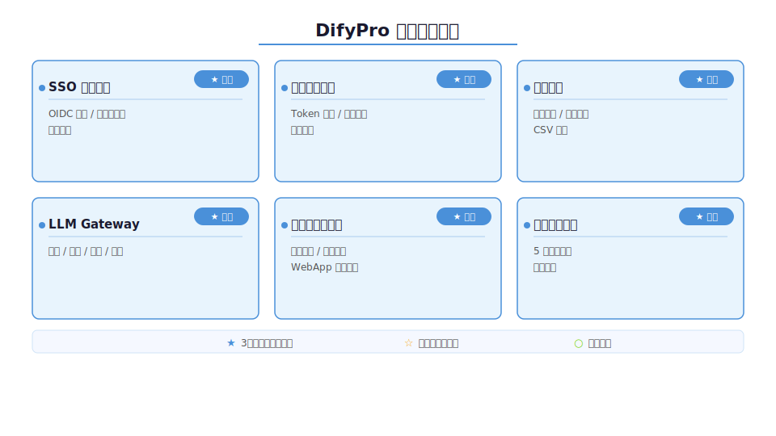
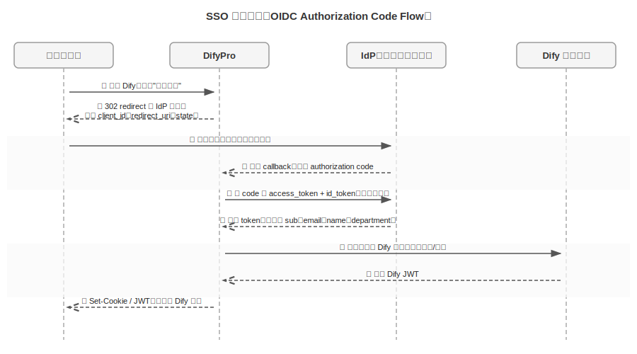
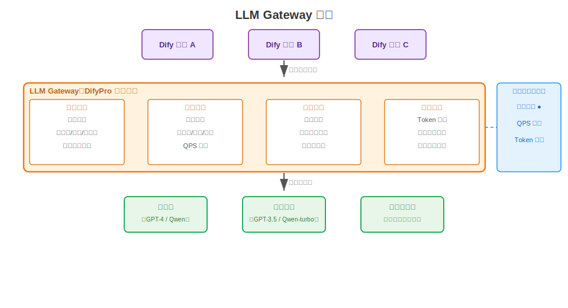
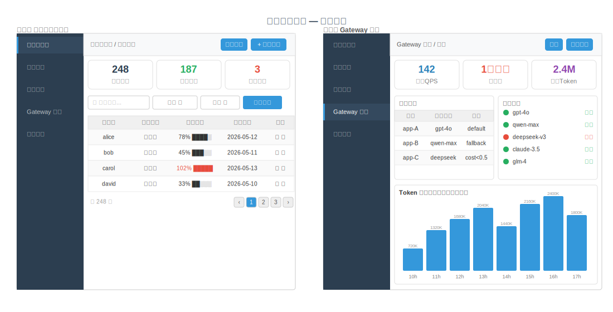

# DifyPro：项目需求文档

> 本文档说明 DifyPro 的功能需求。功能分三档：核心功能训练营 3 周内完成，课后作业训练营期间完成，社区共建功能作为长期方向开放。
>
> 本文档定义 What，How 在《DifyPro 项目技术方案文档》中展开。

## 一、项目概述

DifyPro 是基于 Dify 社区版的企业级二次开发项目，填补 Dify 在企业生产环境下的能力缺口。

这个项目存在三层理由。

**第一层是真实的企业需求。** Dify 是 2026 年企业搭内部 AI 平台最常用的底座，136k GitHub stars，Volvo Cars、锚网（服务 160+ 中大型企业）等已经生产落地。但企业要把 Dify 跑进生产环境，社区版就开始撑不住了：身份认证接不进企业 SSO 体系（Dify Issue #6481 至今 open）、token 成本没法管控、没有审计日志（Issue #22827 至今 open）、多部门数据没有隔离、发布的 WebApp 没有访问权限控制（Issue #3285）。Dify 的 LICENSE 把 SSO、多租户、white-labeling 锁定在商业版，Enterprise 无公开定价、需 business@dify.ai 直接洽谈，业界估计年费数万到数十万美金起。企业要么掏钱，要么自己二开——DifyPro 是走第二条路的标准答案。

**第二层是开源生态的空白。** 市面上最接近这个定位的项目是 Dify-Plus（YFGaia），4 个月从 1.3k 涨到 2k stars，fork 从 272 增至 417，证明需求真实存在。但 Dify-Plus 覆盖面有限：实现了基于 gin-vue-admin 的管理中心和用户配额管理，加了钉钉登录，但 OIDC/SAML 级别的企业 SSO、完整审计日志、LLM Gateway 治理、WebApp 访问权限控制这些核心诉求还缺失。开源社区需要一个做得更深、更广的版本——DifyPro 想填这个位置。

**第三层是工程训练的价值。** DifyPro 在训练营里是"用 AI 编程在大型陌生代码库里做企业级二次开发"的标准实战场景。Dify 有 Python 后端 + React 前端 + 复杂调用链路，在这种代码库里用 AI 读懂逻辑、找到扩展点、做最小侵入改造，是每个工程师在公司最常遇到的真实挑战。练的不只是 Dify，练的是这种能力本身。

## 二、企业版能力差距分析

在规划 DifyPro 的功能边界之前，必须先搞清楚 Dify 各版本的能力矩阵，以及社区二开已经填补了哪些、还剩哪些。

### 2.1 Dify 版本能力矩阵

| 能力 | Community（开源免费） | Premium（AWS AMI） | Enterprise（商业版） |
|------|----------------------|-------------------|---------------------|
| 多工作区 / 多租户 | ✗ | ✗ | ✓ |
| SSO（OIDC / SAML / OAuth2） | ✗（默认禁用） | ✗ | ✓ |
| RBAC 细粒度权限 | 基础角色 | 基础角色 | ✓ |
| 审计日志 | 碎片化，不合规 | 碎片化 | ✓ |
| 用户级 Token 配额 | ✗ | ✗ | ✓ |
| API 限流（用户 / 应用 / 全局） | ✗（需外挂 Redis） | ✗ | ✓ |
| MFA / 二步验证 | ✗ | ✗ | ✓ |
| White-label 定制 | ✗ | ✓ | ✓ |
| 模型负载均衡 | ✗ | ✗ | ✓ |
| WebApp 访问权限控制 | ✗ | ✗ | ✓ |
| Admin 管理中心 | ✗ | ✗ | ✓ |
| Kubernetes / Helm | ✗ | ✗ | ✓ |

### 2.2 Dify-Plus 已实现的能力

Dify-Plus（YFGaia）代表了社区二开的最高水位线，已实现：

- **用户配额管理**：对话次数上限、Token 消耗上限、API Key 配额限制、异步配额统计
- **管理中心**：基于 gin-vue-admin 的独立后台，用户列表、配额调整、API Key 消耗报表
- **钉钉登录**：对接钉钉 OAuth，覆盖了一部分企业认证场景
- **基础费用统计**：按月展示模型调用费用趋势

**Dify-Plus 明确缺失的：**

- OIDC / SAML 级别的标准企业 SSO（Okta、Azure AD、企业微信接不进来）
- 完整审计日志（谁在什么时间调用了哪个模型、查了哪个知识库）
- LLM Gateway 治理层（熔断、多模型路由、降级）
- WebApp 发布后的访问权限控制
- 部门级数据隔离（多团队共用一个实例时 A 团队看不到 B 团队的知识库）
- 结构化可观测（Prometheus 指标、OpenTelemetry trace）

### 2.3 DifyPro 的差异化定位

DifyPro 在 Dify-Plus 已有基础之上做两件事：

1. **补齐 Dify-Plus 缺失的核心企业能力**：标准 OIDC SSO、完整审计日志、LLM Gateway、WebApp 访问控制、部门隔离
2. **做得更深**：每个能力有完整的管理界面、配置热更新、生产级可运维性

## 三、设计目标

DifyPro 的主目标是在 Dify LICENSE 合规边界内，为选择自建的企业提供一套经过验证的企业级能力补全方案，让企业不买商业版也能把 Dify 跑进生产环境。

**合规边界是硬约束，不能碰：**

- **不做真正的多租户**：Dify LICENSE 明确禁止（"you may not use the Dify source code to operate a multi-tenant environment"），不碰
- **不去除 Dify logo 和版权信息**：LICENSE 禁止，不碰
- **不做与 Dify 商业版正面竞争的 SaaS**：无授权，不碰

在这条线之内，企业级二开的空间很大，DifyPro 的核心功能方向全部在合规范围内。

**几件事 DifyPro 明确不做：**

- **不重写 Dify 核心**：最小侵入原则，能加中间层就不改源码，能用 extension 机制就不动核心文件
- **不与 Dify 上游分裂**：保持可同步性，二开代码用独立标识隔离，方便跟随上游升级

## 四、完整功能清单

> 以下是 DifyPro 的全功能清单，按优先级和工作量排序。核心功能（3 周内完成）标注 ★，课后作业标注 ☆，社区共建标注 ○。

### 4.1 SSO 单点登录

企业落地 Dify 的第一道门。企业有现成的 AD / LDAP / Okta / Azure AD 体系，所有内部系统走统一登录。Dify 如果接不进去，员工要单独注册账号，IT 管理员要维护两套账号体系，安全团队无法在统一平台管控 Dify 的访问权限——这不是不方便，是 IT 管理员不会批准部署。Dify Issue #6481 有 200+ 用户投票，至今没有社区版支持计划，官方把 SSO 明确锁在 Enterprise。

**★ 核心阶段（3 周内）**

核心阶段实现基于 OIDC Authorization Code Flow 的 SSO 集成，支持主流企业 IdP：Okta、Azure AD、企业微信、钉钉。整个流程是标准的 OIDC 三段式：用户点击登录后 redirect 到 IdP 授权页，IdP 回调带 code，DifyPro 用 code 换 token，再用 token 拿 user info，映射到 Dify 账号。

用户管理上有两个关键点。第一是自动建账号：首次登录时按 IdP 返回的 sub、email、name、department 属性在 Dify 里建账号，员工不需要任何手动操作。第二是属性同步：每次登录都更新部门和角色信息，IdP 里调岗了，下次登录 Dify 里的权限自动跟上。企业还可以开启强制 SSO 模式，禁止邮箱密码登录，所有用户必须走 IdP，防止账号管理出现漏洞。

管理端提供 SSO 配置界面，管理员填写 IdP 地址、Client ID、Client Secret、属性映射规则，配置保存后立即生效，不重启服务。另提供用户同步状态查询（上次同步时间、成功 / 失败数）和强制登出接口。

**☆ 课后作业**

OIDC 覆盖了 80% 的场景，但传统企业还在用 SAML 2.0 和老版 AD，课后补 SAML 2.0 支持，对接这类 IdP。SCIM 协议让 IdP 主动推送用户变更，新员工入职自动创建账号、离职员工自动禁用，是 OIDC 的互补而非替代。

**○ 社区共建**

CAS 协议、飞书 / Salesforce / GitHub Enterprise IdP 适配，由有具体 IdP 需求的社区成员贡献。

### 4.2 用户额度精细化管理

LLM 调用是真金白银。Dify 社区版没有任何用户级 token 管控，Issue #17354 的提出者说得直接："bugs in calling application code (loop) or malicious user could get a huge bill"——一个循环 bug 或者一个恶意用户，就能把整个团队当月的 token 预算烧光。Issue #33053 记录了更严重的场景：embedding 模型触发 rate limit 后没有熔断，整个系统进程重启，不是降级，是崩溃。

**★ 核心阶段（3 周内）**

核心是按用户维度的 token 配额管理。配额有两个维度：对话次数上限和 token 消耗上限，支持按天、按月、按总量三种统计周期，满足不同企业的管控粒度需求。配额来源有三条路：管理员手动设置、SSO 登录时按部门属性自动分配、CSV 批量导入。三条路可以混用，按部门自动分配处理大多数场景，手动设置处理特殊用户。

超限后的行为需要设计清楚。调用被拒绝时返回明确的剩余配额提示，而不是一个模糊的错误——用户需要知道自己用完了，不是系统出了问题。管理员可以配置宽限策略，比如超限后降级到低成本模型而不是直接拒绝。用户界面左侧边栏展示实时余额，参照 Dify-Plus 的做法，但修掉它的同步阻塞问题——配额消耗统计必须走异步写入，不能加在主调用链路上。

管理端提供完整的配额管理视图：用户配额列表展示当前配额、已消耗量、超限次数；消耗报表按用户、按部门、按模型、按时间段切片，让管理员看清楚钱花在哪里；超限用户列表一眼识别谁需要充值，支持直接在列表里做手动充值和临时提额操作。

**☆ 课后作业**

用户维度的配额是基础，课后可以扩展到 API Key 维度（每个 Key 独立配额，适合对外开放的场景）和应用维度（按 Dify 应用设置 token 上限）。配额预警——接近上限时推送邮件或企业微信通知——是运营上的必要功能，接入外部通知渠道是独立工作量，留作课后。

**○ 社区共建**

成本预算分析（按 team / 按项目的月度预算 vs 实际对比）和对接企业费用报销的 cost center 字段，适合有具体财务管理需求的企业贡献。

### 4.3 审计日志

金融、医疗、政务类客户的硬要求，不是可选功能，是合规前提。Dify Issue #22827 的提出者直接说："We need this for SOC 2, ISO 27001, GDPR compliance purposes"，并愿意自己提 PR 实现，只需要官方确认架构方向——这个 issue 提出超过半年，官方没有实质回应。Dify 现有的 `OperationLog`、`ApiRequest`、`WorkflowAppLog` 三张表是碎片化的运营日志，不是合规审计：覆盖的操作类型不全，没有统一查询界面，不支持按合规格式导出。

**★ 核心阶段（3 周内）**

核心阶段需要覆盖三类操作的审计埋点。身份与访问类：用户登录（来源 IP、登录方式、成功 / 失败结果）、用户登出（主动 / 强制 / Session 过期）、账号状态变更。应用与数据类：应用的创建、修改、删除、发布，知识库的创建、文档上传、文档删除、查询触发，以及每次模型调用的模型名、token 消耗、耗时、结果状态、调用来源。管理操作类：用户管理操作（创建、禁用、配额调整、强制登出）、配置变更（SSO 配置、Gateway 配置、限流规则）、API Key 的创建和删除。

审计日志存储必须独立于 Dify 主数据库，按时间分区，保留策略可配置（默认 90 天，到期自动清理，防止存储无限增长）。写入走异步，不阻塞主调用链路。管理端提供多维度筛选界面，支持按用户、操作类型、资源 ID、时间范围的复合查询，日志条目可展开看详情，可按筛选条件导出 CSV。

**☆ 课后作业**

基础审计日志稳定后，课后可以补日志完整性校验（hash 链或签名，防篡改）、外部用户通过发布的 WebApp 的访问记录、以及异常行为检测（同一用户短时内大量调用触发告警）。

**○ 社区共建**

Splunk / ELK 对接、SIEM 集成、合规报告生成（SOC 2 / ISO 27001 格式），这类需求企业差异很大，适合由有具体合规场景的社区成员贡献。

### 4.4 LLM Gateway 增强

大企业的 AI 平台跑着几十上百个应用，没有治理层的后果是：一个应用的循环 bug 打满模型 API 的 rate limit，所有应用跟着失败；主模型抖动时没有降级，用户看到的是报错而不是备用模型的响应；某个部门突发高峰，把共享的 token 预算全部占完，其他部门当天用不了。Issue #17354 里，社区的应对方案是在工作流里外挂 Upstash Redis 节点做 RPM 控制——能用，但配置复杂，每个应用都要单独配，没有统一视图，出了问题也不好排查。

**★ 核心阶段（3 周内）**

Gateway 以中间层形式插入 Dify 的模型调用入口，通过 model provider 扩展点接入，不修改核心调用逻辑。核心实现四个能力。

路由：按规则把不同请求分配到不同模型。规则可以基于应用类型、用户角色、请求来源——比如简单问答走便宜模型、复杂推理走高端模型、VIP 用户优先走性能更好的模型。路由规则热更新，改完立即生效，不重启服务。

熔断降级：主模型调用超时（阈值可配）或连续返回 5xx 时，自动切换到备用模型，对用户透明。熔断状态在管理台可视化——哪些模型当前处于降级中，一眼可见。主模型恢复后，通过探针检测自动切回，不需要人工干预。

限流：三个维度的 QPS 上限——按应用、按用户、按全局。固定窗口和滑动窗口两种策略可选。超限返回 429，携带 Retry-After 头，让调用方知道什么时候可以重试，而不是无限报错。

Token 追踪：每次调用记录 input token、output token、模型名、耗时、调用来源，实时聚合后推给额度管理模块，这是配额管理的数据基础。Gateway 层的指标也在管理台实时展示。

**☆ 课后作业**

规则路由先行，课后可以补智能路由——根据请求内容的 token 预估或意图分类自动选模型，以及成本优化路由（在满足质量要求的前提下优先选低成本模型）。OpenTelemetry trace 导出留作课后，让 Gateway 调用链接入企业现有的可观测平台。

**○ 社区共建**

流量录制与回放（用于模型切换前的验证）、A/B 测试路由（按比例分流到不同模型），由有具体需求的社区成员贡献。

### 4.5 多部门权限隔离

明确一点：这不是多租户（LICENSE 禁止），是单租户内的部门级数据隔离和权限管控。Dify 的 Workspace 机制设计为团队协作，不是隔离——同一个 Workspace 里，所有成员能看到所有知识库和应用。Issue #3285 记录了大量企业用户的反馈：HR 部门上传了员工薪资相关的知识库，销售部门的员工也能查到；内部只供特定团队使用的 AI 工具，发布后对全公司开放。这不是功能缺陷，是设计选择，Dify 不会在社区版修复它。

**★ 核心阶段（3 周内）**

DifyPro 在 Dify 现有 Workspace 机制之上叠加部门层，通过权限中间件在请求层做隔离校验，不破坏现有的多 Workspace 逻辑。

部门（Team）支持树形结构，最多三级，覆盖大多数企业的组织形态。成员管理支持添加、移除、设置角色。SSO 接入后，用户登录时按 IdP 返回的部门属性自动分配，不需要管理员手动维护。

资源归属是隔离的核心。应用和知识库可以设置部门归属，支持归属多个部门（共享资源）。未设置归属的资源，管理员可见，普通用户不可见——这是安全默认值，不是访问默认值。权限分三级：读（查看和使用）、写（编辑内容）、管理（配置权限和删除），部门管理员可以管理本部门的成员和资源，但不能跨部门操作。

WebApp 访问控制是这个模块里对用户最可见的能力。发布的 WebApp 支持三种访问策略：公开（当前默认行为）、部门内（只有归属部门的成员可访问）、需要登录（任何登录用户可访问）。外部用户访问部门内应用时，触发 DifyPro 的登录验证，验证通过后按部门权限决定是否允许访问。

**☆ 课后作业**

课后可以补应用级 IP 白名单（限定 WebApp 只能从特定网段访问，适合内网场景）、资源级操作日志对接审计模块，以及跨部门资源申请审批流程（A 部门申请访问 B 部门知识库，B 部门管理员在管理台审批）。

**○ 社区共建**

细粒度 RBAC（自定义权限点和角色组合）、敏感知识库内容按用户角色打码，这类需求企业差异大，适合社区按具体场景贡献。

### 4.6 统一管理中心

把上面四个功能的管理入口整合成一个统一的管理后台，给 IT 管理员和运维人员用。Dify 社区版没有管理中心，Dify-Plus 做了一个，但只覆盖配额和费用报表。DifyPro 要做完整版：SSO、配额、审计、Gateway、部门权限，全部有对应的管理界面，管理员不需要在多个页面之间跳转或者直接操作数据库。

**★ 核心阶段（3 周内）**

管理中心提供五个核心页面，通过 DifyPro 新增 API 驱动，前端独立部署，不和 Dify 主前端耦合，技术栈用 React + Ant Design，复用 Dify 前端已有的依赖。

用户与部门管理页是日常运维频率最高的入口。用户列表展示状态、所属部门、配额使用率、最后登录时间，支持按部门筛选。部门树结构可以直接在页面上编辑。SSO 同步状态区块展示上次同步时间和成功 / 失败数。每个用户行上可以直接操作：禁用、启用、重置配额、强制登出、跳转查看该用户的审计日志。

额度管理页分两个视图：配额配置和消耗报表。配置视图支持按用户或按部门批量设置，超限告警列表列出当前已超限的用户，点进去可以直接充值。消耗报表用可视化图表展示 token 消耗趋势，可以按时间、按部门、按模型三个维度切换。

审计日志查询页提供多维度筛选（用户、操作类型、资源、时间范围），查询结果支持展开看详情，也支持按当前筛选条件导出 CSV，满足合规场景下的取数需求。

Gateway 监控页是运维视角的实时看板：当前生效的路由规则列表、各应用和各用户的实时 QPS 统计、熔断状态（哪些模型当前处于降级中）、调用量和 token 消耗的趋势图。这个页面让运维人员不需要看日志就能判断 Gateway 是否正常。

系统配置页集中管理所有需要运行期修改的配置：SSO 的 IdP 地址、Client ID、属性映射规则，Gateway 的路由规则、熔断阈值、限流规则，以及审计日志的保留策略。配置保存后热生效，不重启服务。

**☆ 课后作业**

课后可以补报警配置界面（阈值设置和通知渠道配置），以及把管理员在管理中心的操作本身也记录到审计日志里——管理员改了谁的配额、禁用了哪个用户，这些操作也应该留痕。

## 五、3 周交付范围

### 5.1 3 周内核心功能清单

下表是 DifyPro 训练营 3 周内必须完成的交付范围，选取原则：企业落地最高优先级 + 工作量在 3 周内可完成 + 有清晰的验收标准。

| 功能 | 子功能 | 工作量估算 |
|------|--------|-----------|
| SSO 单点登录 | OIDC 完整 flow、用户自动创建、强制 SSO 模式、管理配置界面 | 5 天 |
| 用户额度管理 | 配额设置、超限拦截、余额展示、消耗异步统计 | 4 天 |
| 审计日志 | 关键操作埋点、独立存储、查询接口、管理台查询界面 | 4 天 |
| LLM Gateway | 多模型路由、熔断降级、请求限流、token 追踪 | 5 天 |
| 部门权限隔离 | 部门管理、资源归属、访问权限中间件、WebApp 访问控制 | 4 天 |
| 统一管理中心 | 5 个管理页面（前端 + API） | 5 天 |
| 环境 & 文档 | Docker Compose 部署、配置说明、集成测试 | 3 天 |

总计约 30 个有效工作日（3 周 × 10 天），与 3 周训练营节奏匹配。

### 5.2 3 周内不做的功能

以下功能有价值但工作量偏大，或依赖核心功能先稳定后扩展，列为课后作业：

| 功能 | 原因 |
|------|------|
| SAML 2.0 支持 | 协议复杂，需要专项调试；OIDC 覆盖了 80% 场景 |
| SCIM 协议 | 需要双向同步机制，工作量独立 |
| API Key 维度配额 | 依赖额度管理基础能力先稳定 |
| 配额预警推送 | 需要接入外部通知渠道，独立工作量 |
| 审计日志完整性校验 | 可在基础审计日志稳定后补 |
| Gateway 智能路由 | 规则路由先行，智能路由是增强 |
| OpenTelemetry 接入 | 可观测扩展，不影响核心功能 |
| 部门资源申请审批流 | 较复杂的业务流程，属于增强功能 |
| 应用级 IP 白名单 | 边缘功能，优先级低 |

### 5.3 验收标准

3 周结束时，DifyPro 核心版本需满足以下可验证的标准：

**SSO：** 配置 Okta 或企业微信 IdP 后，员工通过 IdP 登录，自动创建 Dify 账号并分配部门，全程无需手动注册。

**额度管理：** 管理员为用户 A 设置 1000 次对话上限，用户 A 第 1001 次调用时收到明确的超限提示，管理端可看到实时消耗数据。

**审计日志：** 用户 B 登录、创建应用、上传文档、触发知识库查询，管理端审计日志页可查到这 4 条记录，包括时间、IP、操作详情。

**LLM Gateway：** 配置主模型超时后切换备用模型，模拟主模型返回 500，验证自动降级，管理端显示熔断状态。

**部门隔离：** A 部门成员看不到 B 部门的知识库；A 部门知识库对应的 WebApp 设为"部门内可见"后，B 部门成员访问时收到权限拒绝。

**管理中心：** 5 个管理页面全部可正常访问和操作，不依赖外部环境调试。

## 六、课后作业清单

以下功能在训练营期间作为课后作业完成，学员在 3 周核心功能基础上逐步扩展：

**Week 1 课后：**
- [ ] 企业微信 IdP 对接（OIDC 基础上的配置适配）
- [ ] 用户配额 CSV 批量导入

**Week 2 课后：**
- [ ] SAML 2.0 基础实现
- [ ] API Key 维度配额管理
- [ ] 审计日志 CSV 导出

**Week 3 课后：**
- [ ] Gateway 智能路由（基于 token 预估的简单规则）
- [ ] 配额超限告警（邮件通知）
- [ ] 部门资源申请流程（简化版：申请 + 审批）

## 七、社区共建方向

以下功能不在训练营主线计划内，作为长期方向开放给社区贡献：

**更多 SSO 协议：** SAML 进阶场景、CAS、OAuth2 企业变体，由有具体 IdP 需求的社区成员贡献。

**更多 IdP 适配：** 飞书、Salesforce、GitHub Enterprise、GitLab，对应不同企业的 IdP 选型。

**可观测性：** Prometheus 指标暴露（LLM 调用 QPS / 成功率 / 耗时分布 / token 消耗趋势）+ Grafana Dashboard 模板，开箱即用。

**OpenTelemetry 集成：** Gateway 调用链接入 OTel，方便接入企业现有可观测平台。

**私有化部署增强：** 离线环境适配、国产数据库支持（达梦、人大金仓）、信创环境兼容性。

**多语言管理台 SDK：** 把 DifyPro 管理 API 封装成 Go / TypeScript SDK，方便其他语言栈的团队集成。

**告警与通知增强：** 企业微信 / 钉钉 / 飞书消息推送、模型调用失败率超阈值告警、审计日志异常行为检测。

**Dify 上游跟随：** 自动化的上游版本同步脚本、冲突检测工具、版本兼容性测试套件。

## 八、非功能需求

**合规性**

| 约束 | 要求 |
|------|------|
| Dify LICENSE | 严格遵守，不做多租户，不去除版权信息 |
| 代码隔离 | 二开代码用独立目录和标识（`difypro/` 前缀），与 Dify 原生代码明确区分 |
| 上游同步 | 保持与 Dify 主项目的可合并性，不做不可逆的核心改动 |

**性能**

| 指标 | 要求 |
|------|------|
| SSO 登录响应 | 端到端 < 2s（含 IdP 回调） |
| Gateway 额外延迟 | 中间层引入的额外延迟 < 10ms |
| 审计日志写入 | 异步写入，不阻塞主调用链路 |
| 配额检查延迟 | < 5ms（Redis 查询，不走数据库） |
| 管理台页面加载 | 首屏 < 3s |

**可运维性**

- 二开功能支持通过环境变量开关独立启用 / 禁用，不影响 Dify 原生功能
- SSO 配置、Gateway 路由规则支持热更新，不需要重启服务
- 审计日志支持按时间自动清理（TTL 可配置），防止存储无限增长
- 提供完整的 Docker Compose 部署方案，覆盖 DifyPro 所有新增依赖

## 九、总结

DifyPro 做三件事：帮企业省掉 Dify Enterprise 的高额授权费、给开源社区提供一个比 Dify-Plus 更完整的企业级二开方案、给训练营学员提供"在真实大型 Python 项目里做企业级二开"的实战场景。

训练营 3 周内完成六大核心功能：OIDC SSO、用户额度精细化管理、审计日志、LLM Gateway 基础治理、多部门权限隔离、统一管理中心。课后补齐 SAML、API Key 配额、告警通知等扩展功能。可观测性、多语言 SDK、上游跟随、私有化部署增强等长期方向开放给社区共建。

DifyPro 的差异化是：比 Dify-Plus 做得更完整（OIDC SSO、完整审计日志、LLM Gateway 这三块 Dify-Plus 还没有），同时保持对 Dify LICENSE 的严格合规，让任何企业都可以放心使用。
