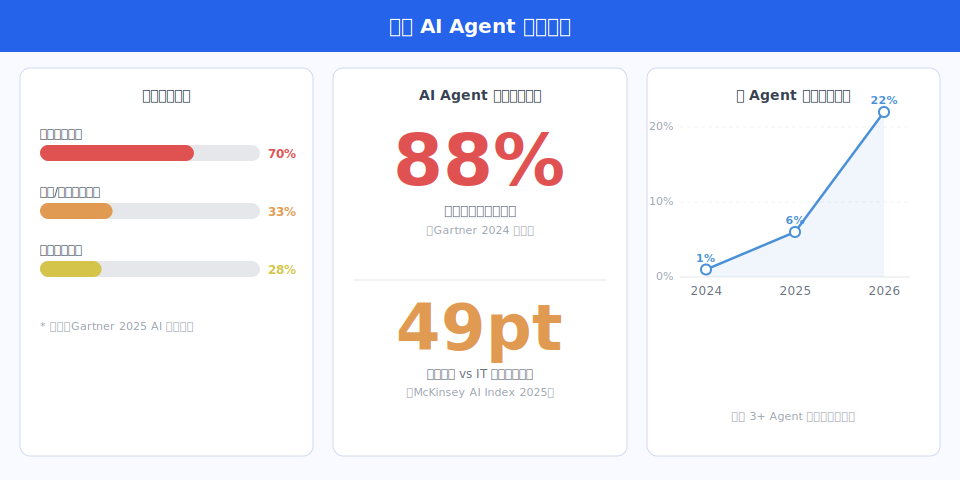
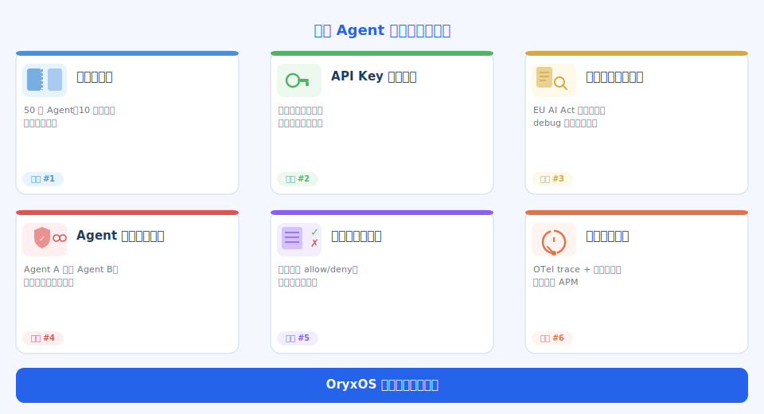

# OryxOS：Agent OS 业界调研

> 我们想做一个开源项目，叫 OryxOS。
>
> OryxOS 是一个企业级 AI Agent 操作系统——不是构建 Agent 的框架，而是运行 Agent 的运行时基础设施。它把多个 AI Agent 当作持久化进程管理，提供隔离、身份、多渠道接入和治理能力。定位是"Agent 应用之下的 OS 层"。
>
> 这份文档是调研的整理。看完之后再决定怎么做、做多大、和现有方案怎么错开。

---

## 一、企业落地 AI Agent 的现状

AI Agent 的落地现状存在一个明显的结构性矛盾：讨论 Agent 的声量极大，而真正跑在生产环境里的 Agent 极少。

Anaconda 和 Forrester 联合调研的数据是：88% 的 Agent 试点项目从未到达生产环境。Gartner 预测到 2026 年底，80% 的企业应用将内嵌至少一个 Agent。但现实是，当前只有 31% 的企业在生产环境中运行 Agent。这个 49 个百分点的缺口不是技术进步的滞后问题，而是系统性的落地阻力。

阻力的具体来源可以从企业端的调研数据里读出来。70% 的企业把"非确定性输出"列为第一阻力——Agent 给出什么答案、触发什么工具调用，企业在部署之前很难预判，部署之后很难审计。33% 的企业指向工具和数据访问权限不足，Agent 访问什么系统、读哪些数据、能不能写入，这些权限边界在现有框架里几乎都需要业务方自己手工维护。治理能力缺失是第三个高频答案：谁授权 Agent 做某件事、每次操作有没有记录、如何在出现问题时快速撤销权限——这些需求用当前主流框架根本无法满足。

监管层面的压力已经落地。EU AI Act 的处罚机制于 2025 年 8 月 2 日正式生效，自主 Agent 系统被明确列入高风险 AI 系统范畴，要求可解释性、可审计性和人工监督接入点。OWASP 在 2025 年 12 月发布了《Agentic AI Top 10》，将 Agent 的工具调用滥用、身份伪造和权限提升列为最高级别风险。Deloitte 2026 年的调研显示，只有 20% 的企业对自主 Agent 具备成熟的治理能力。

多 Agent 编排的趋势进一步放大了这些问题。使用 3 个及以上 Agent 的生产部署占比，从 2024 年的 1%，增长到 2025 年的 6%，再到 2026 年的 22%。单 Agent 时，权限和审计问题还可以靠人工凑合；到了多 Agent 协作场景，Agent 之间的身份验证、调用链追踪、权限传递链，任何一个缺失都可能导致整个系统的行为无法解释。

这个状态定义了一个真实需求：企业不是缺构建 Agent 的工具，而是缺运行 Agent 的基础设施。前者解决"怎么让 Agent 工作"，后者解决"怎么让 Agent 在企业环境里安全、可控地持续运行"。这两件事是不同的工程问题。

---

## 二、主流 Agent 框架的能力矩阵

### 横向对比

| 框架 | Stars（2026 年 Q2） | 语言 | Agent 持久化 | 多租户隔离 | 治理 / 审计 | 多渠道接入 | 企业控制平面 |
|------|---------------------|------|------------|-----------|-------------|-----------|------------|
| Hermes Agent | 131,800+ | Python | 支持（Profile 隔离） | 部分（Profile） | 无 | 20 种平台适配器 | 无 |
| OpenClaw | 250,000+ | TypeScript | 支持（Session） | 无 | 无 | 插件 | 无（已知安全漏洞） |
| LangGraph | 31,900 | Python | 支持（State Persistence） | 无 | 部分（time-travel） | 无 | 无 |
| CrewAI | 51,000 | Python | 部分 | 无 | 无 | 无 | 无 |
| AutoGen / MS Agent | 57,800 | Python | 支持（Actor 模型） | 无 | Azure 绑定 | 无 | Azure 绑定 |

### Hermes Agent（Nous Research）

Hermes Agent 是目前 Agent 领域 GitHub 星数增长最快的项目，131,800 颗星是在 v0.1 发布后 8 周内从 0 积累到的。它的核心设计是三层记忆：Episodic（SQLite FTS5 全文检索）、Semantic（MEMORY.md / USER.md 长期文本记忆）和 Procedural（技能 markdown 过程性知识）。项目最具差异性的声明是内建学习循环："The only agent with a built-in learning loop — it creates skills from experience, improves them during use."

Hermes 在单 Agent 能力上做到了当前开源项目的高水位线。Profile 隔离机制允许同一 Agent 类在不同身份下运行，20 种平台适配器覆盖了 CLI、API、ACP、批处理、Gateway 等接入形态。但 Hermes 的设计单元是"一个 Agent"，多 Agent 编排和企业级多租户隔离不在它的设计域之内。治理能力是结构性缺失：没有 audit log、没有工具调用策略管理、没有跨 Agent 的权限模型。

### OpenClaw

OpenClaw 以 250,000+ 颗星成为 GitHub 上"最多星的非聚合软件项目"，其创始人随后被 OpenAI 收购。OpenClaw 的工程质量很高，Command Queue 设计（全局通道并发 4、会话通道并发 1、子 Agent 通道并发 8）解决了多任务下的竞争问题。Cron Jobs、Heartbeat（每 30 分钟注入 HEARTBEAT.md）和 Event-Driven Webhooks 三种主动机制让 Agent 具备了持续运行的能力。

但 OpenClaw 在企业化方向上的缺口已经被行业明确指出。2026 年 1 月，ClawHub 技能市场被黑客攻击，供应链安全漏洞暴露。安全研究机构 eSentire 的 Alexander Feick 指出："no enterprise control plane capable of expressing fine-grained trust boundaries"。Solo.io 的分析则更具体地列出缺失项："spend caps, merchant safelists, ExtAuth server for centralized authentication"。OpenClaw 是一个强大的 Agent 工具，但它假设的运行环境是受信任的个人工作站，而不是多租户企业环境。

### LangGraph

LangGraph 以 31,900 颗星和 5,400 个 Fork 成为 Python 生态里企业 Agent 编排事实上的生产标准，LinkedIn、Uber、Replit、Elastic 在内的约 400 家企业都在使用。LangGraph 的核心价值在于状态持久化、time-travel 调试和人工介入节点（human-in-the-loop）——这三个能力恰好是企业关心的。

但 LangGraph 的落地成本高：2 到 4 周的典型学习曲线，大规模场景下的内存管理问题，以及"3x slower than direct implementation"的性能基准结论。更重要的是，LangGraph 的设计模型是"工作流图"，它处理的是执行逻辑，而不是 Agent 的生命周期管理。它没有解决多 Agent 的进程隔离、身份管理和跨 Agent 的审计问题。

### CrewAI

CrewAI 51,000 颗星，2024 年 10 月拿到 Insight Partners 领投的 1800 万美元 A 轮，150 家企业客户。CrewAI 在早期落地速度上有优势："production agents in 2 weeks vs 2 months with LangGraph"。但随着业务复杂度增加，CrewAI 的天花板出现：在 6 到 12 个月后，50% 到 80% 的企业用户需要把复杂分支场景迁移到 LangGraph 重写。这个迁移成本是 CrewAI 用户的常见抱怨。

### AutoGen / Microsoft Agent Framework

AutoGen 57,800 颗星，2025 年 10 月并入 Semantic Kernel。v0.4 在 2025 年 1 月重新设计为 Actor 模型，在架构上是这几个框架里最接近分布式系统设计的。但企业级特性几乎全部绑定 Azure：Azure AI Foundry、Azure Container Apps、Azure Monitor。对于不在 Azure 上的企业，AutoGen 的企业能力基本等于不存在。

---

## 三、AI Agent OS 的关键技术能力

我们的调研发现，要构建一个真正意义上的 Agent OS，需要在架构层面做出一系列明确的技术判断。这些判断不是理论推演，而是工程实践中逐步收敛的设计选择。以下是 OryxOS 设计的核心技术判断。

### 架构设计

OryxOS 选择以 Rust workspace 的形式组织代码，单一二进制部署，不依赖 OpenSSL（使用 rustls 实现纯 Rust TLS）。我们选择这种分层 crate 组织的原因是显式控制依赖方向：类型定义层 → Provider 抽象层 → 记忆与 Agent 运行时层 → 渠道与会话层 → API 与编排层。每一层只能向下依赖，横向隔离。

这个分层设计中有一个关键决策：LLM Provider 抽象层是一个纯接口层，支持 14 种 LLM Provider（Anthropic、OpenAI、Gemini、DeepSeek、Ollama 等），任何上层模块通过统一接口调用，不感知具体 Provider。我们选择这种设计，而不是在每个业务模块里直接调用 Provider SDK，是因为 Provider 的可用性和成本是运行时变量，不应该硬编码进业务逻辑。

两种运行模式体现了"OS"的设计意图：Chat 模式是交互式的，Gateway 模式是持久化守护进程——这是 Agent 框架里几乎没有的设计，因为框架的运行单元是"一次执行"，而不是"一个持续存在的进程"。OryxOS 的设计单元是后者。

### LLM 路由

工程实践证明，LLM 路由是 Agent OS 技术含量最高的部分之一。OryxOS 的设计选择三种路由策略覆盖不同场景：Off（直连单 Provider）、Hedge（通过 `tokio::select!` 并发竞速两个 Provider，取先到者）、Lane（基于四因子评分的加权路由：稳定性 0.3、质量 0.3、优先级 0.2、成本 0.2）。

我们选择自动升级机制：当连续 3 次响应的延迟超过基线的 3 倍时，系统自动激活 Hedge 模式并开启 Speculative 队列。Circuit Breaker 机制是：连续 3 次失败则将 Provider 标记为 Degraded 状态。这个设计的工程质量和生产可用性，远超任何一个 Agent 框架的 LLM 调用层。

### 记忆系统

OryxOS 的三层记忆架构设计是：Episodic（redb 嵌入式 KV 数据库 + BM25 关键词检索和 HNSW 近邻向量检索的混合检索）、Long-term（MEMORY.md 长期文本记忆）、Entity Bank（实体知识库）。我们选择 BM25+HNSW 混合检索而不是单纯的语义检索，是因为关键词精确匹配在技术文档、代码片段、命令历史等场景下的召回率远高于纯向量检索，两者组合才能覆盖真实使用场景。

### 工具执行与安全

沙箱设计支持三种后端：bwrap（Linux）、sandbox-exec（macOS）、Docker。工具执行前需要剥离 18 种危险环境变量，防止工具调用带走宿主机凭证。我们选择 Hook 系统支持四个拦截点：`before_tool_call`（可拒绝）、`after_tool_call`、`before_llm_call`、`after_llm_call`，全部通过 Shell 命令实现，使用 JSON stdin/stdout 传参，与语言无关。

工具策略系统（Tool Policy）支持 allow/deny 规则和具名工具组（group:fs、group:runtime、group:web），这是现有主流框架里最接近企业 RBAC 概念的设计。Skills 作为独立可执行文件运行，支持任意语言，通过 stdin/stdout JSON 通信，并有独立的 Skills 注册表。

### Pipeline 与会话

Pipeline 使用 DOT 语言描述 Agent 编排图，支持 human-in-the-loop 门控、AllOrNothing / BestEffort / RetryFailed 三种监督策略。会话持久化为 JSONL 格式，支持 LRU 淘汰、会话 Fork、超过 40 条消息时自动 Compact。

消息队列支持五种模式：followup / collect / steer / interrupt / speculative，覆盖了从简单追问到复杂投机执行的场景。REST API 暴露 `/api/chat`、`/api/chat/stream`、`/api/sessions` 和 Prometheus 格式的 `/metrics`。

### OryxOS 的设计边界

OryxOS 的运行时层聚焦于单机场景：解决"在一台机器上运行数百个专业化 Agent"的问题，多渠道接入覆盖 Telegram、Discord、Slack、WhatsApp、Feishu/Lark、WeCom、WeChat、Email、Twilio、Matrix、QQ Bot 共 12 种渠道。运行时层的设计边界在此止步——它不负责多租户工作空间隔离、集中式 API Key 轮换、跨实例的 Agent 审计和企业 SSO 集成。这些能力属于控制平面层，是 OryxOS 在运行时层之上需要单独构建的部分。这种分层设计使运行时层保持轻量可嵌入，控制平面层可以用不同语言实现并通过 gRPC/REST 与运行时通信。

---

## 四、企业内自建 Agent 平台的真实样本

OKG 公司的内部案例提供了一个观察角度。OKG 的基础设施团队在压力测试平台之下构建了一个叫 `hickwall-agent` 的 Sub Agent，连接到内部的 `multi-agent-server`。这个 Agent 的设计有几个关键决策：Agent Card 声明技能清单、Planner 通过 Nacos 服务发现做路由、主体是无状态 Go 二进制、支持身份传递（identity passthrough）。

重要的是这个系统的构建方式：OKG 的工程师需要从头设计并实现服务注册机制、Agent Card 规范、意图路由逻辑、身份传递链、权限模型——所有这些，用了几个月时间，且这些代码只服务于 OKG 内部的特定业务场景，无法复用。

这个案例不是特例。Stripe、Shopify、Airbnb 的工程博客里都有类似记录：在把 Agent 接入企业内部系统时，业务团队花在"构建 Agent 基础设施"上的时间，往往比"构建 Agent 业务逻辑"本身还长。服务注册、Agent 发现、权限模型、审计链——这些是每家公司都要解决的共性问题，但当前没有开源平台提供这个层次的抽象。

eSentire 在对 OpenClaw 的安全审计报告里给这件事起了一个名字："the enterprise control plane problem"。每家企业最终都在构建一个功能部分重叠的内部 Agent 控制平面，只是实现质量和覆盖范围参差不齐。这是一个典型的基础设施重复建设问题，等待一个通用的开源解决方案出现。

---

## 五、现有方案的共同缺口

把 Hermes、OpenClaw、LangGraph、CrewAI、AutoGen 和现有单机 Agent OS 方案放在一起分析，可以找到一组所有方案共同缺失的能力。这组缺失恰好对应企业落地的最高频阻力。

**多租户工作空间隔离**是第一个缺口。当一家企业运行 50 个 Agent，服务于 10 个不同业务团队时，不同团队的 Agent 实例需要在数据、工具访问、LLM 配额上相互隔离。现有单机运行时的沙箱机制是进程级隔离，不是租户级隔离。其余框架根本没有 Workspace 的概念。

**集中式 API Key 和配额管理**是第二个缺口。企业使用 OpenAI、Anthropic、DeepSeek 等多个模型 Provider，需要统一管理 API Key 轮换、设置每个 Agent 或租户的调用配额、在 Key 泄漏时快速撤销和轮换。现有框架把 API Key 配置放在每个 Agent 实例的配置文件里，这在企业安全要求下不可接受。Solo.io 对 OpenClaw 的批评直接指出了 "spend caps" 缺失——企业需要对每个 Agent 的 LLM 消费设上限，超限自动停止，而不是让 Agent 无限制地消耗 API 配额。

**工具调用审计日志**是第三个缺口。EU AI Act 要求对高风险 AI 系统的每次决策保留可检索的审计记录。OWASP Agentic AI Top 10 的第一个风险项是工具调用的权限滥用（Tool Call Abuse）。但当前所有主流框架的工具调用日志要么是 debug 级别的终端输出，要么根本不存在，没有一个支持结构化、可查询、可导出的审计日志。Hook 拦截机制是最接近的设计，但它仍然依赖用户自行配置 Shell 命令来实现，没有内建的结构化日志存储。

**Agent 身份和 mTLS**是第四个缺口。在多 Agent 系统里，Agent A 调用 Agent B 时，Agent B 需要验证调用方的身份。没有 Agent 身份，就无法构建可信的调用链，也无法在出现问题时追溯到具体是哪个 Agent 做了什么操作。现有框架把 Agent 当作函数调用，而不是有身份的进程实体。

**声明式治理策略**是第五个缺口。企业安全团队需要能够声明"Agent X 不能调用任何写操作工具"、"Business Unit Y 的所有 Agent 只能访问已批准的 API 列表"、"财务相关工具调用需要人工审批"，并且这些策略要能在不重新部署 Agent 的情况下动态更新。工具策略系统（Tool Policy）的 allow/deny 规则和具名工具组是这个方向上最成熟的设计，但策略粒度停在工具组级别，不是企业 RBAC 的完整表达。

**可观测性集成**是第六个缺口。企业有现成的 APM 和日志平台（Datadog、Grafana、ELK、自建系统），希望 Agent 的运行指标能接入这些平台。Prometheus 格式的 `/metrics` 端点是目前做得最好的，但 trace 和 log 的结构化导出还不完整。其余框架基本依靠 LangSmith（LangChain 商业产品）或者不提供。

---

## 六、OryxOS 的差异化定位

OryxOS 的核心定位是：在调研验证的单机 Agent OS 运行时能力之上，增加企业运行时所需的控制平面。

### 定位对比

| 维度 | Agent 框架（LangGraph/CrewAI） | OryxOS 目标 |
| ---- | ------------------------------ | ----------- |
| 设计单元 | 一次执行 | 一个 Agent 租户集群 |
| 持久化 | 状态机 | 会话 + 工作空间级数据隔离 |
| 多租户 | 无 | 工作空间级隔离 |
| 身份模型 | 无 | Agent 证书 + mTLS |
| API Key 管理 | Agent 配置文件 | 集中式 Secret Store |
| 审计日志 | 无 / debug 输出 | 结构化、可查询、内建 |
| 治理策略 | 无 | 声明式 RBAC + OPA |
| 渠道接入 | 无 | 12 种渠道（内建）+ 企业 SSO |
| LLM 路由 | 无 | Hedge + Lane（内建）+ 配额管理 |
| 可观测性 | LangSmith（商业） | OTel 全链路 |
| 部署模式 | 嵌入式库 | 单机 + 多节点 |

### OryxOS 的核心能力边界

OryxOS 运行时层涵盖以下经过工程验证的能力：单机运行数百个 Agent 进程、14 种 LLM Provider 的统一适配、自适应路由（Hedge/Lane/Circuit Breaker）、BM25+HNSW 混合记忆检索、12 种渠道接入、工具沙箱（bwrap/sandbox-exec/Docker）、Hook 拦截机制、DOT Pipeline 编排。这些能力构成 OryxOS 的 Rust 运行时内核，采用 15-crate workspace 组织，不需要在这些方向上重新发明。

OryxOS 在运行时层之上需要补充的是控制平面层：多租户 Workspace 管理（租户注册、隔离边界、资源配额）、集中式 Secret Store（API Key 存储、轮换、范围限制）、Agent 身份系统（证书颁发、mTLS、调用链身份传递）、声明式治理策略（allow/deny 规则、人工审批门控、OPA 策略评估）、结构化审计日志（工具调用记录、LLM 调用记录、策略决策记录，可接入 SIEM）、OTel 全链路追踪（Trace 从渠道接入到工具执行）。

这个分层对 OryxOS 的技术栈有直接含义：Rust 运行时内核负责 Agent 运行时效率，控制平面可以用任何工程团队熟悉的语言实现，两者之间通过 gRPC 或 REST 通信。这种解耦也让 OryxOS 的贡献者社区可以分别在不同层上工作，而不需要每个贡献者都是 Rust 专家。

---

## 七、技术可行性判断

AI Agent OS 的技术可行性已经不是需要论证的问题。一个单机守护进程，同时支持 14 种 LLM Provider、12 种消息渠道、三层记忆体系、工具沙箱隔离——这套架构的每一个组件在工程上都有成熟的实现路径：Rust 的 tokio 异步运行时、redb 嵌入式 KV、tantivy BM25 索引、axum HTTP 框架、bwrap 进程沙箱。OryxOS 要论证的不是"Agent OS 这个想法是否可行"，而是"如何在已有运行时能力之上构建企业控制平面"。

控制平面的各个组件也不是没有参考实现。多租户隔离有 Kubernetes Namespace 模型可以参考；集中式 Secret Store 有 HashiCorp Vault 的设计模式；声明式策略引擎有 OPA（Open Policy Agent）；结构化审计日志有 CNCF 的 CloudEvents 规范；OTel 全链路追踪有完整的开源生态支撑。OryxOS 的控制平面不需要从零发明，需要的是把这些已有的模式组合，并与 Rust 运行时内核通过清晰的 REST API 连接起来。

主要的工程风险在三个地方。第一是 Rust 运行时内核与 Java 控制平面的接口设计——错误的接口会导致两层之间的耦合，使后续扩展困难。第二是多租户下的 Agent 进程隔离粒度——Workspace 级隔离意味着每个租户的 Agent 进程不能共享内存和工具状态，这在单机模式下是可以用 Rust 的所有权系统保证的，但跨节点时需要设计清楚的隔离协议。第三是审计日志的性能影响——每次工具调用都写结构化日志，在高频场景下可能成为瓶颈，需要异步写入和批量落盘设计。

当前开源生态里，没有一个项目同时具备完整的 Agent 运行时能力和企业控制平面能力。hickwall-agent 类型的内部自建项目证明了企业对这个"位置"有真实的需求，但没有人填上它。OryxOS 的机会就在这里。
