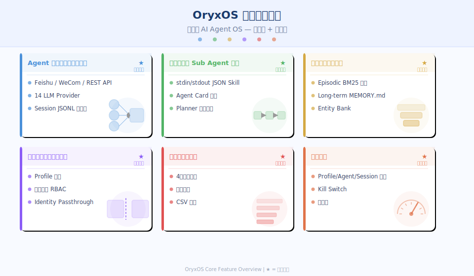
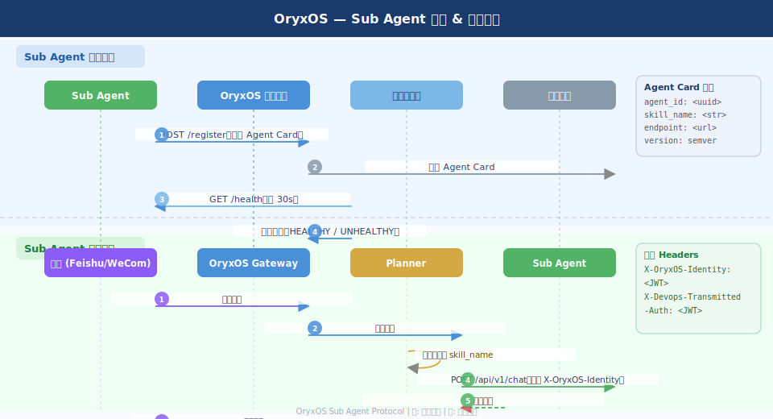

# OryxOS：项目需求文档

> 本文档说明 OryxOS 的功能需求。功能分三档：核心功能训练营 3 周内完成，课后作业训练营期间完成，社区共建功能作为长期方向开放。
>
> 本文档定义 What，How 在《OryxOS 项目技术方案文档》中展开。

## 一、项目概述

OryxOS 是一个开源的 AI Agent OS，企业级 runtime 平台，以持久进程的方式管理多个 AI Agent。它增加企业落地必需的多租户隔离、治理审计和管控平面能力——在工程可行性上，AI Agent OS 的核心运行时架构已经经过验证，OryxOS 在这套经过验证的架构上补上企业落地必需的治理层。

这个项目存在的理由，有三层。

**第一层是企业 AI Agent 落地的真实困境。** Gartner 2025 年的数据显示，88% 的 AI Pilot 项目无法进入生产，McKinsey 的调研记录了大型企业的实际感受与 IT 交付能力之间存在 49 分的认知差距。不是需求不真实，是基础设施没跟上。企业希望用 AI Agent 替代或增强特定业务流程——压测排查、HR 问答、客服接待、代码审查——但部署一个 Agent 进企业内网，涉及的问题从来不是"模型够不够好"，而是：这个 Agent 能不能和企业身份体系打通？HR 的 Agent 看到的数据，销售的员工能不能看到？谁调用了这个 Agent、调用了什么工具、消耗了多少 token，有没有可查的记录？一个 Agent 出问题了，能不能在不重新部署的情况下立刻关掉它？这四个问题，是开源社区的个人级 AI Agent 框架没有办法回答的。OryxOS 想把这四个问题的答案固化成平台能力。

**第二层是 AI Agent OS 架构的价值与边界。** 业界在这个方向上已有相对成熟的工程探索，证明 AI Agent OS 这套架构可以跑起来：Gateway 模式常驻多渠道接入、14 个 LLM Provider 的自适应路由、BM25+HNSW 混合检索的三层记忆体系、bwrap/sandbox-exec 沙箱隔离、Hooks 机制、DOT-based Pipeline 编排、Prometheus 指标——这套架构已经相当完整，个人使用或小团队使用没有明显的缺口。但企业部署场景下，通用 Agent 运行时缺三样东西：第一，没有 Profile/租户隔离，所有 Agent 共享一个全局空间，不同部门的数据天然互通；第二，没有 Sub Agent 注册协议，各团队自建的领域 Agent（比如 hickwall-agent 这种专门做压测的 Sub Agent）没有统一的发现和路由机制；第三，没有治理层，Agent 的每一次工具调用、LLM 调用、数据访问都没有可查的日志，合规场景下无法审计。OryxOS 的定位是：补上这三样，不重新发明 Agent 运行时，而是做企业治理层。

**第三层是工程训练的价值。** OryxOS 是一个多语言项目：Agent 运行时核心用 Rust 实现，追求性能和安全性；企业治理层（Profile 管理、审计日志、管控平面 Web 界面）用 Java/Spring Boot 实现，复用 Java 生态成熟的企业级能力。在训练营里，这是"Rust 系统编程 + Java 企业服务 + 跨语言 API 协作"的完整实战组合。学员练的不只是某个框架，而是在多语言项目里分解职责、设计接口边界、完成端到端集成的工程能力。

## 二、设计目标

OryxOS 的主目标是给企业提供一个可以托管多个 AI Agent 的运行时平台，支持按部门/团队隔离，具备完整的治理审计能力，有管控平面可以在不重新部署的情况下管理 Agent 的生命周期。

几件事 OryxOS 明确不做：

- **不替代 LLM Provider**：OryxOS 调用外部 LLM，不训练或服务模型，这是 OpenAI、DashScope、DeepSeek 的事
- **不是 Agent 构建框架**：用 LangGraph、CrewAI 或其他 Pipeline 框架构建 Agent 的工作不在 OryxOS 的范围内，OryxOS 是运行和管理已构建 Agent 的平台
- **不是 SaaS 多租户平台**：这里的"多租户"指一个企业内部按部门/团队的隔离，不是"一套安装服务多个公司"的 SaaS 架构，后者是完全不同的问题
- **不从零重建 Agent 运行时**：Gateway 常驻进程、多层记忆体系、沙箱隔离、Hook 拦截机制、Pipeline 编排——这些运行时核心能力的工程可行性已经充分验证，OryxOS 以这些经过验证的运行时模式为基础，而不是重写它
- **不做全栈 AI 应用平台**：知识库 RAG 管理、Prompt 工程、模型微调、可视化 Workflow 编排这些是 Dify 的范畴，OryxOS 专注 Agent 运行时和治理层

OryxOS 的核心价值在于四个字：**"跑进企业"**。让企业能够把自建的 AI Agent 以符合 IT 治理要求的方式部署进内网，有隔离、有审计、有管控，而不是用一个调试工具勉强撑着生产流量。

## 三、核心功能

### 3.1 Agent 运行时与多渠道接入

★ 核心阶段

当前企业内部的 AI 使用方式分散而割裂：员工在 ChatGPT 的网页上问问题，开发者在自己的脚本里直接调 API，业务部门在不同的 SaaS 工具之间切换。这些方式的共同问题是：没有统一入口，Agent 的能力无法复用，访问行为无从追踪。Gateway 模式解决了这个问题的技术层面：一个常驻进程，同时监听多个渠道的消息，每个渠道的请求都进入同一个 Agent 运行时处理。

OryxOS 基于 Gateway 模式实现运行时核心。平台以持久进程形式运行，同时接入多个消息渠道：Telegram、Discord、Slack、Feishu/Lark、WeCom（企业微信）、WeChat、Email、WhatsApp 以及 Twilio SMS。每个渠道对应一个独立的 Channel Adapter，适配各渠道的消息格式差异，统一转换为平台内部的消息结构后进入处理队列。渠道与 Agent 的映射关系在配置里维护，支持一个 Agent 同时服务多个渠道，也支持不同渠道路由到不同 Agent。

LLM 路由是运行时的核心调度能力。OryxOS 适配了 14 个主流 LLM Provider，并提供两种路由模式：Hedge 模式并发发送请求到多个 Provider 取最快响应，Lane 模式按优先级顺序尝试 Provider 形成 Failover 链。OryxOS 保留这套路由机制，在企业场景下加入 Provider 级别的熔断器——当某个 Provider 连续失败超过阈值时自动标记为不可用，路由时跳过，待恢复探针确认后自动重新加入可用列表。每次 LLM 调用的结果（Provider、模型、输入输出 token、延迟）记录到审计系统。

Session 管理采用 JSONL 持久化方案。每个 Session 对应一个 JSONL 文件，记录完整的对话历史。支持 Session Fork（从某个历史节点创建新分支）和 Session Compaction（摘要压缩历史，控制 Context 长度），每个渠道连接维护独立的 Session 上下文，渠道间互不干扰。在 OryxOS 的多租户扩展下，Session 归属到 Profile，跨 Profile 的 Session 天然隔离。

3 周核心阶段实现：Gateway 常驻进程（Rust 实现）、Feishu/Lark 和 WeCom 两个企业渠道 Adapter（优先级高于个人渠道）、OpenAI + DashScope + DeepSeek 三个 LLM Provider 路由与熔断、Session JSONL 持久化与 Fork 支持、REST API 接入（支持 OpenAI 兼容格式）。

☆ 课后作业：补全 Telegram、Slack、Discord、Email 等更多渠道 Adapter；Hedge 模式并发路由；Twilio SMS 接入；Session Compaction 自动触发策略。

### 3.2 技能系统与 Sub Agent 协议

★ 核心阶段

技能（Skill）是 OryxOS 里最重要的扩展机制之一：任何语言写的可执行文件，只要接受 stdin JSON 输入、输出 stdout JSON，就是一个合法的 Skill。这个设计的价值在于无语言绑定——Python 脚本、Go 二进制、Shell 脚本、Rust 程序都可以作为 Skill，AI Agent 调用 Skill 和调用命令行工具没有本质区别。

在 Skill 系统的基础上，OryxOS 增加了 Sub Agent 协议，这是面向企业的核心扩展。hickwall-agent 提供了一个真实的参照：一个专门做压测分析的领域 Agent，对外暴露 `/.well-known/agent-card.json`，描述自己的能力、支持的 skill_name 列表、调用地址；调用时发送 `POST /api/v1/chat`，请求体里的 `contextInfo.skill_name` 字段告诉 Agent 该调用哪个领域能力；身份透传通过 `X-Devops-Transmitted-Auth` Header 完成，下游 Agent 拿到的是用户的真实身份，而不是平台的服务账号。

OryxOS 把这个模式标准化为 Sub Agent 协议：

Agent Card 规范定义了 Sub Agent 的自描述格式，JSON 结构，必须暴露在 `/.well-known/agent-card.json`。Card 里包含：Agent 标识（id、name、version）、能力描述（自然语言，供 Planner 匹配意图）、支持的 skill_name 列表、调用地址、健康检查地址、鉴权方式。任何团队按这个规范实现一个 HTTP 服务，就完成了 Sub Agent 的接入。

注册与发现：Sub Agent 启动时向 OryxOS 的注册中心注册 Agent Card，注册中心支持两种实现——内置轻量注册表（适合小规模部署）和 Nacos 对接（适合已有 Nacos 的企业）。注册信息包含 Agent Card 内容和健康状态，注册中心定期对注册的 Sub Agent 发起健康检查，失联超过阈值的 Agent 自动标记为不可用。

Planner 路由：用户的请求进入 OryxOS 后，Planner 负责把用户意图匹配到正确的 Sub Agent。匹配策略先走关键词精确匹配（对应 skill_name），再走向量语义匹配（对应 Agent 的能力描述），最后 fallback 到 Default Agent。路由结果可在管控平面查看和干预——运维人员可以查看每次路由决策，也可以手动配置规则覆盖自动匹配。

工具策略（Tool Policy）采用 allow/deny 机制，每个 Sub Agent 在注册时声明需要的工具访问权限，平台管理员审批后生效。运行期通过 Hooks 机制（before_tool_call 可拒绝、after_tool_call 可记录）在每次工具调用前后插入审计逻辑。

3 周核心阶段实现：Skill 执行框架（stdin/stdout JSON 协议、任意语言支持）、Agent Card JSON 规范与内置注册中心、Sub Agent 注册与健康检查、Planner 关键词路由（语义路由作为课后）、identity passthrough Header 规范、Tool Policy allow/deny 基础实现、before_tool_call Hook 审计拦截。

☆ 课后作业：Planner 向量语义路由；Nacos 注册中心对接；Skill 版本管理（同一 Skill 多版本共存，灰度切换）；Skill 共享市场（团队间共享 Skill 包）。

### 3.3 记忆与上下文管理

★ 核心阶段

Agent 的记忆管理是长对话质量的决定性因素，也是企业场景下数据隔离的关键边界。OryxOS 实现了三层记忆体系，并加入 Profile 级别的隔离。

Episodic Memory（情节记忆）存储对话片段，检索时采用 BM25 关键词匹配与 HNSW 向量最近邻搜索的混合策略。BM25 擅长处理精确的关键词和专有名词，HNSW 擅长处理语义相近但措辞不同的内容，两者组合的 Recall 显著优于单一策略。每次 LLM 调用前，系统自动检索相关的历史片段拼入 Context，超出 Context 窗口时按相关性排序截断。

Long-term Memory（长期记忆）对应 MEMORY.md 机制：Agent 在对话结束时（或触发条件满足时）将重要信息提炼写入结构化的长期记忆文件。这个文件在后续对话开始时自动加载进 System Prompt，让 Agent 跨 Session 保持对用户偏好和上下文背景的认知。

Entity Bank（实体库）存储用户提到的实体及其属性（人名、项目名、技术术语），支持跨 Session 的实体关联查询，防止 Agent 在不同对话里对同一实体的理解出现矛盾。

在 OryxOS 的多租户架构下，三层记忆全部按 Profile 隔离。Profile A 的对话片段不会出现在 Profile B 的检索结果里，Long-term Memory 文件按 Profile 存储，Entity Bank 也按 Profile 分区。这不是通过应用层过滤实现的软隔离，而是存储层的物理分区——不同 Profile 的数据写入不同的索引或命名空间，即使查询出 bug，也不会跨界。

3 周核心阶段实现：Episodic Memory BM25 检索（HNSW 作为课后增强）、Long-term Memory MEMORY.md 持久化与 System Prompt 注入、Per-Profile 记忆物理隔离、Session 内 Context 窗口管理与截断策略。

☆ 课后作业：BM25+HNSW 混合检索完整实现；Long-term Memory 自动提炼触发策略优化；Entity Bank 跨 Session 实体关联；记忆导出与迁移（Profile 迁移时携带历史记忆）。

### 3.4 多租户隔离与权限管理

★ 核心阶段

企业部署 AI Agent 平台最先碰到的问题是数据边界。HR 部门的 Agent 接入了员工档案系统，财务部门的 Agent 接入了报销系统——这两个 Agent 必须运行在同一个平台实例里（运维成本），但它们绝对不能相互看到对方的数据和对话历史（安全要求）。早期 AI Agent 运行时设计通常面向个人或小团队，没有 Profile 层的概念，所有 Agent 和 Session 共享同一个全局空间。OryxOS 补上这一层。

Profile 是 OryxOS 多租户模型的核心单元，对应企业内部的一个团队或部门。每个 Profile 拥有完全独立的资源空间：自己的 Agent 列表、Skill 列表、Memory 存储（三层全部隔离）、Session 历史、Tool Policy 配置、渠道配置。Platform Admin 创建和管理 Profile；每个 Profile 有至少一个 Profile Admin，负责管理本 Profile 的 Agent、成员和 Skill，Profile Admin 无法看到或操作其他 Profile 的任何资源。普通成员只能使用本 Profile 的 Agent，看不到配置和历史数据。

资源配额是企业关心的成本管控机制。每个 Profile 可配置三个维度的配额：每日 LLM 调用次数上限、每月 Token Budget（input + output 分别计算）、最大并发 Session 数。配额达到上限后，Profile 内的新请求收到明确的超限响应，不会静默失败。Platform Admin 可以实时查看各 Profile 的配额消耗情况，可以在不重启的情况下调整配额。

Identity Passthrough 是企业场景下比隔离更难处理的问题。当 Feishu 用户"张三"通过企业 Lark 机器人向 OryxOS 发送请求，请求链路是：Lark → OryxOS → Sub Agent → 下游工具（比如 Jira API）。下游工具需要知道是"张三"在发起调用，而不是 OryxOS 的服务账号——否则 Jira 的操作日志里全是同一个机器人账号，个人权限控制形同虚设。OryxOS 实现了沿 hickwall-agent 的 `X-Devops-Transmitted-Auth` 模式标准化的 Identity Passthrough：用户在渠道层的身份（渠道 ID + 渠道类型）经过平台验证后，转换为企业统一身份（通过 OIDC/OAuth2），以标准 Header 的形式传递到 Sub Agent 调用链的每一跳。下游工具可以直接从 Header 里提取用户身份，按用户自身的权限决定可见数据范围，不依赖平台做二次过滤。

3 周核心阶段实现：Profile CRUD（创建/修改/停用）、Profile 内资源完全隔离（Agent/Session/Memory/Skill）、Platform Admin 和 Profile Admin 两级角色、三维配额（LLM 次数/Token Budget/并发 Session）与超限拦截、渠道身份到企业统一身份的映射、Identity Passthrough Header 注入（兼容 hickwall-agent 的 `X-Devops-Transmitted-Auth` 模式）。

☆ 课后作业：Profile 级别的 IP 白名单（仅允许指定来源 IP 的请求）；企业 OIDC/SSO 对接（Lark、WeCom 企业账号体系直接映射到 Profile 成员）；配额预警通知（接近上限时推送 Lark/WeCom 消息）；跨 Profile 共享 Skill（只读共享，不暴露 Profile 数据）。

### 3.5 治理与审计日志

★ 核心阶段

金融、医疗、政务类企业引入 AI Agent 的必要前提是：能说清楚 Agent 干了什么。EU AI Act 对高风险 AI 系统要求完整的操作日志和人类监督机制；OWASP Agentic AI Top 10 里，"Prompt Injection"和"Excessive Agency"这两个高危风险的缓解措施都依赖运行期的操作日志。没有审计日志，安全团队无法评估 Agent 的实际行为，合规团队无法向监管机构证明平台在合规边界内运行，出了事故也无法溯源。

OryxOS 把审计日志设计为平台的一等公民，而不是事后叠加的功能。每一类 Agent 操作都有对应的审计事件类型：

LLM 调用事件记录：调用发起时间、Profile ID、Agent ID、Session ID、用户身份、Provider、模型名、输入内容摘要（不存原始内容，存 hash，防止敏感内容明文落库）、输出内容摘要、input token 数、output token 数、延迟、结果状态（success/error/timeout）。

工具调用事件记录：工具名称、调用参数（结构化记录，敏感字段脱敏）、调用结果（成功/拒绝/失败）、是否被 before_tool_call Hook 拦截及原因、执行耗时。这里的"工具"包括 Skill 调用、Sub Agent 调用和任何外部 API 调用。

渠道消息事件记录：消息来源渠道、用户身份（渠道 ID + 已映射的企业身份）、消息时间、路由到哪个 Agent、Session ID。消息内容本身不存储（隐私考虑），只记录摘要 hash 和 token 长度。

管理操作事件记录：Platform Admin 和 Profile Admin 的所有管理操作——Profile 创建/修改/停用、Agent 配置变更、Tool Policy 变更、配额调整、Kill Switch 操作——操作人、时间、操作内容完整记录。

审计日志写入必须走异步通道，不阻塞 Agent 请求的主处理路径，写入延迟不允许叠加到用户感知的响应延迟上。存储独立于 Agent 运行时数据库，按时间分区，默认保留 90 天，保留策略可配置。查询接口支持多维度组合过滤：Profile、Agent、用户身份、事件类型、时间范围，结果支持分页查询和 CSV 导出，导出文件满足合规取数需求。

3 周核心阶段实现：四类审计事件完整埋点（LLM 调用/工具调用/渠道消息/管理操作）、异步写入通道（不阻塞主流程）、独立存储+时间分区、多维度查询 API、管控平面审计查询页+CSV 导出、敏感内容 hash 化处理。

☆ 课后作业：审计日志完整性校验（签名链，防篡改）；Token 成本按 Profile/用户维度的月度报表；异常行为检测（同一用户短时大量 LLM 调用触发告警）；Lark/WeCom 告警通知集成。

### 3.6 管控平面

★ 核心阶段

一个 AI Agent 平台必须有运维人员可以直接操作的控制界面，否则任何配置变更都需要改文件、重启服务，出了问题也只能靠日志排查，这在生产环境里是不可接受的。简单的 Agent Dashboard 通常没有企业管控的概念——没有 Profile 管理、没有 Agent 生命周期控制、没有实时配额监控。OryxOS 的管控平面是独立的 Spring Boot 服务，通过 REST API 与 Agent 运行时通信，前端用 React + Ant Design，适合企业内部工具的风格和使用习惯。

**Profile 管理页**是 Platform Admin 的主要工作区域。页面展示所有 Profile 的列表，包含每个 Profile 的状态（active/suspended）、成员数、Agent 数、当日 LLM 调用量、当日 Token 消耗量。点入 Profile 详情可以管理成员（添加/移除/设置角色）、查看 Agent 列表、调整配额、查看该 Profile 近期的审计日志摘要。Profile Admin 登录后看到的是自己 Profile 的子视图，无法访问其他 Profile 数据。

**Agent 监控页**提供所有运行中 Agent 的实时状态视图：Agent 名称、归属 Profile、当前活跃 Session 数、过去 1 小时的 LLM 调用 QPS、当前绑定的 LLM Provider、健康状态、最后一次调用时间。Sub Agent 注册表在这个页面也有入口：显示所有已注册的 Sub Agent、Agent Card 摘要、健康状态、路由命中次数。Kill Switch 操作直接在这个页面执行——勾选一个或多个 Agent，点击"停用"，立即生效，运行中的 Session 收到中止信号，新请求被拒绝，整个过程不需要重新部署。Kill Switch 操作本身记录到审计日志。

**Session 监控页**显示当前所有活跃 Session 的列表，可按 Profile、Agent、渠道筛选。每个 Session 展示：Session ID、所属 Profile、对应 Agent、渠道来源、用户身份、Session 起始时间、当前 Context 长度、累计 Token 消耗。管理员可以对单个 Session 执行强制结束操作（Human-in-the-Loop 干预）。

**实时指标页**展示平台级别的 Prometheus 格式指标可视化：全局 LLM 调用 QPS 折线图、各 Profile 的 Token 消耗占比饼图、Top 5 Token 消耗用户列表、各 LLM Provider 的可用状态与响应延迟分布、工具调用成功率。指标数据每 30 秒刷新一次，支持切换时间窗口（最近 1 小时/6 小时/24 小时）。

**热配置页**提供不需要重启服务就能修改的配置项管理界面：Agent 的 System Prompt 编辑（即时生效，新 Session 使用新 Prompt，老 Session 保持不变）、Tool Policy 规则编辑（allow/deny 列表）、LLM 路由规则编辑（Provider 优先级、Failover 链）、Planner 路由规则手动覆盖（强制指定某类请求路由到某个 Sub Agent）、Profile 配额实时调整。配置变更操作全部记录到管理操作审计日志。

3 周核心阶段实现：Profile 管理页（列表/详情/成员管理/配额调整）、Agent 监控页（状态列表/Kill Switch）、Session 监控页（活跃 Session 列表/强制结束）、实时指标页（基础 QPS/Token 消耗图表）、热配置页（System Prompt/Tool Policy 编辑）、管控平面独立部署（不与 Agent 运行时耦合）。

☆ 课后作业：Sub Agent 注册表可视化管理（在管控平面手动注册/注销 Sub Agent）；Planner 路由决策可视化（每次路由的决策过程可查）；审计日志告警规则配置界面；性能历史趋势图（7 天/30 天）。

## 四、3 周交付范围

### 4.1 3 周内核心功能清单

下表是 OryxOS 训练营 3 周内必须完成的交付范围，选取原则：企业落地最高优先级 + 工作量在 3 周内可完成 + 有清晰的验收标准。

| 功能模块 | 子功能 | 工作量估算 |
|----------|--------|-----------|
| Agent 运行时 | Gateway 常驻进程、Feishu+WeCom Channel Adapter、3 个 LLM Provider 路由与熔断、Session JSONL 持久化、REST API | 6 天 |
| 技能系统与 Sub Agent | Skill 执行框架（stdin/stdout）、Agent Card 规范与内置注册中心、Sub Agent 注册与健康检查、Planner 关键词路由、Tool Policy + before_tool_call Hook | 5 天 |
| 记忆管理 | Episodic Memory BM25 检索、Long-term Memory MEMORY.md、Per-Profile 记忆隔离、Context 窗口管理 | 4 天 |
| 多租户隔离 | Profile CRUD、Profile 内资源隔离、两级角色权限、三维配额+超限拦截、Identity Passthrough | 5 天 |
| 治理与审计 | 四类审计事件埋点、异步写入、独立存储、多维度查询 API+CSV 导出 | 4 天 |
| 管控平面 | 5 个核心管理页面（Profile/Agent/Session/指标/热配置）、前端 React + 后端 Spring Boot API | 5 天 |
| 环境与文档 | Docker Compose 一键启动、集成测试（端到端验收场景）、API 文档 | 3 天 |

总计约 32 个有效工作日，3 周训练营节奏（每周约 10 个有效工作日）可以覆盖。

### 4.2 3 周内不做的功能

以下功能有价值，但工作量偏大，或依赖核心能力先稳定后扩展，列为课后作业或社区共建：

| 功能 | 原因 |
|------|------|
| HNSW 向量检索（记忆系统） | BM25 先行，HNSW 是增强，工作量独立 |
| Planner 语义路由 | 关键词路由覆盖核心场景，语义路由需要嵌入模型部署 |
| Nacos 注册中心对接 | 内置注册表满足训练营验收，Nacos 对接是生产增强 |
| 企业 OIDC/SSO 集成 | 渠道身份映射已实现，完整 OIDC 流程独立工作量 |
| Hedge 模式并发路由 | Lane 模式覆盖核心 Failover 场景，Hedge 是性能增强 |
| 审计日志完整性校验 | 基础审计稳定后补，不影响核心合规需求 |
| Lark/WeCom 告警通知 | 依赖企业账号配置，验收环境不确定性高 |
| Skill 共享市场 | 需要版本管理基础，属于平台生态扩展 |
| Kubernetes Operator | 云原生部署增强，不影响 Docker Compose 验收 |
| MCP Server 暴露 | 实验性功能，优先级低于企业治理核心 |

### 4.3 验收标准

3 周结束时，OryxOS 核心版本需满足以下可验证的标准：

**运行时与渠道接入：** 在 Feishu 企业机器人里向 OryxOS 发送消息，Agent 正确响应，响应内容调用了配置的 LLM（可切换 OpenAI/DashScope），Session 历史在服务重启后仍然保留。

**Sub Agent 协议：** 启动一个按 Agent Card 规范实现的 Demo Sub Agent（参照 hickwall-agent 模式），在 OryxOS 注册后，向 Agent 发送包含对应 skill_name 的请求，Planner 正确路由到该 Sub Agent，调用结果携带原始用户身份（Identity Passthrough Header 验证）。

**多租户隔离：** 创建 Profile A 和 Profile B，分别配置不同的 Agent 和 Session 历史。Profile A 的用户无法看到 Profile B 的 Agent 列表和 Session 历史。为 Profile A 设置每日 LLM 调用上限为 10 次，第 11 次调用收到明确的超限响应。

**审计日志：** 完成上述验收场景的操作后，管控平面的审计日志页可查到：渠道消息事件（包含用户身份和路由结果）、LLM 调用事件（包含 token 消耗）、工具调用事件（如有）、管理操作事件（Profile 创建和配额设置）。按 Profile A 过滤后，只显示 Profile A 的事件。导出 CSV，格式符合预期。

**管控平面：** Kill Switch 操作：在管控平面停用一个 Agent，立即向该 Agent 发送请求，收到拒绝响应；在管控平面重新启用，请求恢复正常。热配置：修改 Agent 的 System Prompt，新 Session 使用新 Prompt，管控平面审计日志记录该修改操作。

## 五、课后作业清单

以下功能在训练营期间作为课后作业完成，学员在 3 周核心功能基础上逐步扩展：

**Week 1 课后：**
- [ ] Telegram 和 Slack Channel Adapter（基于已有 Adapter 框架快速实现）
- [ ] Planner 路由日志可视化（在管控平面查看每次路由决策链路）
- [ ] Session Compaction 自动触发（Context 超过阈值时自动摘要压缩）

**Week 2 课后：**
- [ ] BM25+HNSW 混合检索（Episodic Memory 检索质量增强）
- [ ] Nacos 注册中心对接（替代内置注册表，适配已有 Nacos 的企业）
- [ ] 企业 OIDC 集成（Feishu/WeCom 企业账号与 Profile 成员自动映射）
- [ ] 审计日志 Token 成本报表（按 Profile/用户的月度消耗统计）

**Week 3 课后：**
- [ ] Planner 语义路由（基于嵌入向量的意图匹配）
- [ ] Hedge 模式 LLM 并发路由（多 Provider 并发取最快响应）
- [ ] 配额超限 Lark/WeCom 通知推送
- [ ] Sub Agent Skill 共享（跨 Profile 只读 Skill 共享机制）

## 六、社区共建方向

以下功能不在训练营主线计划内，作为长期方向开放给社区贡献：

**更多渠道 Adapter：** WhatsApp Business API、Email（SMTP/IMAP）、Twilio SMS、Discord、Microsoft Teams，由有具体渠道接入需求的社区成员贡献对应 Adapter。

**更多 LLM Provider：** Anthropic Claude、Google Gemini、Mistral、本地 Ollama、Azure OpenAI，对应不同地区和企业选型偏好，每个 Provider 适配是独立贡献单元。

**Kubernetes Operator：** 把 OryxOS 的部署、Profile 扩容、配置热更新工程化成 K8s CRD，让平台真正融入企业的云原生基础设施。Operator 的 Profile 对应 K8s Namespace 隔离，Agent 对应 Deployment，Kill Switch 对应 K8s Scale to Zero。

**MCP Server 暴露：** 把 OryxOS 管理的 Agent 能力暴露为 MCP Server，让 Claude Desktop、Cursor 等 MCP 客户端可以直接调用企业部署的 Agent，这是 AI 时代企业内部知识和工具能力的新分发方式。

**多语言 Skill SDK：** Skill 协议（stdin/stdout JSON）本身语言无关，但有 SDK 能降低实现成本。社区可以贡献 Python、Go、TypeScript、Java 的 Skill SDK，包含协议封装、错误处理、日志格式标准化。

**Sub Agent SDK：** 标准化 Agent Card 生成、注册流程、Identity Passthrough Header 解析，降低各语言栈团队实现 Sub Agent 的门槛。参照 hickwall-agent 的 Java 实现，可贡献 Go、Python、TypeScript 版本。

**企业 IdP 对接扩展：** OryxOS 核心阶段实现 Feishu/WeCom 企业身份接入，社区可扩展 DingTalk（钉钉）、Azure AD、Okta、GitHub Enterprise 等更多企业 IdP，覆盖不同企业的 SSO 选型。

**可观测增强：** Grafana Dashboard 模板（OryxOS 专属，开箱即用）、OpenTelemetry trace 导出（Agent 调用链接入企业已有 APM）、Prometheus Alert 规则预置包。

## 七、非功能需求

**性能**

| 指标 | 目标 |
|------|------|
| 渠道消息处理延迟（P99） | 入队到 Agent 开始处理 < 100ms |
| LLM 路由额外开销 | OryxOS 路由层引入的额外延迟 < 20ms |
| 审计日志写入延迟（异步） | 不阻塞主流程，异步队列处理延迟 < 500ms |
| Tool Policy 检查延迟 | < 5ms（内存判断，不走数据库） |
| 单节点并发 Session | ≥ 500 个并发活跃 Session |
| Sub Agent 注册中心心跳 | 30s 间隔，失联 3 次标记不可用 |

**安全**

| 约束 | 要求 |
|------|------|
| Skill 沙箱 | 沿用 bwrap/sandbox-exec 机制，18 个危险环境变量强制清除 |
| Sub Agent 通信 | 仅允许 HTTPS，证书验证不可跳过；内网可配置 mTLS |
| 身份透传 | Identity Passthrough Header 必须经过平台签名，防止 Sub Agent 侧伪造 |
| 审计日志 | 写入后不可删除（通过 DB 权限控制，只有 TTL 到期才清理）；导出操作本身记录到审计 |
| Profile 隔离 | 存储层物理分区，应用层再做 Profile ID 校验，双重保障 |
| 管控平面 | RBAC 强制校验，所有写操作需二次确认（Kill Switch、Profile 停用） |
| 敏感内容 | LLM 输入输出不明文落库，存 hash；Skill 调用参数里的密码类字段自动脱敏 |

**可运维性**

- Docker Compose 一键启动，覆盖全部依赖（运行时 + 管控平面 + 存储），首次启动不需要手工初始化步骤
- 支持滚动升级不中断 Session，Agent 运行时升级时已有 Session 不丢失
- 配置变更（System Prompt、Tool Policy、LLM 路由规则、配额）全部支持热更新，不需要重启服务
- Kill Switch 对 Agent 生效时间 < 1 秒（从管控平面点击到新请求被拒绝）
- Profile 级别的数据备份：导出一个 Profile 的全部数据（Agent 配置、Session 历史、Memory），支持恢复到新实例
- 健康检查接口（`/actuator/health`），供 Kubernetes liveness/readiness probe 使用

## 八、总结

OryxOS 做一件事：让企业能够真正把 AI Agent 跑进生产。

Gateway 常驻、多渠道接入、BM25+HNSW 混合记忆、bwrap 沙箱、Hooks 拦截、Pipeline 编排，这些运行时能力是 OryxOS 的基础层，OryxOS 在此之上补上企业落地缺的那四样：Profile 多租户隔离、Sub Agent 注册协议、治理审计日志、管控平面。

hickwall-agent 是一个具体的证据，说明企业确实在以 Sub Agent 模式构建领域 AI 服务——压测分析、HR 问答、代码审查，每个团队构建自己的领域 Agent，然后需要一个平台来托管、路由、治理这些 Agent。OryxOS 是那个平台。

OryxOS 是企业级 AI Agent OS，在通用 Agent 运行时能力之上，多了 Profile 隔离、Sub Agent 协议、审计日志、管控平面这四层，少了在企业内部不需要的个人化配置灵活性，换来的是 IT 部门愿意批准部署的合规性和可管控性。

训练营 3 周内完成六大核心模块的可验证版本：Agent 运行时 + 双企业渠道接入、Skill 系统 + Sub Agent 协议、三层记忆 + Profile 隔离、多租户配额与 Identity Passthrough、完整审计日志、五页管控平面。课后补齐更多渠道、语义路由、OIDC 集成等扩展能力。Kubernetes Operator、MCP Server 暴露、多语言 Sub Agent SDK、更多 LLM Provider 和 IdP 对接作为长期社区共建方向。
