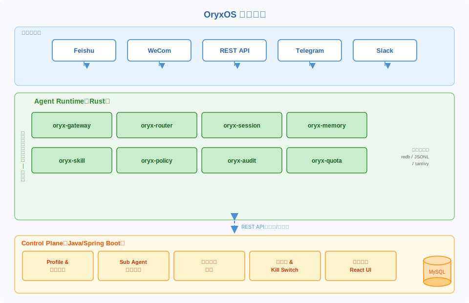
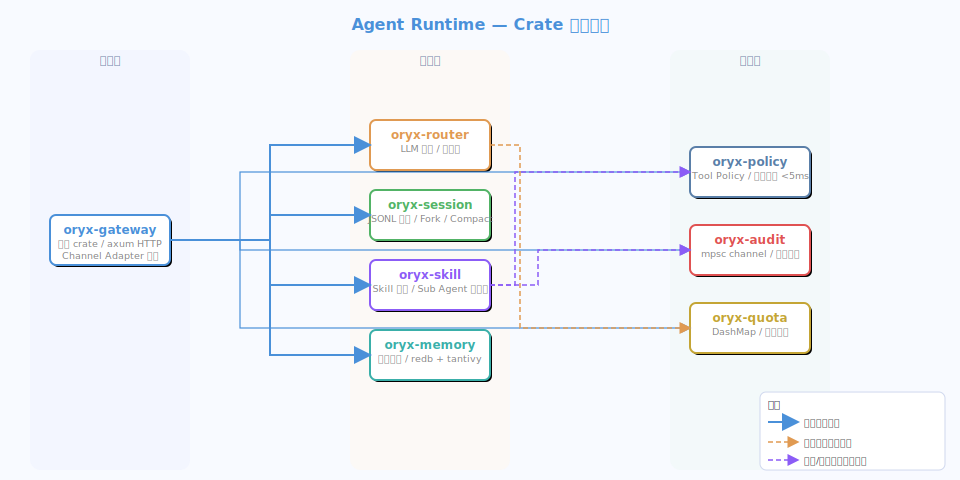
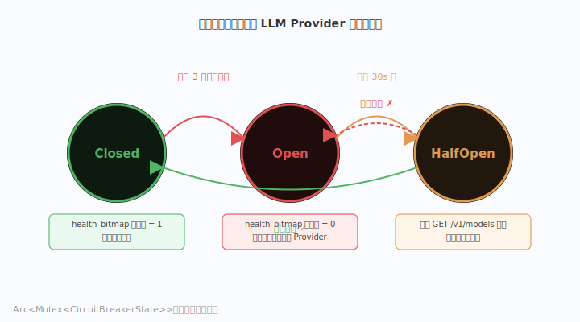
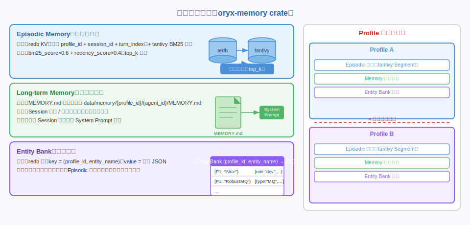
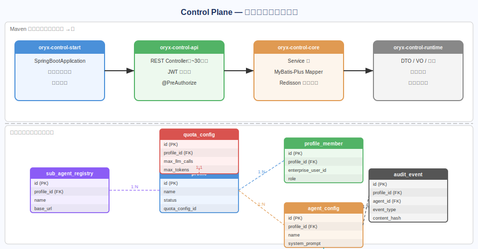
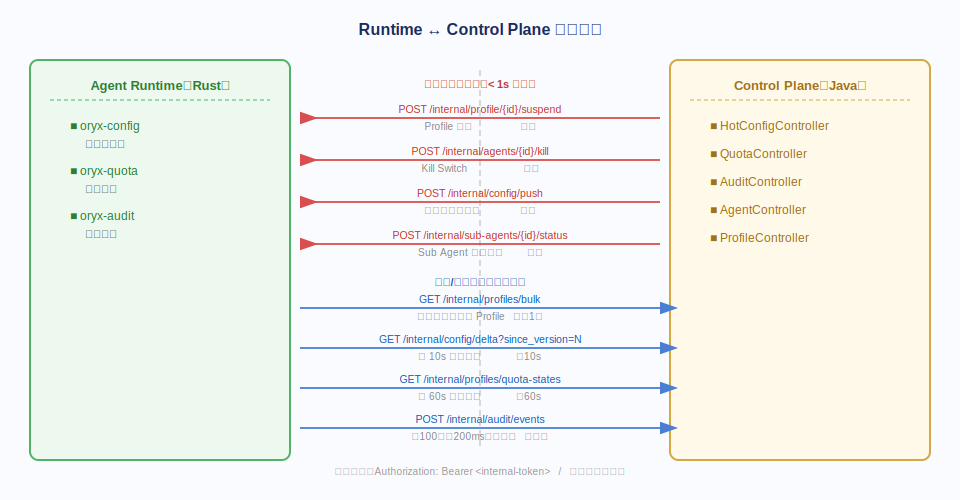
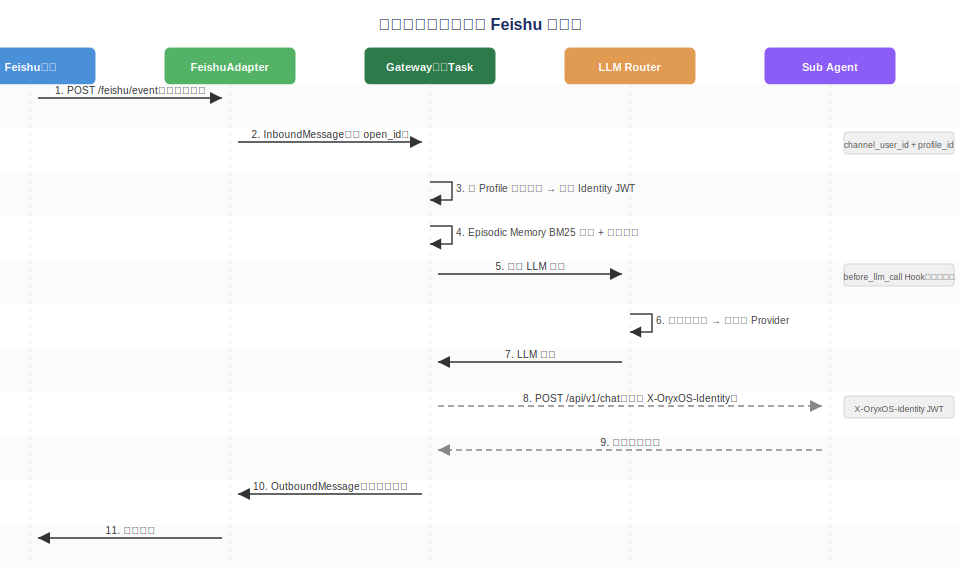
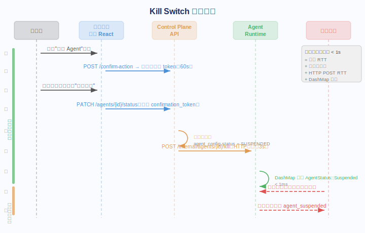

# OryxOS：技术方案

> 承接《OryxOS 需求文档》。需求文档说 What，本文说 How。

---

## 一、概述

### 1.1 背景与设计原则

OryxOS 的存在理由在需求文档里已经说清楚：企业 AI Agent 落地有四道门槛——身份隔离、数据边界、行为审计、运行时管控——而 AI Agent OS 的运行时核心技术问题已有充分的工程验证，缺的是这四道企业门槛的工程实现。本技术方案的根本约束由此确定：**不重新发明 Agent 运行时，在成熟的运行时机制上补企业治理层**。

这个约束直接产生了两个设计决策。第一，Agent 运行时用 Rust 实现，追求性能与内存安全，核心数据路径（消息接收、LLM 路由、工具调用）的额外延迟控制在 20ms 以内（需求文档非功能需求 §7 定义的硬指标）。第二，治理层用 Java/Spring Boot 实现，Control Plane 是一个独立进程，通过 REST API 与 Agent Runtime 通信，两者运行时完全解耦——Control Plane 宕机不影响 Agent Runtime 处理正常请求，只是失去实时配置推送能力。

解耦带来一个重要推论：Agent Runtime 必须在本地缓存足够的运行状态，不能对 Control Plane 有同步依赖。配额状态、Profile 隔离规则、热配置——这些都在 Runtime 内存里维护，Control Plane 是权威来源，Runtime 是本地缓存，通过周期性拉取和事件推送保持同步。这个设计在 Control Plane 暂时不可达时给 Runtime 提供了降级能力。

安全边界的设计同样是自顶向下的。沙箱隔离从 OS 层（bwrap/sandbox-exec）做，不依赖应用层过滤；Profile 隔离从存储 Key 的命名空间做，应用层的 profile_id 校验只是第二道防线；审计日志写入用异步通道，Audit 失败不回滚 Agent 请求，但 Agent 处理不被 Audit 延迟阻塞。这几个选择都是"把保证下推到更低层"的体现。

### 1.2 整体架构

OryxOS 由两个独立进程组成，加上一套共享存储。

**Agent Runtime**（Rust）是流量路径的核心。它以常驻进程形式运行，同时监听来自多个消息渠道的入站请求，路由到 LLM，执行工具调用（Skill 或 Sub Agent），管理 Session 状态，并将审计事件异步写到 Control Plane。所有面向企业用户的请求都在这个进程里处理。

**Control Plane**（Java/Spring Boot）是管控路径的核心。它提供 Profile 生命周期管理、Sub Agent 注册中心、审计日志存储与查询、Kill Switch、热配置下发，以及给运维人员使用的管理 Web 界面。Control Plane 通过两类通道与 Runtime 通信：推送（HTTP POST 到 Runtime 内部端口，用于 Kill Switch 和配置变更）和拉取（Runtime 主动 GET Control Plane 的 delta 接口）。

**共享存储**分两段：MySQL 存 Control Plane 的结构化数据（Profile、审计事件、热配置等）；Runtime 的会话状态、记忆索引、实体库使用本地文件系统和 redb 嵌入式 KV，不依赖任何外部数据库，这是有意为之——减少 Runtime 的外部依赖，提升部署简单性。



### 1.3 术语表

| 术语 | 含义 |
|------|------|
| Profile | 企业内部一个团队或部门的隔离单元，拥有独立的 Agent、Session、Memory、配额 |
| Agent Runtime | OryxOS 的 Rust 进程，处理所有面向用户的 AI 请求 |
| Control Plane | OryxOS 的 Java 进程，负责管控、审计、配置 |
| Channel Adapter | 将特定消息渠道（Feishu/WeCom）的协议适配为内部 InboundMessage 的模块 |
| Sub Agent | 按 Agent Card 规范实现的外部领域 Agent，通过 HTTP 与 Runtime 通信 |
| Skill | 通过 stdin/stdout JSON 协议调用的任意语言可执行文件 |
| Kill Switch | 管控平面立即挂起某个 Agent 的操作，生效时间 < 1s |
| Hot Config | 不需要重启服务即可生效的配置项（System Prompt、Tool Policy、LLM Route） |
| Identity Passthrough | 将渠道用户身份转换为平台签名 JWT 并透传到 Sub Agent 调用链的机制 |
| Lane Mode | LLM 路由的优先级顺序模式，按序尝试 Provider 形成 Failover 链 |
| Episodic Memory | 存储对话片段并支持 BM25 检索的短期记忆层 |
| Entity Bank | 存储跨 Session 实体属性的结构化记忆层 |

---

## 二、系统架构

### 2.1 两层架构：Agent Runtime 与 Control Plane

两层架构的分割线不是技术选型（Rust vs Java），而是数据路径特征。Agent Runtime 处于**热路径**（hot path）：每一个用户消息都要经过它，延迟直接影响用户体验，吞吐直接影响平台容量。因此 Runtime 的设计优先原则是：内存优先、零拷贝、无外部同步调用。所有需要持久化的状态，要么是 append-only（Session JSONL、审计事件），要么是可从本地文件恢复的（redb KV），Runtime 重启不需要询问任何外部服务就能恢复到可服务状态。

Control Plane 处于**冷路径**（cold path）：管理操作（Profile CRUD、配置变更、审计查询）的频率远低于 Agent 请求，对延迟的容忍度也高得多。因此 Control Plane 用标准的 Java/Spring Boot 企业服务范式实现，MyBatis-Plus 访问 MySQL，REST API 对外暴露，前端 React 应用消费这些 API。这层的复杂度在业务逻辑和数据模型，不在性能。

两层之间的交互只有四类。第一，Runtime 启动时拉取所有 Profile 的配置和配额信息（HTTP GET，Control Plane 提供 bulk 接口）。第二，Runtime 每 10s 拉取热配置 delta（HTTP GET `/internal/config/delta?since_version=N`）。第三，Runtime 每 60s 刷新配额状态（HTTP GET）。第四，Control Plane 向 Runtime 推送紧急操作（Kill Switch、Profile 挂起），这是唯一的主动推送，走 HTTP POST 到 Runtime 的内部端口（默认 :9001），这个端口不对外暴露。

### 2.2 部署拓扑

训练营核心阶段采用单节点部署：一个 Agent Runtime 进程、一个 Control Plane 进程、一个 MySQL 实例，用 Docker Compose 编排。两个进程共用同一台主机，通过 localhost 通信，避免网络配置复杂度。

生产环境的标准拓扑是 Runtime 和 Control Plane 分别部署，Runtime 可以水平扩展（无共享可变状态，Session 文件在本地，多实例时需要在 Ingress 层按 session_id 做 sticky routing）。Control Plane 是单点，MySQL 做主从高可用。Runtime 向 Control Plane 推审计事件时，Control Plane 的地址通过环境变量 `CONTROL_PLANE_URL` 配置。

### 2.3 通信协议

Runtime 和 Control Plane 之间全部走 HTTP/1.1 JSON，不使用 gRPC。选 HTTP 而不是 gRPC 有明确理由：两层通信频率不高（每 10~60s 一次拉取，Kill Switch 是低频操作），对延迟的要求宽松（10s 内生效即可），而 gRPC 需要 Rust 和 Java 两侧维护 proto 文件，增加跨语言协调成本。审计事件批量写入（单次最多 500 条）是吞吐最高的接口，HTTP/1.1 加上 gzip 压缩完全够用。

Runtime 对外的用户接口走 OpenAI 兼容格式（`POST /v1/chat/completions`），Channel Adapter 内部使用 tokio 异步 channel 在接收任务和处理任务之间解耦，所有异步 IO 都运行在 tokio 多线程运行时上。

---

## 三、Agent Runtime（Rust）

### 3.1 模块结构



Agent Runtime 分为七个 Rust crate，通过 Cargo workspace 组织。模块划分的原则是：每个 crate 拥有一个清晰的数据边界，crate 间通过定义在各自 crate 的 trait 接口交互，避免循环依赖。

`oryx-gateway` 是入口 crate，包含 axum HTTP 服务器、Channel Adapter 的启动逻辑、请求分发器。它依赖其他所有 crate，是整个依赖图的根节点。

`oryx-router` 负责 LLM Provider 的选择与熔断，内部维护 Provider 健康状态位图和每 Provider 的 CircuitBreaker 状态机。

`oryx-memory` 封装三层记忆体系：Episodic Memory 的 redb 存储和 tantivy BM25 索引、Long-term Memory 的文件 IO、Entity Bank 的 redb 表。所有接口都以 `profile_id` 作为第一参数，强制隔离。

`oryx-skill` 包含 Skill 执行器（子进程管理、stdin/stdout JSON 协议）和 Sub Agent 客户端（HTTP 调用、Agent Card 解析、Identity 注入）。

`oryx-session` 管理 JSONL 会话文件的读写、fork、compaction，以及 Context 窗口的截断逻辑。

`oryx-audit` 是审计事件的写入器，内部持有一个 tokio mpsc channel，工作任务负责批量将事件 POST 到 Control Plane。

`oryx-policy` 负责 Tool Policy 的内存查询，不触碰任何 IO，确保 < 5ms 的检查延迟。

`oryx-quota` 管理内存中的配额状态（`DashMap<ProfileId, QuotaState>`），在 LLM 调用前被 oryx-router 查询，周期性刷新从 Control Plane 拉取。

### 3.2 Channel Adapter 层

Channel Adapter 的设计目标是：每种消息渠道的适配代码完全隔离，添加新渠道不影响任何现有代码。为此定义如下 trait：

```rust
#[async_trait]
pub trait ChannelAdapter: Send + Sync {
    fn channel_type(&self) -> &str;
    async fn receive(&self) -> impl Stream<Item = InboundMessage> + Send;
    async fn send(&self, msg: OutboundMessage) -> Result<(), AdapterError>;
}
```

`InboundMessage` 是渠道无关的内部结构，携带 `channel_type`、`channel_user_id`（渠道原始用户标识）、`profile_id`（由配置映射决定）、`session_id`（由渠道的对话 ID 或消息线程 ID 派生）、`content` 和 `timestamp`。

`FeishuAdapter` 实现这个 trait，通过订阅 Feishu 事件回调（`POST /feishu/event`）接收消息。Feishu 的消息事件格式是 JSON，包含 `open_id`（用户在企业内的唯一标识）和消息内容，Adapter 负责验证 Feishu 的请求签名（HMAC-SHA256，密钥来自配置）、提取 `open_id` 和文本内容，转换为 `InboundMessage`。发送时调用 Feishu 消息发送 API（`POST https://open.feishu.cn/open-apis/im/v1/messages`）。

`WeComAdapter` 结构类似，对接企业微信的消息推送 API，消息格式和签名机制与 Feishu 不同，但 trait 接口相同，oryx-gateway 的分发器对两者一视同仁。

两个 Adapter 在 oryx-gateway 启动时各自在独立的 tokio task 中运行 receive 循环，产生的 InboundMessage 通过 `mpsc::Sender<InboundMessage>` 发送到统一的处理 channel。处理任务从 channel 的 Receiver 端消费消息，触发 Session 查找、LLM 调用、工具执行的完整处理链路。

REST API 接入（`POST /v1/chat/completions`）作为第三种"渠道"处理，由 axum handler 直接产生 InboundMessage，profile_id 从请求体的扩展字段读取，channel_type 标记为 `rest`。

### 3.3 LLM Router 与熔断器



LLM Router 实现需求文档 §3.1 定义的 Lane 模式：按优先级顺序尝试 Provider，前一个失败时自动尝试下一个，形成 Failover 链。Lane 模式的选择优先于 Hedge 模式，因为 Hedge 模式（并发请求多个 Provider 取最快响应）会产生多余的 token 消耗，在企业场景下成本不可控，Lane 模式是更保守、更可控的选择。

Router 内部维护一个有序的 `Vec<ProviderConfig>` 和一个 `u64` 类型的健康位图 `health_bitmap`，位图的第 i 位对应第 i 个 Provider，置 1 表示健康，置 0 表示熔断中。路由逻辑是：按序遍历 Provider 列表，跳过 `health_bitmap` 对应位为 0 的 Provider，取第一个健康的 Provider 发起调用。如果所有 Provider 都熔断，返回 `{code: "NO_HEALTHY_PROVIDER"}` 错误。

熔断器（Circuit Breaker）为每个 Provider 独立维护，状态机有三个状态：`Closed`（正常，请求通过）、`Open`（熔断，请求被拒绝）、`HalfOpen`（探针，允许一个试探请求）。状态转移规则：Closed 状态下连续 3 次调用失败 → 转 Open，同时将 `health_bitmap` 对应位清零；Open 状态保持 30s 后 → 转 HalfOpen，向 Provider 发一个轻量探测请求（`GET /v1/models` 或等价接口）；探测成功 → 转 Closed，恢复位图；探测失败 → 重置 30s 计时，继续 Open。

这个状态机用 Rust 的 `Arc<Mutex<CircuitBreakerState>>` 保护，多个并发请求共享同一个 CircuitBreaker 实例。状态转移产生的事件（Provider 熔断开启、熔断恢复）写入 oryx-audit 的审计 channel，供 Control Plane 的监控页展示。

### 3.4 Session 管理

Session 的持久化采用 JSONL 格式，一个 Session 对应一个文件，路径为 `data/sessions/{profile_id}/{session_id}.jsonl`。每行是一个 JSON turn，结构为：

```json
{"role": "user", "content": "...", "ts": 1748000000000, "token_count": 42}
{"role": "assistant", "content": "...", "ts": 1748000001000, "token_count": 187}
```

选择 JSONL 而非 SQLite 或其他格式，有三个理由：append-only 写入天然线程安全，不需要锁；人可读，出问题时可以直接 cat 排查；fork 操作只需要 `cp` 文件到指定行，实现极简单。

**Session Fork** 的实现：`fork_session(session_id, fork_at_turn_index)` 生成一个新的 `session_id`，将原文件的前 `fork_at_turn_index` 行复制到新文件，新的对话在新文件上继续。原 Session 文件不修改。

**Session Compaction** 的实现：读取文件中超出 Context 窗口的前缀 turns，调用 LLM 生成摘要，将摘要写成一个 `role: "summary"` 的 turn，然后用摘要 turn + 剩余 turns 重写文件。Compaction 触发条件：当前 Session 的累计 token_count 超过配置阈值（默认 8192）。Compaction 是有损操作，会丢失前缀轮次的详细内容，但摘要 turn 作为系统上下文注入，保持对话连贯性。

Session 文件的路径包含 `profile_id` 作为目录层级，这是 Profile 隔离的物理保证之一：即使 Session ID 碰撞，两个不同 Profile 的 Session 也在不同目录，不会相互覆盖。

### 3.5 记忆体系



三层记忆体系全部在 oryx-memory crate 内实现，对外暴露的接口签名都以 `profile_id: &str` 作为第一参数。

**Episodic Memory** 用 redb 存储会话片段的元数据，tantivy crate 维护 BM25 倒排索引。redb 是一个纯 Rust 的嵌入式 ACID KV 数据库，表定义使用复合主键 `(profile_id, session_id, turn_index)` 作为 key，value 是序列化后的片段内容和时间戳。tantivy 索引按 profile_id 分段（Segment），避免跨 Profile 检索的可能性。

检索路径：`bm25_search(query: &str, profile_id: &str, top_k: usize) -> Vec<EpisodicFragment>` 调用 tantivy 的 Searcher，在对应 Profile 的索引段上执行 BM25 查询，返回原始得分最高的 top_k * 3 个候选，然后按 `(bm25_score * 0.6 + recency_score * 0.4)` 重排，取最终 top_k 个。`recency_score` 计算公式为 `exp(-decay_factor * hours_since)` 其中 `decay_factor = 0.1`，时间越近得分越高。这套检索在训练营核心阶段实现，HNSW 向量检索作为课后作业补充。

**Long-term Memory** 是 `data/memory/{profile_id}/{agent_id}/MEMORY.md` 文件，内容为 Markdown 格式的结构化长期记忆。每次 Session 开始时，oryx-session 调用 `long_term_memory.load(profile_id, agent_id)` 读取文件内容，拼接到 System Prompt 的最前面（在用户配置的 System Prompt 之前）。文件更新由 Agent 在对话结束时（或触发条件满足时，如用户明确说"记住这个"）显式调用 `long_term_memory.append(profile_id, agent_id, content)` 写入。

**Entity Bank** 使用 redb 的另一张表，key 为 `(profile_id, entity_name)`，value 为结构化属性 JSON。Entity Bank 的写入由 Agent 在识别到新实体时调用，读取由 Episodic Memory 检索后的上下文拼接逻辑触发（检索到相关片段后，提取片段中提到的实体名，从 Entity Bank 拉取属性，附加到 Context 里）。

### 3.6 Skill 执行器与沙箱

Skill 执行器的核心约定是 stdin/stdout JSON 协议：平台向 Skill 进程的 stdin 写一个 JSON 对象，Skill 处理后向 stdout 输出一个 JSON 对象，平台读取结果。这个协议语言无关，任何能读 stdin、写 stdout 的程序都是合法的 Skill。

实现上，Skill 执行器用 `tokio::process::Command` 启动子进程：

```rust
pub async fn execute(skill: &SkillConfig, input: &SkillInput) -> Result<SkillOutput, SkillError> {
    let mut child = Command::new(&skill.executable)
        .stdin(Stdio::piped())
        .stdout(Stdio::piped())
        .stderr(Stdio::piped())
        .env_clear()
        .envs(&sanitized_env())
        .spawn()?;

    let stdin = child.stdin.take().unwrap();
    serde_json::to_writer(stdin, input)?;
    
    let output = timeout(Duration::from_secs(30), child.wait_with_output()).await
        .map_err(|_| SkillError::Timeout)??.stdout;
    
    Ok(serde_json::from_slice(&output)?)
}
```

`sanitized_env()` 返回一个经过白名单过滤的环境变量集合。出于安全考虑，以下 18 类环境变量被强制清除：`AWS_ACCESS_KEY_ID`、`AWS_SECRET_ACCESS_KEY`、`GOOGLE_APPLICATION_CREDENTIALS`、`ANTHROPIC_API_KEY`、`OPENAI_API_KEY`、`DASHSCOPE_API_KEY`，以及 `HOME`（覆盖为沙箱内的隔离目录）、原始 `PATH`（替换为仅包含基本系统工具的受限路径），以及所有 `*_TOKEN`、`*_SECRET`、`*_PASSWORD` 模式的变量。

**沙箱**在 Linux 上用 `bwrap`（Bubblewrap）实现，将 Skill 进程限制在只读 bind mount 的受限文件系统视图中，不能访问宿主机的 `/home`、`/etc`、`/var`、`/tmp`（用独立 tmpfs 替代）。在 macOS 上用 `sandbox-exec` 配合 seatbelt profile 实现等价的访问限制。沙箱是在 `Command::new` 的基础上包一层 wrapper：实际 spawn 的命令是 `bwrap [bwrap options] skill_executable`，对 Skill 进程透明。

### 3.7 Sub Agent 协议实现

需求文档 §3.2 定义了 Sub Agent 协议，本节描述 Runtime 侧的客户端实现。

Sub Agent 客户端首先读取 Agent Card：向 Sub Agent 的 `{base_url}/.well-known/agent-card.json` 发 GET 请求，解析 JSON 得到 `AgentCard` 结构体（包含 `id`、`name`、`version`、`capabilities`、`skill_names: Vec<String>`、`chat_url`、`health_url`、`auth_scheme`）。Agent Card 读取结果缓存在内存（`DashMap<String, AgentCard>`），每 30s 刷新一次（与 Control Plane 的健康检查周期对齐）。

调用 Sub Agent 的接口是 `POST {agent.chat_url}`，请求体结构为：

```json
{
  "message": "<用户消息文本>",
  "contextInfo": {
    "skill_name": "<匹配到的 skill_name>",
    "profile_id": "<当前 profile_id>",
    "user_identity": "<企业用户 ID>"
  }
}
```

请求头注入两个特殊 Header：
- `X-OryxOS-Identity: <平台签名 JWT>`（见 §3.11）
- `X-Devops-Transmitted-Auth: <同上，兼容 hickwall-agent 的命名>`

两个 Header 携带相同内容，兼容字段名的差异确保与现有 Sub Agent 实现的互操作性。

HTTP 调用使用 `reqwest::Client`，连接池复用，超时设置为 60s（Sub Agent 可能调用 LLM，需要留出足够时间）。调用结果（成功或失败）写入 oryx-audit 的工具调用事件。

Planner 的关键词路由实现：从所有已注册 Sub Agent 的 Agent Card 中收集 `skill_names`，建立 `HashMap<String, SubAgentId>` 映射表。用户请求进入时，对请求文本做简单分词，匹配 skill_names 里的关键词（大小写不敏感，支持前缀匹配），命中则路由到对应 Sub Agent，未命中则路由到 Default Agent（当前 Profile 配置的主 Agent）。

### 3.8 Hooks 机制

Hooks 是 Agent 生命周期上的拦截点，允许在不修改 Agent 代码的情况下插入自定义逻辑。OryxOS 实现四个生命周期点，两个可以拒绝执行（`before_tool_call`、`before_llm_call`），两个只能观察（`after_tool_call`、`after_llm_call`）。

每个 Hook 配置为一条 shell 命令，接受 JSON stdin，返回 JSON stdout。`before_tool_call` Hook 的输入结构：

```json
{
  "hook_type": "before_tool_call",
  "profile_id": "...",
  "agent_id": "...",
  "user_identity": "...",
  "tool_name": "...",
  "tool_args": {...}
}
```

返回结构：

```json
{"action": "allow"}
```

或：

```json
{"action": "deny", "reason": "tool is not permitted for this profile"}
```

Hook 执行复用 Skill 执行器的子进程框架（同样有 30s 超时和沙箱），返回 `deny` 时，工具调用被拦截，拦截原因连同工具名称记录到审计事件（`event_type: TOOL_CALL`，`status: DENIED`，`detail_json` 包含 deny reason）。Hook 执行失败（超时、崩溃、输出格式错误）时，默认策略是 `allow`——这是一个有意识的 fail-open 选择，防止 Hook 故障阻断所有 Agent 请求。如果需要 fail-safe，可在热配置里将该 Hook 的 `fail_policy` 设为 `deny`。

`after_tool_call` 和 `after_llm_call` 的返回值被忽略（只看 stdout，不看 action 字段），这两个点纯粹用于观察和记录，无法影响执行结果。

### 3.9 审计事件写入

审计系统的设计约束来自需求文档 §3.5：写入不阻塞主处理路径，异步队列处理延迟 < 500ms。实现方式是 tokio 的 `mpsc::channel`，容量设为 10000。

在主处理路径上，审计事件通过 `audit_tx.try_send(event)` 非阻塞写入 channel。`try_send` 在 channel 已满时立即返回 `Err(TrySendError::Full)`，此时记录一条 WARN 级别日志（`audit_channel_full, event_dropped: 1`）然后继续处理——审计满了不能让用户的 Agent 请求失败，这是审计系统设计的基本原则。

工作 task 在后台持续从 channel Receiver 端消费事件，积攒 100 条或等待 200ms（取先到者），组成一批通过 HTTP POST 发到 Control Plane 的审计入口接口 `POST /internal/audit/events`。请求体是 `Vec<AuditEvent>` 的 JSON 数组。如果 POST 失败（Control Plane 不可达），工作 task 做指数退避重试（最多 3 次），超过后丢弃这一批事件并记录 ERROR 日志。重试期间 channel 继续积攒事件，不阻塞主路径。

`AuditEvent` 的 Rust 结构体字段：`event_id: Uuid`、`profile_id: String`、`agent_id: String`、`session_id: Option<String>`、`event_type: EventType`（枚举：LLM_CALL/TOOL_CALL/CHANNEL_MSG/ADMIN_OP）、`user_identity: String`、`content_hash: String`（SHA-256 hex）、`token_in: Option<u32>`、`token_out: Option<u32>`、`latency_ms: u64`、`status: String`、`detail_json: Value`、`created_at: DateTime<Utc>`。

内容本身（LLM 的输入输出文本、工具调用参数的原始值）不写入 `detail_json`，只存 SHA-256 hash。需要验证特定调用的内容时，由持有原始内容的系统（如 Agent 侧的 Session 日志）与 hash 对比，控制平面的审计数据库不成为敏感内容的存储点。

### 3.10 Profile 隔离与配额执行

Profile 隔离通过三个层次叠加实现，防止单点漏洞导致跨 Profile 数据泄露。

第一层是存储层命名空间：所有 redb 表的 key 使用 `(profile_id, ...)` 复合主键，文件路径包含 `profile_id` 目录段，tantivy 索引按 profile_id 分 Segment。这一层由数据结构设计保证，不依赖任何运行时条件判断，即使应用层逻辑有 bug，跨 Profile 查询也需要显式构造跨界的 key，这在正常代码路径上不会发生。

第二层是接口层校验：oryx-memory、oryx-session、oryx-skill 的所有公开函数，第一个参数是 `profile_id: &str`，函数内部将传入的 profile_id 与请求上下文中的 profile_id 做断言（debug build 下是 `assert_eq!`，release build 下是 `if profile_id != ctx.profile_id { return Err(ProfileMismatch) }`）。

第三层是 Gateway 层绑定：每个入站 InboundMessage 在产生时就绑定了 profile_id（Feishu Adapter 根据 open_id → profile_member 映射表确定），整个处理链路的 Context 结构体持有这个 profile_id 不可变，下游模块从 Context 取，不接受外部传入。

配额执行在 oryx-quota crate 中实现。`DashMap<String, QuotaState>` 以 profile_id 为 key，`QuotaState` 包含 `llm_calls_today: AtomicU64`、`tokens_this_month: AtomicU64`、`active_sessions: AtomicI64`。LLM 调用前，Router 调用 `quota.check_and_reserve(profile_id)` 原子性地检查并预扣：

```rust
pub fn check_and_reserve(&self, profile_id: &str) -> Result<QuotaGuard, QuotaError> {
    let state = self.map.get(profile_id).ok_or(QuotaError::ProfileNotFound)?;
    let config = self.config.get(profile_id).ok_or(QuotaError::ConfigNotFound)?;
    
    let calls = state.llm_calls_today.fetch_add(1, Ordering::SeqCst);
    if calls >= config.max_llm_calls_per_day {
        state.llm_calls_today.fetch_sub(1, Ordering::SeqCst);
        return Err(QuotaError::Exceeded {
            code: "QUOTA_EXCEEDED",
            limit_type: "llm_calls_per_day",
            current: calls,
            limit: config.max_llm_calls_per_day,
        });
    }
    Ok(QuotaGuard::new(state.clone()))  // RAII guard，LLM 失败时自动回滚 tokens_this_month
}
```

`QuotaState` 的初始化和每 60s 刷新通过 `GET /internal/profiles/quota-states` 从 Control Plane 批量拉取，响应体是 `HashMap<ProfileId, QuotaSnapshot>` 的 JSON。刷新时直接替换 DashMap 中的值，不停服，不锁整表。

### 3.11 Identity Passthrough

Identity Passthrough 解决需求文档 §3.4 描述的问题：下游 Sub Agent 和工具需要知道是哪个真实用户在发起调用，不能只看到平台的服务账号。

链路分三步。第一步，Channel Adapter 从渠道消息中提取渠道原生用户标识（Feishu 的 `open_id`，WeCom 的 `external_userid`），这个标识写入 InboundMessage 的 `channel_user_id` 字段，同时记录 `channel_type`。

第二步，oryx-gateway 的处理上下文中，用 `channel_user_id` + `channel_type` + `profile_id` 三元组查找企业统一身份。映射表存在 Profile 的成员配置中（`profile_member` 表，字段 `channel_type`、`channel_user_id`、`enterprise_user_id`），Runtime 启动时从 Control Plane 拉取并缓存在内存 HashMap，每 5 分钟刷新。查找到 `enterprise_user_id` 后，用 Control Plane 在启动时下发的 RSA 私钥（2048 位，PEM 格式，通过挂载的 secret 文件传入）签名生成 JWT：

```json
{
  "sub": "<enterprise_user_id>",
  "profile_id": "<profile_id>",
  "channel": "feishu",
  "iat": 1748000000,
  "exp": 1748003600
}
```

签名算法 RS256，有效期 1h（Sub Agent 调用链通常在分钟级完成，1h 留有足够余量）。

第三步，Sub Agent 调用时将签名后的 JWT 分别注入 `X-OryxOS-Identity` 和 `X-Devops-Transmitted-Auth` 两个 Header，后者兼容 hickwall-agent 的现有实现。下游 Sub Agent 用 Control Plane 公开的 `/internal/identity/public-key` 接口（或预先配置的公钥文件）验证签名，从 `sub` 字段提取企业用户 ID，完全不信任 `enterprise_user_id` 的裸字符串传递。

---

## 四、Control Plane（Java）

### 4.1 模块结构



Control Plane 采用四层 Maven 模块结构，依赖方向单向：start → api → core → runtime。

`oryx-control-runtime` 是叶节点，只包含跨模块共享的 DTO/VO/枚举/分页封装，不引入任何业务逻辑，不依赖任何框架（只依赖 Jackson 和 Lombok）。

`oryx-control-core` 包含 Service 层、MyBatis-Plus Mapper、DB Entity 类、Redisson 客户端（用于分布式锁，防止多实例 Control Plane 并发写配置）。业务逻辑的实现层。

`oryx-control-api` 包含 REST Controller 类和 JWT 过滤器，不含业务逻辑，Controller 调用 core 层的 Service，格式化结果返回。

`oryx-control-start` 是启动模块，包含 `@SpringBootApplication` 入口、全局异常处理器（`@ControllerAdvice`）、各组件的 Bean 配置（数据源、Redis、安全配置）。

### 4.2 数据模型

Control Plane 使用单一 MySQL schema `oryxos`，核心表设计如下。

`profile` 表：`id VARCHAR(64) PK`、`name VARCHAR(128)`、`status ENUM('ACTIVE','SUSPENDED')`、`quota_config_id VARCHAR(64)`、`created_at DATETIME`、`updated_at DATETIME`。

`profile_member` 表：`id VARCHAR(64) PK`、`profile_id VARCHAR(64) FK`、`enterprise_user_id VARCHAR(128)`、`channel_type VARCHAR(32)`、`channel_user_id VARCHAR(128)`、`role ENUM('PROFILE_ADMIN','MEMBER')`、`created_at DATETIME`。

`agent_config` 表：`id VARCHAR(64) PK`、`profile_id VARCHAR(64) FK`、`name VARCHAR(128)`、`status ENUM('ACTIVE','SUSPENDED')`、`system_prompt TEXT`、`llm_route_config JSON`、`created_at DATETIME`、`updated_at DATETIME`。

`sub_agent_registry` 表：`id VARCHAR(64) PK`、`profile_id VARCHAR(64) FK`、`name VARCHAR(128)`、`base_url VARCHAR(512)`、`agent_card_json JSON`、`health_url VARCHAR(512)`、`status ENUM('HEALTHY','UNHEALTHY','UNKNOWN')`、`last_checked_at DATETIME`。

`quota_config` 表：`id VARCHAR(64) PK`、`profile_id VARCHAR(64) FK`、`max_llm_calls_per_day BIGINT`、`max_tokens_per_month BIGINT`、`max_concurrent_sessions INT`、`updated_at DATETIME`。

`audit_event` 表：`id BIGINT AUTO_INCREMENT PK`、`event_uuid VARCHAR(64) UNIQUE`、`profile_id VARCHAR(64)`、`agent_id VARCHAR(64)`、`session_id VARCHAR(64)`、`event_type ENUM('LLM_CALL','TOOL_CALL','CHANNEL_MSG','ADMIN_OP')`、`user_identity VARCHAR(256)`、`content_hash VARCHAR(64)`、`token_in INT`、`token_out INT`、`latency_ms INT`、`status VARCHAR(32)`、`detail_json JSON`、`created_at DATETIME`。`audit_event` 表按 `DATE(created_at)` 做 Range 分区，默认保留 90 天（TTL 通过定时任务实现，删除过期分区）。

`hot_config` 表：`id BIGINT AUTO_INCREMENT PK`、`profile_id VARCHAR(64)`、`agent_id VARCHAR(64)`、`config_key VARCHAR(128)`、`config_value LONGTEXT`、`version BIGINT`（全局自增，由 `SELECT MAX(version)+1` 在事务内生成）、`updated_by VARCHAR(128)`、`updated_at DATETIME`。

### 4.3 Profile 与成员管理

Profile 的生命周期状态机只有两个状态：`ACTIVE` 和 `SUSPENDED`。从 `ACTIVE` 到 `SUSPENDED` 是挂起操作，从 `SUSPENDED` 到 `ACTIVE` 是恢复操作，不存在删除状态（Profile 数据永远保留，只能挂起）。

挂起操作的实现是一个分布式事务的简化版：`ProfileService.suspend(profileId)` 先在本地数据库将状态更新为 `SUSPENDED`，成功后立即向 Agent Runtime 发送挂起通知（`POST /internal/profile/{id}/suspend`），Runtime 收到后将该 Profile 的所有新请求拒绝（在 Gateway 层检查 Profile 状态缓存），并对所有当前活跃 Session 发送中止信号。如果 Runtime 通知失败（网络不通），Control Plane 记录一条 ERROR 日志，并在数据库标记 `notification_failed: true`，通过一个周期性任务（每 30s）重试通知。Runtime 侧的 Profile 状态缓存每 5 分钟从 Control Plane 全量刷新，即使通知始终失败，最晚 5 分钟内 Runtime 也会感知到 Profile 已挂起。这是 CP 和 Runtime 解耦的代价——用最终一致性换取独立部署能力。

### 4.4 Sub Agent 注册中心

Sub Agent 注册流程：管理员在管控平面填写 Sub Agent 的 `base_url`，Control Plane 立即向 `{base_url}/.well-known/agent-card.json` 发 GET 请求，成功则将 Agent Card 内容写入 `sub_agent_registry`，状态设为 `UNKNOWN`，等待下次健康检查。

健康检查由 Spring 定时任务（`@Scheduled(fixedDelay = 30000)`）触发，对所有 `status != DELETED` 的 Sub Agent 逐一发 `RestTemplate.getForEntity(agent.health_url, String.class)`，3 次连续失败（由 `consecutive_fail_count` 字段记录）后将 `status` 改为 `UNHEALTHY`，恢复后改回 `HEALTHY`。

健康状态变化通过 `POST /internal/sub-agents/{id}/status` 推送给 Runtime，Runtime 更新内存中的 Sub Agent 注册表，路由时跳过 `UNHEALTHY` 的 Sub Agent。

Planner 的关键词路由映射（`skill_name → sub_agent_id`）存储在 `sub_agent_registry.agent_card_json` 里解析出来，在 Control Plane 侧维护为一个 `HashMap<String, String>`，注册或状态变化时重建，并随下次 Runtime 的热配置 delta 拉取一起下发。

### 4.5 审计日志系统

审计入口接口 `POST /internal/audit/events` 接受 Runtime 批量上报的审计事件，单次最多 500 条。Controller 接收后交给 `AuditService`，`AuditService` 使用 MyBatis-Plus 的批量插入接口（`saveBatch(list, 200)`）写入 `audit_event` 表，每批最多 200 条，多批并行。这个接口不做任何同步过滤或计算，纯写入。

审计查询接口 `GET /api/v1/audit/events` 支持以下过滤维度：`profile_id`、`agent_id`、`event_type`、`user_identity`（前缀模糊匹配）、`from`（ISO8601）、`to`（ISO8601）、`page`、`size`（最大 200）。MyBatis-Plus 的 `LambdaQueryWrapper` 根据传入参数动态拼条件，`created_at` 范围查询走分区裁剪，避免全表扫描。结果封装为 `PagingList<AuditEventVO>` 返回，`AuditEventVO` 对 `detail_json` 中的敏感字段（根据配置的 field mask 列表）做脱敏展示。

CSV 导出接口 `GET /api/v1/audit/events/export` 使用 Spring MVC 的 `StreamingResponseBody`，逐批从数据库查询（游标分页，每批 1000 条），边查边写入 CSV 输出流，不在内存中组装完整结果集。响应 Header：`Content-Disposition: attachment; filename="audit_export_{from}_{to}.csv"`、`Content-Type: text/csv; charset=UTF-8`。导出操作本身在导出完成后写入一条 `ADMIN_OP` 类型的审计事件（导出人、导出时间范围、导出行数）。

### 4.6 Kill Switch 实现

Kill Switch 的接口是 `PATCH /api/v1/agents/{id}/status`，请求体 `{"status": "SUSPENDED", "confirmation_token": "<one-time-token>"}`。Confirmation token 是一个一次性令牌，由前端在用户点击"停用"后调用 `POST /api/v1/agents/{id}/confirm-action` 获取，有效期 60s，防止 CSRF 和误操作。

Controller 验证 token 后调用 `AgentService.suspend(agentId)`：在数据库将 `agent_config.status` 改为 `SUSPENDED`，然后向 Agent Runtime 发送 `POST /internal/agents/{id}/kill`。Runtime 收到后，在 `DashMap<AgentId, AgentStatus>` 中将对应 Agent 的状态标记为 `Suspended`，Gateway 层在每个请求处理开始时检查这个 map，状态为 `Suspended` 时直接返回 `{"error": "agent_suspended", "message": "This agent has been suspended by administrator"}`。

整个链路的端到端时延（从管控平面点击到新请求被拒绝）目标 < 1s，影响因素是网络 RTT（通常 < 10ms）和 Runtime 内部的状态写入（DashMap 无锁，< 1ms）。运行中的已有 Session 收到中止信号（通过 tokio cancellation token 传播），当前正在等待 LLM 响应的请求会在本次 LLM 调用完成后被中止（不强制中断 LLM 流），下一轮 Agent 调用不再发起。

Kill Switch 操作记录为 `ADMIN_OP` 类型审计事件，包含操作人 `user_identity`、操作时间、被操作的 `agent_id` 和新状态。

### 4.7 热配置下发

Hot Config 的设计目标是：配置变更对新 Session 立即生效，对运行中的 Session 不中断（继续使用旧配置直到 Session 结束）。

Control Plane 侧，每次管理员修改配置（System Prompt、Tool Policy、LLM Route、Planner 路由规则），`HotConfigService` 在事务中将新值写入 `hot_config` 表，`version` 字段取当前表最大 version + 1。写操作完成后，向 Runtime 发 `POST /internal/config/push`（payload 携带变更的配置项），作为优化的"心跳外触发"，减少 Runtime 感知变更的延迟。

Runtime 侧，`oryx-config` 模块（在 oryx-gateway crate 内）每 10s 发 `GET /internal/config/delta?since_version={local_max_version}`，Control Plane 返回 `version > since_version` 的所有配置项列表。Runtime 收到后按 `(profile_id, agent_id, config_key)` 更新内存中的配置 HashMap（用 `DashMap<(ProfileId, AgentId, ConfigKey), ConfigValue>` 实现，支持细粒度更新，不锁整张表），更新本地 `max_version`。新 Session 开始时从这个 HashMap 读取当前生效的配置；运行中 Session 的 `config_snapshot` 在 Session 创建时生成，不受后续变更影响。

Config keys 的语义：`system_prompt` 的 value 是 Markdown 字符串，直接替换 Agent 的系统提示；`tool_policy_allow` 和 `tool_policy_deny` 的 value 是 JSON 数组（工具名列表），更新 oryx-policy 的内存表；`llm_route` 的 value 是 JSON 数组（Provider 优先级列表），更新 oryx-router 的路由配置。

所有热配置变更记录 `ADMIN_OP` 审计事件，包含变更前值和变更后值（均作为 JSON 字段存入 `detail_json`，不单独存储）。

### 4.8 管控平面 API 与前端

Control Plane 的 JWT 认证使用 JJWT v0.12.6，RS256 算法，公私钥对在部署时生成，私钥由 Control Plane 持有，公钥在 Identity Passthrough 中也供 Sub Agent 验证使用。JWT payload 包含 `sub`（用户名）、`role`（`PLATFORM_ADMIN` 或 `PROFILE_ADMIN`）、`profile_id`（Profile Admin 专属）、`iat`、`exp`（24h）。

所有 Controller 方法上用 `@PreAuthorize` 注解声明权限要求：

```java
@PreAuthorize("hasRole('PLATFORM_ADMIN')")
@PostMapping("/api/v1/profiles")
public Result<ProfileVO> createProfile(@RequestBody CreateProfileRequest req) { ... }

@PreAuthorize("hasRole('PLATFORM_ADMIN') or " +
              "(hasRole('PROFILE_ADMIN') and #profileId == authentication.details.profileId)")
@GetMapping("/api/v1/profiles/{profileId}/members")
public Result<PagingList<MemberVO>> listMembers(@PathVariable String profileId, ...) { ... }
```

写操作（Kill Switch、Profile 挂起、热配置变更）需要 confirmation token，通过 `ConfirmationTokenService`（内存 `ConcurrentHashMap<token, ActionContext>`，TTL 60s）管理。

前端是 React + Ant Design 5.x 的 SPA，通过 Vite 构建，部署为静态文件由 Nginx 服务，API 请求反代到 Control Plane。五个核心页面的技术实现：

**Profile 管理页**：Ant Design Table + Drawer 组合，列表用 `useRequest` 轮询刷新（30s 间隔），详情抽屉懒加载。配额编辑使用 Form + InputNumber 组件，提交前弹出 Popconfirm 确认。

**Agent 监控页**：Table 展示 Agent 列表，Kill Switch 操作流程分两步：点击"停用"按钮 → 调用 `/confirm-action` 获取 token → 弹出确认对话框显示 token（用于操作留痕）→ 用户二次确认 → 调用 `PATCH /status`。状态列用 Badge 组件区分 ACTIVE（绿）/ SUSPENDED（红）/ UNKNOWN（灰）。

**Session 监控页**：Table 展示活跃 Session，支持按 Profile/Agent/Channel 筛选，Context 长度用 Progress 组件可视化（当前 token / 最大 token 窗口），强制结束操作同样需要二次确认。

**实时指标页**：从 Agent Runtime 的 `/metrics` 端点（Prometheus 格式）拉取数据，用 echarts 渲染折线图（QPS）和饼图（各 Profile Token 消耗占比），数据每 30s 自动刷新。

**热配置页**：System Prompt 编辑用 Ant Design 的 Input.TextArea 组件（Markdown 源文本编辑），Tool Policy 用可排序的 TagInput 组件，LLM Route 用可拖拽排序的 List 组件展示 Provider 优先级。所有编辑操作有 Preview 对话框展示变更前后的差异（`diff-match-patch` 库实现 diff 展示），确认后提交。

---

## 五、跨层协议

### 5.1 Runtime ↔ Control Plane 通信



两层之间的所有接口按流向分为两类。

**Control Plane → Runtime（推送，低频）**

| 接口 | 方法 | 触发时机 | 期望 Runtime 响应时间 |
|------|------|----------|----------------------|
| `/internal/profile/{id}/suspend` | POST | Profile 挂起 | < 1s |
| `/internal/agents/{id}/kill` | POST | Kill Switch | < 1s |
| `/internal/config/push` | POST | 热配置变更 | < 100ms（只是提示，Runtime 会主动 pull） |
| `/internal/sub-agents/{id}/status` | POST | Sub Agent 健康状态变化 | < 500ms |

推送接口使用 `Authorization: Bearer <internal-token>` 鉴权，internal-token 是部署时配置的共享密钥（16 字节随机，hex 编码），不用 JWT，减少验签开销。

**Runtime → Control Plane（拉取或上报，周期性）**

| 接口 | 方法 | 频率 | 数据量 |
|------|------|------|--------|
| `/internal/profiles/bulk` | GET | 启动时 1 次 | 全量 Profile 配置 |
| `/internal/config/delta?since_version=N` | GET | 每 10s | 增量配置项 |
| `/internal/profiles/quota-states` | GET | 每 60s | 全量 QuotaState |
| `/internal/audit/events` | POST | 每 100 条或 200ms | 批量审计事件（最多 500 条） |

所有接口统一响应格式：`{"code": 0, "data": {...}}` 成功，`{"code": <非零>, "message": "..."}` 失败。Runtime 侧用 `reqwest` 客户端调用，设置 5s 超时（审计批量上报 10s），失败时记录日志但不中断主流程。

### 5.2 Identity Passthrough 签名

JWT 签名的私钥由 Control Plane 在启动时生成并存储（RSA 2048，PEM 格式，路径通过环境变量 `ORYX_IDENTITY_PRIVATE_KEY_PATH` 配置），Runtime 启动时通过 `GET /internal/identity/signing-key` 获取私钥（该接口只在 Control Plane 的内部端口暴露，不对外）。

Runtime 用 `jsonwebtoken` crate 签名，每次 Sub Agent 调用前生成一个新 JWT（不缓存，防止 exp 过期问题）。Sub Agent 侧用 `GET /internal/identity/public-key` 获取公钥（这个接口在 Control Plane 的公开端口暴露），验证签名后从 `sub` 字段提取企业用户 ID。

私钥轮转机制：Control Plane 支持双密钥（current + previous），轮转时 current 降为 previous，新密钥成为 current，Runtime 在下次启动或每 24h 刷新时获取新密钥，过渡期（24h）内 Sub Agent 侧同时接受两个公钥的签名，确保平滑过渡。

### 5.3 配额同步协议

配额同步是 Runtime 和 Control Plane 之间最重要的数据一致性问题：Token 消耗计数在 Runtime 内存中实时更新，但 Control Plane 的配置（如 Platform Admin 临时提升配额上限）需要及时同步到 Runtime。

同步协议的选择是：Runtime 侧做内存计数，周期性（每 60s）将 `used_calls_delta` 和 `used_tokens_delta` 上报给 Control Plane（附在配额刷新请求的 body 里），Control Plane 累积这些 delta 更新数据库中的实际使用量，同时返回最新的配额上限配置。Runtime 用返回的新上限替换本地缓存的上限值。

这个协议在 Runtime 重启时有一个时间窗口的计数丢失（重启前 60s 内的 delta 未上报），但这不影响实际的 Token 消耗（token 已经被 LLM 消费了），只是 Control Plane 的统计数据有最多 60s 的误差，这在企业场景下是可接受的。如果需要更精确的统计，可以在 Runtime 每次 LLM 调用后立即向 audit 事件中写入 token 消耗，Control Plane 从 audit 事件表实时统计，但这会增加 Control Plane 的查询压力，训练营阶段不实现。

---

## 六、关键流程

### 6.1 消息处理全链路



以 Feishu 用户发消息为例，描述从渠道到 LLM 响应的完整路径。

用户在 Feishu 企业机器人中发送消息，Feishu 服务器向 OryxOS 配置的 Webhook 地址（`POST /feishu/event`）发送事件推送，携带签名和消息内容。`FeishuAdapter` 验证签名（`X-Lark-Signature` Header，HMAC-SHA256），提取 `open_id` 和文本内容，构造 `InboundMessage`，通过 mpsc channel 发送给处理 task。

处理 task 接收到消息后：(1) 用 `(profile_id, open_id, "feishu")` 查 Profile 成员映射，确定 `enterprise_user_id`，同时确认 Profile 状态为 `ACTIVE`；(2) 用 `enterprise_user_id` 签名生成 Identity JWT；(3) 查找或创建 Session（读 JSONL 文件，写入新消息 turn）；(4) 从 Episodic Memory 检索相关历史片段（BM25），加载 Long-term Memory，拼接 Context；(5) 调用 oryx-quota 检查配额；(6) 检查 before_llm_call Hook（如配置）；(7) 调用 oryx-router 路由 LLM 请求；(8) LLM 响应写回 Session JSONL；(9) 如果 LLM 输出包含工具调用指令，检查 before_tool_call Hook 和 Tool Policy，执行 Skill 或 Sub Agent；(10) 最终响应通过 FeishuAdapter.send 回复给用户；(11) 各步骤产生的审计事件写入 oryx-audit mpsc channel。

整个链路的时延目标：渠道消息入队到 Agent 开始处理 < 100ms（步骤 1-5 均为内存操作或本地文件 IO，无外部 HTTP 调用），LLM 路由层引入的额外延迟 < 20ms。LLM 调用本身的延迟由 LLM Provider 决定，不计入 OryxOS 的指标。

### 6.2 Sub Agent 调用链路

Planner 的关键词路由匹配成功后，处理流程进入 Sub Agent 调用链路。

oryx-skill crate 的 Sub Agent 客户端首先检查 `DashMap<SubAgentId, AgentCard>` 缓存，确认目标 Sub Agent 的 `status == HEALTHY`。然后构造请求体（包含 message、contextInfo），注入 `X-OryxOS-Identity` 和 `X-Devops-Transmitted-Auth` Header，用 reqwest 发 POST 请求。

Sub Agent 的 HTTP 响应体是一个 JSON 对象，包含 `reply` 字段（文本响应）。如果 Sub Agent 支持流式响应（SSE），客户端用 reqwest 的流式 API 逐行读取事件并转发给 Channel Adapter 的 send 路径，实现流式传递。

如果 Sub Agent 返回非 2xx，或连接超时（60s），客户端记录错误，将审计事件标记为 `status: FAILED`，向用户返回降级响应（"当前功能暂时不可用"）。Planner 不自动 fallback 到 Default Agent，避免用户误以为请求已成功处理实际上走了降级逻辑。

### 6.3 Kill Switch 生效链路



管理员在管控平面点击"停用 Agent"，触发以下事件序列：

1. 前端调用 `POST /api/v1/agents/{id}/confirm-action`，获取一次性 confirmation token（60s 有效）
2. 用户在确认对话框中点击"确认停用"，前端调用 `PATCH /api/v1/agents/{id}/status`，携带 token
3. Control Plane 验证 token，调用 `AgentService.suspend(agentId)`，写库
4. Control Plane 立即向 Runtime 发 `POST /internal/agents/{id}/kill`，HTTP 请求超时 3s
5. Runtime 的 axum handler 接收请求，在 `DashMap<AgentId, AgentStatus>` 中写入 `AgentStatus::Suspended`
6. 此后所有新进入的、目标为该 Agent 的请求，在 Gateway 层状态检查时（`check_agent_status(agent_id)`）得到 `Suspended`，立即返回拒绝响应
7. Control Plane 写入 `ADMIN_OP` 审计事件

步骤 1-6 的端到端时延：前端 RTT + 数据库写入 + HTTP POST RTT + DashMap 写入，通常 < 500ms，目标 < 1s 完全可达。

### 6.4 审计日志链路

审计事件从产生到可查询经过以下路径：

在 Agent Runtime 中，每个关键操作（LLM 调用、工具调用、渠道消息接收）产生 `AuditEvent` 结构体，通过 `try_send` 写入容量 10000 的 mpsc channel，这一步在主处理路径上，耗时 < 1μs。工作 task 从 channel 消费事件，积攒 100 条或 200ms 后批量 POST 到 `POST /internal/audit/events`。

在 Control Plane 中，`AuditController` 接收批量事件，调用 `AuditService.saveBatch(events)` 写入 MySQL 的 `audit_event` 表（按日期分区），批量写入耗时通常 10-50ms，与主流程完全异步，不影响 Agent 响应延迟。

管理员查询时，`GET /api/v1/audit/events?profile_id=X&event_type=LLM_CALL&from=2026-05-13&to=2026-05-13&page=1&size=50` 触发 MyBatis-Plus 的动态 SQL 查询，利用 `created_at` 的分区索引和 `profile_id` 的二级索引，通常在 100ms 内返回结果。

---

## 七、非功能设计

### 7.1 性能

需求文档定义的性能指标中，最关键的是两个：单节点 ≥ 500 并发活跃 Session，以及 LLM 路由额外开销 < 20ms。

500 并发 Session 在 Rust 的 tokio 异步模型下是保守目标。每个 Session 的处理是一个 tokio task，等待 LLM 响应期间（通常 1-10s）不占用线程，只占用少量堆内存（Session 上下文约 10-50KB，500 个 Session 约 5-25MB，加上 JSONL 文件的内存映射，整体内存使用在 100MB 以内）。tokio 的多线程调度器在等待 IO 时复用线程，支持远超线程数的并发 task。

LLM 路由额外开销 < 20ms 的保证来自：路由决策（遍历 Provider 列表，检查健康位图）是纯内存操作，< 1ms；熔断器状态检查是 `Arc<Mutex<>>` 的快速读，< 1ms；配额检查是 `DashMap` 的无锁读，< 1ms；前后两次 Hook 检查（如启用）是子进程启动，这是主要开销，建议 Hook 命令设计为启动快的脚本或二进制（启动 < 10ms），总开销控制在 15ms 以内。

审计写入的异步 channel 容量 10000 提供了足够的缓冲。在稳定流量下，工作 task 的批量发送频率（每 200ms 一批）足以消化 channel 积压；在突发流量（如 500 个 Session 同时完成 LLM 调用）下，10000 容量提供约 20s 的缓冲时间（假设每次 LLM 调用产生 3 个审计事件，500 个并发 Session 每 200ms 最多产生 1500 个事件，10000 容量约 7 批，1.4s 消化完），不会溢出。

### 7.2 安全

沙箱隔离覆盖 Skill 执行的所有路径。bwrap 在 Linux 上通过 mount namespace 和 user namespace 实现文件系统隔离，Skill 进程看不到宿主机的 `/home`、`/root`、`/etc/passwd`、`/etc`（敏感配置），读不到宿主机的网络配置（如果配置了 network namespace 隔离）。18 个危险环境变量的清除确保 Skill 进程无法通过环境变量窃取云服务凭证。

Sub Agent 通信强制 HTTPS，`reqwest::Client` 配置 `danger_accept_invalid_certs(false)`（这是 reqwest 的默认值，明确说明不允许修改），证书验证由 OS 的 CA 信任链保证。内网部署场景下，Sub Agent 可以配置 mTLS（在 `sub_agent_registry` 中存储客户端证书路径，Runtime 加载后配置到 reqwest Client）。

Profile 隔离的双重保障（存储层命名空间 + 接口层校验）在安全审计场景下可以通过静态分析验证：对 `oryx-memory` crate 的所有公开函数做调用点分析，检查第一参数是否始终来自请求 Context 的 `profile_id`，而非外部传入。这种可验证性是选择在接口签名中显式传递 `profile_id`（而非通过线程局部变量隐式传递）的原因。

管控平面的 RBAC 通过 Spring Security 的 `@PreAuthorize` 和方法级安全实现，配合 JWT 中的 `role` 字段，不依赖数据库查询权限（避免 N+1 问题）。破坏性写操作（Kill Switch、Profile 挂起、热配置变更）的二次确认（confirmation token）防止 CSRF 攻击和管理员操作失误。

### 7.3 可运维性

Docker Compose 编排文件覆盖 Agent Runtime、Control Plane、MySQL、Nginx（前端静态文件）四个服务，`docker compose up -d` 一键启动，首次启动自动执行 MySQL 的 schema 初始化脚本（通过 `healthcheck` + `depends_on: condition: service_healthy` 确保顺序）。

热配置更新的可运维性体现在：System Prompt、Tool Policy 和 LLM 路由规则的变更全部通过管控平面完成，不需要 SSH 进服务器修改文件，不需要重启任何进程，变更在 10s 内（Runtime 的 delta 轮询周期）对新 Session 生效，变更历史完整记录在审计日志中，可以追溯"谁在什么时间把 System Prompt 改成了什么"。

健康检查接口：Agent Runtime 在 `:8080/health` 返回 JSON（`{"status": "ok", "uptime_s": 3600, "active_sessions": 42}`），Control Plane 通过 Spring Boot Actuator 的 `/actuator/health` 返回组件级健康状态（数据库连接、Runtime 可达性）。Kubernetes 部署时，两者都配置 liveness probe（HTTP GET，失败 3 次后重启）和 readiness probe（成功后才接入流量）。

Profile 级别的数据备份：`oryx-gateway` 提供 `GET /internal/profiles/{id}/export`（内部接口），返回该 Profile 的完整快照：所有 `agent_config`、所有 Session JSONL 文件（Base64 打包）、Memory 目录（Base64 打包）。恢复到新实例时，调用 `POST /internal/profiles/{id}/import` 上传快照，Runtime 解压文件到正确路径，Control Plane 恢复数据库记录。这个接口在训练营核心阶段作为骨架实现（接口存在，文件导出逻辑完整），完整的流式传输和大文件分片作为课后增强。
