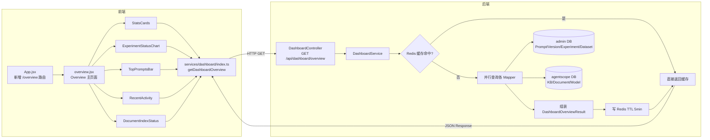

# Overview 数据总览页 — 改造影响分析

> 来源：基于真实代码扫描
> 关联需求：docs/requirements/overview-dashboard.md

---

## Step 1：改造涉及的完整链路

### 链路节点表

| 节点 | 文件 | 状态 | 说明 |
|------|------|------|------|
| 前端路由 | `frontend/packages/main/src/legacy/App.jsx` | 现有，需新增路由 | 新增 `/overview` 路由，指向 OverviewPage 组件 |
| 前端菜单 | `frontend/packages/main/src/legacy/components/Layout.jsx`（或等效侧边栏文件） | 现有，需新增菜单项 | 在菜单顶部新增"总览"入口，icon 用 `DashboardOutlined` |
| 前端页面组件 | `frontend/packages/main/src/legacy/pages/overview/overview.jsx`（新建） | **新建** | Overview 主页面，组织各 Section 组件 |
| 前端 Stats Cards | `frontend/packages/main/src/legacy/pages/overview/components/StatsCards.jsx`（新建） | **新建** | 6 张指标卡，数据来自 `/api/dashboard/overview` |
| 前端 Experiment Chart | `frontend/packages/main/src/legacy/pages/overview/components/ExperimentStatusChart.jsx`（新建） | **新建** | 饼图，依赖 antd `Pie` 或手写 `Progress` 组合 |
| 前端 Top Prompts | `frontend/packages/main/src/legacy/pages/overview/components/TopPromptsBar.jsx`（新建） | **新建** | 横向柱状图，Top 10 Prompt 版本分布 |
| 前端 Recent Activity | `frontend/packages/main/src/legacy/pages/overview/components/RecentActivity.jsx`（新建） | **新建** | Timeline 列表 |
| 前端 Document Index | `frontend/packages/main/src/legacy/pages/overview/components/DocumentIndexStatus.jsx`（新建） | **新建** | 进度条组，按知识库分组 |
| 前端 API 函数 | `frontend/packages/main/src/legacy/services/dashboard/index.ts`（新建） | **新建** | `getDashboardOverview()` 函数 |
| 前端类型声明 | `frontend/packages/main/src/legacy/services/dashboard/typing.ts`（新建） | **新建** | `DashboardOverviewResult` 及子类型 |
| 后端 Controller | `spring-ai-alibaba-admin-server-start/.../admin/controller/DashboardController.java`（新建） | **新建** | `GET /api/dashboard/overview` |
| 后端 Service 接口 | `...admin/service/DashboardService.java`（新建） | **新建** | `getOverview()` 方法签名 |
| 后端 Service 实现 | `...admin/service/impl/DashboardServiceImpl.java`（新建） | **新建** | 聚合查询各模块数据，Redis 缓存 5 分钟 |
| 后端 DTO | `...admin/dto/DashboardOverviewResult.java`（新建） | **新建** | 顶层返回 DTO，含各子 DTO |
| 后端 子 DTO | `...admin/dto/dashboard/`（新建目录，多个文件） | **新建** | `PromptsStats`、`ExperimentStats`、`ModelStats` 等 |
| 后端 Mapper 复用 | `PromptMapper`、`PromptVersionMapper`、`ExperimentMapper`、`DatasetMapper` 等 | **不动** | 新增 COUNT 查询方法 |
| 后端 跨库查询 | agentscope 库（KnowledgeBase、Document、Model 等表） | **不动** | 需通过 MyBatis-Plus 访问 agentscope 数据源 |
| DB schema | 所有相关表 | **不动** | 纯聚合查询，无 schema 变更 |
| Redis | `dashboard:overview` key | 新增 key | TTL 5 分钟，`DashboardServiceImpl` 写入和读取 |

### 链路图

---

## Step 2：所有改造点

### 后端

| 编号 | 类型 | 涉及文件 | 改什么 |
|------|------|---------|--------|
| P01 | 新建 | `dto/dashboard/PromptsStats.java` | total、addedThisMonth |
| P02 | 新建 | `dto/dashboard/PromptVersionsStats.java` | total、releaseCount、preCount |
| P03 | 新建 | `dto/dashboard/ExperimentStats.java` | total + 各状态 count |
| P04 | 新建 | `dto/dashboard/DatasetsStats.java` | total、totalItems |
| P05 | 新建 | `dto/dashboard/KnowledgeBasesStats.java` | total、totalDocuments、indexingCount、failedCount |
| P06 | 新建 | `dto/dashboard/ModelStats.java` | total、enabledCount、byProvider 列表 |
| P07 | 新建 | `dto/dashboard/RecentActivityItem.java` | eventType、entityKey、entityVersion、description、timestamp |
| P08 | 新建 | `dto/dashboard/TopPromptItem.java` | promptKey、releaseVersion、preVersion、updateTime |
| P09 | 新建 | `dto/dashboard/DocumentIndexStatusItem.java` | kbId、kbName、pendingCount、processingCount、completedCount、failedCount |
| P10 | 新建 | `dto/DashboardOverviewResult.java` | 顶层 DTO，组合 P01-P09 |
| P11 | 新建 | `service/DashboardService.java` | 接口：`DashboardOverviewResult getOverview()` |
| P12 | 新建 | `service/impl/DashboardServiceImpl.java` | 实现聚合查询 + Redis 缓存逻辑 |
| P13 | 新建 | `controller/DashboardController.java` | `GET /api/dashboard/overview` 入口 |
| P14 | 修改 | `PromptMapper.java` / `PromptMapper.xml` | 新增 `countByMonth` 方法（查本月新增 Prompt 数） |
| P15 | 修改 | `PromptVersionMapper.java` / xml | 新增 `countGroupByStatus` 方法 |
| P16 | 修改 | `ExperimentMapper.java` / xml | 新增 `countGroupByStatus` 方法 |
| P17 | 修改 | `DatasetMapper.java` / xml | 新增 `countTotalItems`（关联 dataset_item 表） |

### 前端

| 编号 | 类型 | 涉及文件 | 改什么 |
|------|------|---------|--------|
| P18 | 新建 | `services/dashboard/typing.ts` | 所有 TS 类型声明 |
| P19 | 新建 | `services/dashboard/index.ts` | `getDashboardOverview()` 函数 |
| P20 | 新建 | `pages/overview/overview.jsx` | 主页面，`useEffect` 加载数据，分发给各 Section |
| P21 | 新建 | `pages/overview/components/StatsCards.jsx` | 6 张 antd `Card` + `Statistic` 组件 |
| P22 | 新建 | `pages/overview/components/ExperimentStatusChart.jsx` | antd `Progress` 或自定义饼图 |
| P23 | 新建 | `pages/overview/components/TopPromptsBar.jsx` | antd `Progress` 横向柱状图模拟 |
| P24 | 新建 | `pages/overview/components/RecentActivity.jsx` | antd `Timeline` 组件 |
| P25 | 新建 | `pages/overview/components/DocumentIndexStatus.jsx` | antd `Progress` + `Table` 或 `List` |
| P26 | 修改 | `legacy/App.jsx` | 新增 `<Route path="/overview" element={<OverviewPage />} />` |
| P27 | 修改 | 侧边栏/菜单组件 | 新增"总览"菜单项，`DashboardOutlined` icon，路由 `/overview` |

### 文档

| 编号 | 类型 | 涉及文件 | 改什么 |
|------|------|---------|--------|
| P28 | 更新 | `docs/api-list.md` | 新增 `GET /api/dashboard/overview` 接口记录 |
| P29 | 更新 | `docs/data-model.md` | 新增 `DashboardOverviewResult` 及子 DTO 说明 |

---

## Step 3：影响范围与风险

| # | 影响项 | 风险 | 说明 |
|---|--------|------|------|
| 1 | 现有接口 | **无** | 全新路径 `/api/dashboard/overview`，不触碰现有接口 |
| 2 | 跨库查询（admin + agentscope） | **中** | `DashboardServiceImpl` 需同时操作两个 DataSource。注意 agentscope 库的 Mapper 在 `server-runtime` 模块，需确认 `server-start` 模块能正确注入；现有多库路由已验证可行（`ModelConfigBridgeServiceImpl` 有先例） |
| 3 | Redis 缓存 | **低** | 使用 Redisson（已有），key 命名 `dashboard:overview`，TTL 5 分钟。缓存击穿风险低（低并发管理后台）；不设双重检查锁，直接 get-or-set 即可 |
| 4 | 聚合查询性能 | **中** | 一次请求触发 6-8 条 COUNT SQL + Redis 写。冷启动（缓存未命中）预估 200-500ms，可接受。后续数据量大时可考虑 `CompletableFuture` 并行执行各查询 |
| 5 | 前端无依赖引入 | **低** | 全部用 antd 现有组件（`Card`、`Statistic`、`Progress`、`Timeline`），不引入 echarts 等图表库 |
| 6 | 菜单结构 | **低** | 需确认侧边栏菜单配置文件位置（静态 JSX 还是配置数组），改动范围仅新增一条记录 |

---

## Step 4：改造步骤与顺序

| 步骤 | 改造点 | 依赖 | 工作量 |
|------|--------|------|--------|
| 1 | P01-P10（建所有 DTO） | / | 1.5h |
| 2 | P11-P12（Service 接口 + 实现） | 步骤 1 | 3h（含跨库查询调试） |
| 3 | P13（Controller） | 步骤 2 | 0.5h |
| 4 | P14-P17（Mapper 新增 COUNT 方法） | 步骤 2 | 2h |
| 5 | P18-P19（前端 API + 类型） | 步骤 3 接口定型 | 0.5h |
| 6 | P20-P25（前端页面 + 各 Section 组件） | 步骤 5 | 4h |
| 7 | P26-P27（路由 + 菜单） | 步骤 6 | 0.5h |
| 8 | P28-P29（文档） | 步骤 3 | 0.5h |

**合计约 12.5 小时。**
