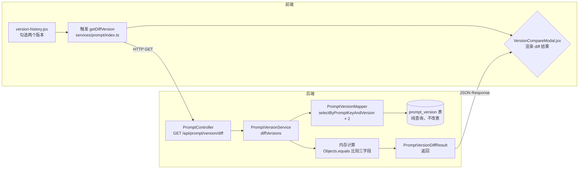
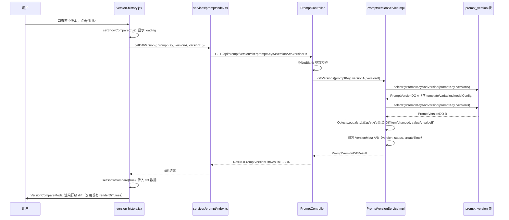

# Prompt 版本 Diff — 改造影响分析

> 来源：按 18 讲提示词逐步产出，基于真实代码扫描

---

## Step 1：改造涉及的完整链路

### 链路节点表

| 节点 | 文件 | 状态 | 说明 |
| --- | --- | --- | --- |
| 前端入口 | `frontend/packages/main/src/legacy/pages/prompts/version-history/version-history.jsx` | 现有，需修改 | 已有"对比版本"勾选交互（`selectedVersions` state），点击"Compare"触发 `showCompare=true`，但对比数据靠前端本地拼装，**不调后端 diff 接口** |
| 前端对比弹窗 | `frontend/packages/main/src/legacy/components/VersionCompareModal.jsx` | 现有，需修改 | 已有弹窗组件，含行级 diff 渲染逻辑（`renderDiffLines`），但数据来自两次独立的 `getPromptVersion` 调用，不走专用 diff 接口 |
| 前端 API 调用 | `frontend/packages/main/src/legacy/services/prompt/index.ts` | 需新增 `getDiffVersion` 函数 | 已有 `getPromptVersion`（单版本详情），diff 需新增一个调后端 diff 接口的函数 |
| 前端类型声明 | `frontend/packages/main/src/legacy/services/prompt/typing.ts` | 需新增 diff 相关 types | 已有 `GetPromptVersionResult`，需新增 `GetPromptVersionDiffParams` / `GetPromptVersionDiffResult` |
| 前端 i18n | `frontend/packages/main/src/i18n/locales/zh-cn.json` `en-us.json` `ja-jp.json` | 按需更新 | 如新增按钮文案需同步三个文件 |
| 后端入口 | `spring-ai-alibaba-admin-server-start/src/main/java/.../admin/controller/PromptController.java` | 需新增 GET diff 接口 | 现有接口不动；新增 `GET /api/prompt/version/diff` handler |
| 后端 Service 接口 | `...admin/service/PromptVersionService.java` | 需新增 `diff` 方法签名 | 现有 `getByPromptKeyAndVersion` 可复用查询逻辑 |
| 后端 Service 实现 | `...admin/service/impl/PromptVersionServiceImpl.java` | 需新增 `diffVersions` 实现 | 内部调 `promptVersionMapper.selectByPromptKeyAndVersion` 两次；**注意：现有 `getByPromptKeyAndVersion` 有 log.info 打印，复用时会双倍打日志** |
| 后端 Mapper | `...admin/mapper/PromptVersionMapper.java` | 不动 | `selectByPromptKeyAndVersion` 直接复用 |
| MyBatis XML | `PromptVersionMapper.xml` | 不动 | `selectByPromptKeyAndVersion` SQL 已覆盖需求 |
| 后端 DTO（新建） | `...admin/dto/PromptVersionDiffResult.java` | 需新建 | 含 `promptKey`、`versionA`/`versionB`（`VersionMeta`）、`diffs`（`DiffFields`）|
| 后端 DTO（新建） | `...admin/dto/VersionMeta.java` | 需新建 | `version`、`status`、`createTime` |
| 后端 DTO（新建） | `...admin/dto/DiffItem.java` | 需新建 | `changed`、`valueA`、`valueB` |
| DB | `prompt_version` 表 | **不动** | 纯查询，无 schema 变更 |

### Mermaid 链路图

---

## Step 2：所有改造点

| 编号 | 类型 | 涉及文件 | 改什么 |
| --- | --- | --- | --- |
| P01 | 新增 | `dto/PromptVersionDiffResult.java`（新建） | 新建顶层 DTO，含 `promptKey`、`versionA`、`versionB`、`diffs` 字段 |
| P02 | 新增 | `dto/VersionMeta.java`（新建） | 新建元信息 DTO，含 `version`、`status`、`createTime`（epoch ms） |
| P03 | 新增 | `dto/DiffItem.java`（新建） | 新建 diff 单元 DTO，含 `changed`、`valueA`、`valueB` |
| P04 | 新增 | `PromptVersionService.java` | 新增 `diffVersions(String promptKey, String versionA, String versionB)` 方法签名，抛 `StudioException` |
| P05 | 新增 | `PromptVersionServiceImpl.java` | 实现 `diffVersions`：查两次 Mapper → 校验（promptKey 存在、两版本存在、versionA≠versionB）→ 内存比较三字段 → 组装返回 |
| P06 | 新增 | `PromptController.java` | 新增 `GET /api/prompt/version/diff` 接口，入参 `@RequestParam` 三个，返回 `Result<PromptVersionDiffResult>` |
| P07 | 修改 | `frontend/.../services/prompt/index.ts` | 新增 `getDiffVersion(params)` 函数，调 `GET /api/prompt/version/diff` |
| P08 | 修改 | `frontend/.../services/prompt/typing.ts` | 新增 `GetPromptVersionDiffParams` 和 `GetPromptVersionDiffResult` 类型声明 |
| P09 | 修改 | `frontend/.../components/VersionCompareModal.jsx` | 改造弹窗：从"两次单版本请求 + 前端拼装"改为"调 getDiffVersion 接口 + 直接渲染返回的 valueA/valueB"；保留现有 `renderDiffLines` 行级 diff 逻辑（前端继续承担行级高亮） |
| P10 | 修改 | `frontend/.../pages/prompts/version-history/version-history.jsx` | 接入 `getDiffVersion`；加请求 loading 状态（`VersionCompareModal` 打开时显示 loading，等待 diff 接口返回再渲染） |
| P11 | 文档 | `docs/api-list.md` | 新增 `GET /api/prompt/version/diff` 接口记录，标"开发中" |
| P12 | 文档 | `docs/data-model.md` | 新增 `PromptVersionDiffResult`、`VersionMeta`、`DiffItem` 三个 DTO 说明 |

> **注意**：前端已有 `VersionCompareModal.jsx` 且已实现行级 diff 渲染（`renderDiffLines`），因此**不需要新建 diff 展示组件**，也**不需要引入新依赖**（`react-diff-viewer` 等），改造成本低于预期。i18n 文件暂无需新增文案（弹窗标题和按钮文案已有）。

---

## Step 3：改造流程图

---

## Step 4：影响范围与风险

| # | 影响项 | 风险 | 说明 |
| --- | --- | --- | --- |
| 1 | 现有 `GET /api/prompt/version` 接口 | **低** | 新接口走新路径 `/api/prompt/version/diff`，原接口完全不动 |
| 2 | `PromptVersionServiceImpl.getByPromptKeyAndVersion` 复用 | **低** | **该方法只有 `log.info` 打日志，无 metrics 打点副作用**（区别于文章示例）；`diffVersions` 直接调 Mapper 两次即可，无需抽取 `getVersionInternal` |
| 3 | 前端 `VersionCompareModal.jsx` 改造 | **中** | 现有弹窗已实现完整行级 diff 逻辑，改造方向是"改数据来源"而非"重建组件"；但需注意现有弹窗直接接收 `version1`/`version2` 对象，改造后需调整 props 结构以接收后端 diff 结果 |
| 4 | 现有测试 | **低** | 当前无 PromptVersion 相关测试，新增测试不影响现有测试 |
| 5 | 文档更新 | **低** | `api-list.md` / `data-model.md` 需更新（已列入 P11/P12） |
| 6 | 前端依赖 | **低** | **无需引入新依赖**，行级 diff 复用现有 `renderDiffLines`，不依赖 `react-diff-viewer` |
| 7 | LONGTEXT 字段大时性能 | **中** | 单版本 template 可达数 MB，两个版本同时返回序列化压力加倍；本期不做大小限制（需求文档已决策），建议上线后观察接口 latency |

---

## Step 5：改造步骤与顺序

| 步骤 | 改造点 | 依赖 | 工作量 | 关键决策 |
| --- | --- | --- | --- | --- |
| 1 | P01 + P02 + P03（建三个 DTO） | / | 1h | 无分歧；`createTime` 用 epoch ms 与现有 `PromptVersionDetail.createTime` 格式一致 |
| 2 | P04 + P05（Service 接口 + 实现） | 步骤 1 | 1.5h | 直接调 Mapper 两次，**不需要抽取 `getVersionInternal`**（无 metrics 副作用）；null 视同空字符串用 `Objects.equals(nullToEmpty(a), nullToEmpty(b))` 处理，对应 E04 产品决策 |
| 3 | P06（Controller 接口） | 步骤 2 | 0.5h | 无分歧；异常处理直接复用现有 `StudioException` 体系 |
| 4 | P07 + P08（前端 API 函数 + 类型声明） | 步骤 3（接口定型） | 0.5h | 无分歧；可与步骤 3 并行（有接口 mock 就能开始） |
| 5 | P09（改造 VersionCompareModal） | 步骤 4 | 2h | **关键决策**：props 结构变更——现有接收 `version1`/`version2` 完整对象，改为接收后端返回的 `PromptVersionDiffResult`；行级 diff 渲染（`renderDiffLines`）继续保留在前端，不移到后端 |
| 6 | P10（version-history.jsx 接入 + loading） | 步骤 5 | 1h | 无分歧；loading 状态在"点击对比"到"diff 接口返回"期间显示，已有 `showCompare` state 基础上扩展 |
| 7 | P11 + P12（文档更新） | 步骤 3（接口定型） | 0.5h | 无分歧 |

**合计约 7 小时。**
