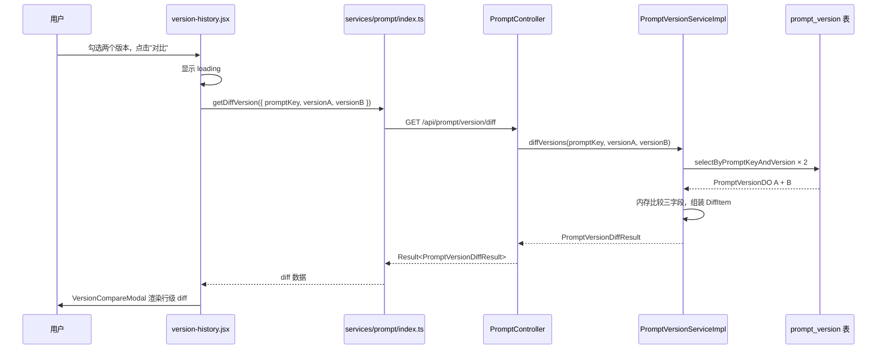
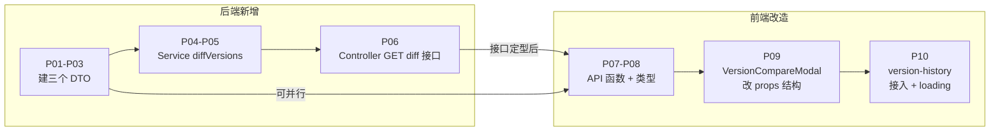

# Prompt 版本 Diff — 改造方案（定稿）

> 状态：方案定稿，待实施
> 来源：prompt-version-diff-impact.md 整合
> 关联需求：docs/requirements/prompt-version-diff.md

---

## 1. 一句话概要

在 `version-history.jsx` 的现有"勾选对比"交互基础上，新增后端 `GET /api/prompt/version/diff` 接口，将当前"两次单版本请求 + 前端拼装"的对比方式改为"后端统一返回 diff 结果"，前端 `VersionCompareModal.jsx` 保留现有行级 diff 渲染逻辑，仅改造数据来源。

---

## 2. 涉及链路

### 节点表

| 节点 | 文件 | 状态 | 说明 |
| --- | --- | --- | --- |
| 前端入口 | `frontend/.../pages/prompts/version-history/version-history.jsx` | 现有，需修改 | 已有勾选和 showCompare 状态，接入 getDiffVersion + loading |
| 前端对比弹窗 | `frontend/.../components/VersionCompareModal.jsx` | 现有，需修改 | 已有行级 diff 渲染，改造 props 结构和数据来源 |
| 前端 API 函数 | `frontend/.../services/prompt/index.ts` | 需新增 | 新增 `getDiffVersion` 函数 |
| 前端类型声明 | `frontend/.../services/prompt/typing.ts` | 需新增 | 新增 diff 相关 types |
| 后端 Controller | `...admin/controller/PromptController.java` | 需新增接口 | 新增 `GET /api/prompt/version/diff` |
| 后端 Service 接口 | `...admin/service/PromptVersionService.java` | 需新增方法 | 新增 `diffVersions` 签名 |
| 后端 Service 实现 | `...admin/service/impl/PromptVersionServiceImpl.java` | 需新增实现 | 两次 Mapper 查询 + 内存比较 |
| 后端 Mapper | `...admin/mapper/PromptVersionMapper.java` | **不动** | 复用 `selectByPromptKeyAndVersion` |
| MyBatis XML | `PromptVersionMapper.xml` | **不动** | 复用现有 SQL |
| DB | `prompt_version` 表 | **不动** | 纯查询，无 schema 变更 |

### 调用链路图

---

## 3. 改造点清单

### 后端

| 编号 | 类型 | 文件 | 改什么 |
| --- | --- | --- | --- |
| P01 | 新增 | `dto/PromptVersionDiffResult.java` | 顶层 DTO |
| P02 | 新增 | `dto/VersionMeta.java` | 版本元信息 DTO |
| P03 | 新增 | `dto/DiffItem.java` | Diff 单元 DTO |
| P04 | 新增 | `PromptVersionService.java` | 新增 `diffVersions` 方法签名 |
| P05 | 新增 | `PromptVersionServiceImpl.java` | 实现 `diffVersions` |
| P06 | 新增 | `PromptController.java` | 新增 GET diff 接口 |

### 前端

| 编号 | 类型 | 文件 | 改什么 |
| --- | --- | --- | --- |
| P07 | 新增 | `services/prompt/index.ts` | 新增 `getDiffVersion` 函数 |
| P08 | 新增 | `services/prompt/typing.ts` | 新增 diff 相关 types |
| P09 | 修改 | `components/VersionCompareModal.jsx` | 改 props 结构，数据来源从前端拼装改为后端 diff 结果 |
| P10 | 修改 | `pages/prompts/version-history/version-history.jsx` | 接入 `getDiffVersion`，加 loading 状态 |

### 测试 & 文档

| 编号 | 类型 | 文件 | 改什么 |
| --- | --- | --- | --- |
| P11 | 文档 | `docs/api-list.md` | 新增接口记录，标"开发中" |
| P12 | 文档 | `docs/data-model.md` | 新增三个 DTO 说明 |

---

## 4. 改造流程图

---

## 5. 影响范围与风险

| # | 影响项 | 风险 | 说明 |
| --- | --- | --- | --- |
| 1 | 现有 `GET /api/prompt/version` 接口 | **低** | 新接口新路径，原接口不动 |
| 2 | `PromptVersionServiceImpl` 现有方法 | **低** | 只有 `log.info` 日志，无 metrics 副作用，直接调 Mapper 无需抽取内部方法 |
| 3 | `VersionCompareModal.jsx` 改造 | **中** | props 结构变更是破坏性改动，需同步更新 `version-history.jsx` 的调用处；行级 diff 逻辑（`renderDiffLines`）保留不动 |
| 4 | 现有测试 | **低** | 当前无 PromptVersion 测试，新增不影响现有 |
| 5 | 前端依赖 | **低** | 无需新增依赖，复用现有 `renderDiffLines` |
| 6 | LONGTEXT 大内容性能 | **中** | 两个版本 template 同时返回，本期不做大小限制，上线后监控接口 latency |

---

## 6. 改造步骤与顺序

| 步骤 | 改造点 | 依赖 | 工作量 | 关键决策 |
| --- | --- | --- | --- | --- |
| 1 | P01 + P02 + P03（建 DTO） | / | 1h | `createTime` 用 epoch ms，与现有 `PromptVersionDetail` 一致 |
| 2 | P04 + P05（Service） | 步骤 1 | 1.5h | null 视同空字符串，用 `Objects.equals(nullToEmpty(a), nullToEmpty(b))` |
| 3 | P06（Controller） | 步骤 2 | 0.5h | 异常复用 `StudioException` 体系 |
| 4 | P07 + P08（前端 API） | 步骤 3 接口定型 | 0.5h | 可与步骤 3 并行 |
| 5 | P09（VersionCompareModal 改造） | 步骤 4 | 2h | **关键**：props 从 `version1/version2` 对象改为 `PromptVersionDiffResult`；行级渲染继续在前端 |
| 6 | P10（version-history 接入） | 步骤 5 | 1h | 在现有 `showCompare` 基础上加 loading 状态 |
| 7 | P11 + P12（文档） | 步骤 3 接口定型 | 0.5h | — |

**合计约 7 小时。**

---

## 7. 待审核的关键决策点

| # | 决策点 | 推荐方案 | 备选 |
| --- | --- | --- | --- |
| D1 | null 字段处理方式 | null 视同空字符串（`nullToEmpty`），`changed` 基于空字符串比较 | null 单独标记为"字段缺失"状态 |
| D2 | `VersionCompareModal` props 结构变更方式 | 直接改 props，同步更新调用方 `version-history.jsx` | 做兼容层同时支持旧 props 和新 props，旧逻辑渐进迁移 |
| D3 | 前端是否加 loading 状态 | 加（diff 接口在 LONGTEXT 时可能较慢，没有 loading 体验差） | 不加（依赖现有弹窗打开的默认状态） |
| D4 | 是否监控 diff 接口 latency | 建议加（为后续是否要做大小限制提供数据依据） | 本期不做 |
