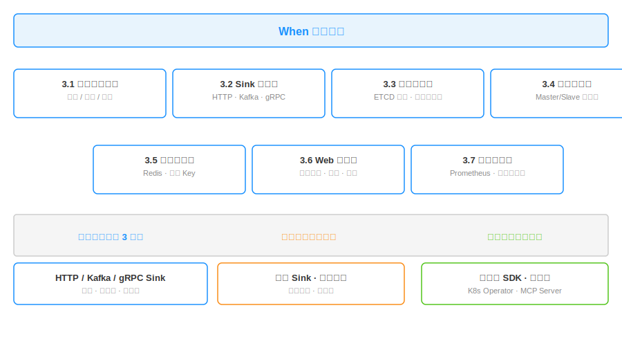

# When：项目需求文档

> 本文档说明 When 的功能需求。所有功能分三档：核心功能训练营 3 周内完成，扩展功能训练营之后可以补齐，社区共建功能作为长期方向开放。
>
> 本文档定义 What，How 在《When 项目技术方案文档》中展开。

## 一、项目概述

When 是一个通用的、独立部署的分布式延时投递组件，用 Java 写。它解决一件事：在指定的时间点，把一条消息精确投递到任意下游。下游可以是 HTTP 接口、Kafka、gRPC 服务、消息队列，或者任何能被调用的外部系统。业务方通过 HTTP API 提交延时消息，When 负责存储、调度、到期投递。

这个项目存在的理由，在前置调研文档（[When：业界调研](when-industry-research.md)）里已经讲清楚：延时投递在企业级业务里是高频刚需，但开源生态里没有一个通用的、独立的、专注做这件事的项目。When 想填这个位置。

## 二、设计目标

When 的主目标是用一个独立服务覆盖业务方的所有延时投递场景，业务方不需要自己造延时。投递目标可扩展，不绑定任何特定下游。集群化部署，生产级可靠性。接入简单，直接 HTTP API，不依赖 SDK。

有几件事 When 明确不做：

- **不做任务调度平台**：cron 表达式、定时任务管理、执行器集群不在 When 的范围，这是 XXL-JOB 的事
- **不做消息队列**：持久化消息流、消费组、订阅模型不在 When 的范围，这是 Kafka 和 RocketMQ 的事
- **不做 worker 执行框架**：业务代码跑在哪里、怎么并发、怎么重试是下游的事，不是 When 的事
- **不做大而全的消息中间件**：专注延时投递这一件事

## 三、核心功能

### 3.1 延时消息投递

业务方通过 HTTP API 提交一条延时消息，指定延时时长、目标 Sink、消息内容。When 在指定时间点把消息投递到目标 Sink。延时时长支持从秒到月的任意长度，到期投递的时间精度控制在秒级。消息内容透传，When 不解析内容。投递语义是至少一次，失败时按重试策略再投。

对外提供三个核心 HTTP 接口：

| 接口 | 说明 |
|------|------|
| `POST /api/v1/messages` | 提交延时消息，返回 message_id |
| `DELETE /api/v1/messages/{id}` | 取消尚未投递的延时消息 |
| `GET /api/v1/messages/{id}` | 查询消息状态：pending / delivered / cancelled / failed |

### 3.2 Sink 插件化

投递目标（Sink）是可插拔的。业务方在提交延时消息时指定 Sink 类型和目标地址，When 调用对应 Sink 完成投递。核心阶段内置三种 Sink：

- **HTTP Webhook**：业务方提供 HTTP 地址，When 到期 POST 过去
- **Kafka**：业务方指定 Kafka 集群地址和 Topic，When 到期写入
- **gRPC 回调**：业务方提供 gRPC 服务地址和方法，When 到期发起调用

Sink 是接口化的，通过 SPI 机制扩展。新增一种 Sink 不需要修改 When 核心，实现 Sink 接口并打包成插件即可。这个机制让后续扩展阶段加入 RocketMQ、NATS、Pulsar 等 Sink 时不需要重构核心。

### 3.3 集群化部署与协调

When 以集群形态部署，多个节点协同工作，任意节点都可以接收业务方请求。集群协调通过 ETCD 完成，每个节点上线时向 ETCD 注册自己，通过 Lease 机制保活。集群中有一个 Controller 节点负责调度决策，包括时间轮分配、节点故障切换、负载平衡。Controller 通过 ETCD 选举产生，失败时自动重新选举。

集群支持动态扩缩容。新节点上线后自动加入集群，Controller 重新平衡负载。节点下线后（主动或异常）Controller 自动迁移其负载，整个过程对业务方透明。

### 3.4 时间轮调度与多副本

时间到期触发是 When 的核心机制，基于多层时间轮实现，在内存里完成调度。多层结构支持从秒到月的延时跨度，O(1) 复杂度的时间推进和任务触发。一个集群里有多个时间轮实例，均匀分布到各个节点上。

每个时间轮有 Master 和 Slave 两个副本，分布在不同节点上。Master 负责实际调度和投递，Slave 同步数据保持热备。Master 所在节点故障时，Slave 自动切换为 Master 接管调度，保证延时消息不丢、不重复。

### 3.5 持久化存储

使用 Redis 作为延时消息和索引的持久化存储。延时消息内容以消息 ID 为 key 存储消息体，延时时间索引以时间轮维度组织。一个关键约束是不使用 Redis 的 ZSet 大集合模式，所有 key 按消息 ID 维度拆分，每个 key 体积可控，避免大 Key 问题对 Redis 单线程模型的冲击。

Redis 本身的可用性由部署方保证（集群部署、AOF 持久化），When 不重复造 Redis 的高可用机制。

### 3.6 Web 管理台

提供基础的 Web 管理界面，用于运维和排查问题。核心阶段提供三个页面：

- **集群状态页**：节点列表、Controller 所在节点、各节点负载、时间轮分布
- **任务列表页**：查询当前所有延时消息，按状态、按时间范围、按 Sink 类型筛选，支持取消和手动重投
- **投递日志页**：消息投递历史，包括成功、失败、重试次数、耗时分布

管理台是独立 Web 应用，通过 HTTP API 和 When 服务端通信，不和服务端耦合部署。

### 3.7 可观测能力

核心指标暴露为 Prometheus 格式，包括写入 QPS、投递 QPS、当前延时消息数量、投递成功率、投递耗时分布、各节点负载等。日志为结构化输出，关键路径有 trace ID 串联。节点提供健康检查接口，供 Kubernetes 或负载均衡器使用。

## 四、扩展功能

扩展功能在核心功能之后推进，补齐生产级使用必需但不在核心路径上的能力。训练营结束后可以陆续补齐。

**Sink 扩展**：除核心阶段的 HTTP、Kafka、gRPC 之外，补充 RocketMQ、NATS、Pulsar、RabbitMQ、Redis Pub/Sub 等常用消息中间件的 Sink。

**鉴权与限流**：基于 token 的调用方鉴权，识别接入应用；按调用方的 QPS 限流，防止单个调用方占满整个集群；每个调用方的延时消息数量配额。

**管理台增强**：任务搜索（按消息内容、按业务标签）、批量操作（批量取消、批量重新投递）、统计图表（投递成功率趋势、延时分布、Sink 流量分布）、报警配置（投递失败率超阈值告警）。

**死信和重试增强**：多次重试投递失败的消息进入死信队列；支持自定义重试策略（指数退避、固定间隔、按 HTTP 状态码区分）。

**优先级队列**：支持给延时消息打优先级标签，到期时高优先级先投递。

## 五、社区共建功能

社区共建功能不在 When 主线开发计划内，作为长期方向开放给社区贡献。

**多语言 SDK** 是社区可贡献的最大方向。When 本身只提供 HTTP API，但社区可以基于 HTTP API 封装 Java、Go、Python、Node.js、Rust 等语言的 SDK，降低各生态的接入成本。

**多租户**：租户维度的资源隔离、配额、数据隔离，适用于把 When 作为内部中台或 SaaS 服务提供时的场景。

**自定义存储后端**：Redis 之外，可以选择嵌入式 KV（RocksDB）、MySQL 等存储，适配不同部署环境。

**跨地域部署**：支持多地域时间轮协调，延时消息可指定投递地域。

**Kubernetes Operator**：把 When 的部署、扩缩容、配置变更工程化，适配云原生环境。

**MCP Server**：把 When 暴露为 MCP Server，让 AI Agent 可以直接调用延时投递能力，这是 AI 时代延时投递可能的新接入方式。

## 六、非功能需求

**性能**

| 指标 | 目标 |
|------|------|
| 单节点写入 QPS | ≥ 10,000 |
| 单节点投递 QPS | ≥ 10,000 |
| 集群写入扩展性 | 随节点数线性扩展 |
| 单节点消息存储容量 | ≥ 100 万条稳定存储 |

**精度**

| 指标 | 目标 |
|------|------|
| 投递时间精度 | 99% 消息在到期时间 ±1s 内投递 |
| 延时跨度 | 1s ～ 30d，精度稳定 |

**可用性**

| 指标 | 目标 |
|------|------|
| 故障切换时间 | Master 故障后 Slave ≤ 10s 接管 |
| 消息可靠性 | Master 宕机，已写入消息不丢 |
| 单节点容错 | N+1 冗余下任意单节点故障不影响整体服务 |

**可运维性**

- 配置变更通过 ETCD 动态下发，不需要重启
- 支持滚动升级不中断服务
- 节点扩缩容自动平衡负载，无需人工干预

## 七、总结

When 是一个通用的、独立部署的分布式延时投递组件，用 Java 写，解决"在指定时间把消息精确投递到任意下游"这件事。

训练营 3 周内完成服务端核心、三种 Sink、基础 Web 管理台和可观测能力，做出一个单节点功能完整、端到端可验证的核心版本。训练营之后可以补齐更多 Sink、鉴权限流、管理台增强、死信重试、优先级队列等扩展功能。多语言 SDK、多租户、自定义存储后端、跨地域部署、Kubernetes Operator、MCP Server 等长期方向开放给社区共建。
