# When 技术方案

> 承接《When 需求文档》。需求文档说 What，本文说 How。


## 一、概述

### 1.1 背景

延时投递是一类高频业务需求：订单超时未支付自动关闭、合同到期前 N 天发送提醒、任务在指定时间点触发回调、消息在流量低谷期延迟推送……这类场景的共同特征是"提交即忘，到点必达"，调用方不关心中间状态，只关心消息在约定时刻能准时出现在目标系统里。

这个需求在各类业务系统里无处不在，但它长期处于一种尴尬状态：每个团队都要为它单独想方案，现成的开源组件要么太重、要么功能残缺、要么有已知的生产级风险。用 RocketMQ 固定档位凑合，用 Redis ZSet 自己拼一个，在数据库里起定时任务轮询——这三种"凑合方案"几乎是行业通用答案，各有缺陷，各自在生产环境踩过坑。

**When** 是为了从根本上解决这个问题而设计的独立开源组件。它以 Java 17 实现，独立部署，核心职责只有一件事：**接收调用方提交的延时消息，在指定时间点精准投递到任意下游目标（HTTP Webhook / Kafka / gRPC）**。

When 的设计目标是成为一个轻量、可靠、可独立运维的基础设施组件，而不是又一套完整的消息队列。调用方不需要引入任何 SDK，通过 HTTP 接口提交和管理消息，投递目标通过 Sink 配置灵活指定，Sink 支持插件化扩展。集群化部署支持水平扩展，单节点故障不影响整体服务，故障恢复目标 10s 内完成。

开源生态里做延时投递的方案不少，但没有一个在"轻量独立部署 + 任意时间精度 + 多 Sink 扩展 + 生产级可靠性"这几个维度上同时达标：

- **Kafka**：无原生延时支持。社区有基于时间戳过滤或额外 Topic 分层的方案，但都有精度损失或运维复杂度问题，不适合作为通用延时层。
- **RocketMQ 4.x**：只有 18 个固定延时档位（1s / 5s / 10s / … / 2h），无法满足任意时间点投递。5.0 引入任意时间延时，但引入整套 RocketMQ 体系成本偏高，单纯为了延时不划算。
- **Pulsar**：原生支持消息级别的延时投递，精度较好，但 Pulsar 整套 BookKeeper + Broker 体系偏重，单纯为了延时引入成本与收益不匹配。
- **Redisson DelayedQueue**：基于 Redis ZSet 实现，方案简单，但所有消息写入同一个 ZSet key，消息量上去之后会形成大 Key，在极端情况下严重影响 Redis 性能，这是有据可查的生产事故来源。
- **Airbnb Dynein**：架构上最接近 When 的设计思路（独立延时服务 + 多 Sink），但强绑定 AWS SQS + DynamoDB，开源后社区几乎停止维护，不具备可落地性。

这个空位是真实存在的。**通用延时投递组件这件事，开源生态里目前没有事实标准**——大公司各做各的、没贡献给社区，中小公司在用次优方案凑合。When 要在这个位置提供一个可用于生产、可公开维护的开源解法。

### 1.2 技术目标

| 维度 | 指标 |
|------|------|
| 吞吐 | 单节点写入 ≥ 10,000 QPS；单节点投递 ≥ 10,000 QPS；集群随节点数线性扩展 |
| 精度 | 99% 消息在到期时间 ±1s 内投递；覆盖 1s ~ 30d |
| 容量 | 单节点稳定存储 ≥ 100 万条延时消息 |
| 可用性 | Master 故障后 Slave ≤ 10s 接管；单节点故障不影响整体服务 |
| 可靠性 | 至少一次投递；Master 宕机已写入消息不丢 |
| 可运维 | ETCD 动态下发配置；支持滚动升级；节点扩缩容自动 rebalance |

### 1.3 术语表

| 术语 | 含义 |
|------|------|
| When | 本项目，也指服务进程 |
| 延时消息 | 业务方提交的、携带到期时间的投递任务单元 |
| Sink | 投递目标的抽象，HTTP Webhook / Kafka / gRPC 等是具体实现 |
| 时间轮（TimeWheel） | 调度核心数据结构，负责到期触发 |
| Slot | 时间轮的最小刻度格 |
| Bucket | 某个 Slot 上挂载的消息集合 |
| Controller | 集群中负责调度决策的逻辑角色，不是独立进程 |
| Master | 时间轮的主副本，负责实际调度和投递 |
| Slave | 时间轮的备副本，同步 Master 数据，故障时接管 |


## 二、业界技术方案调研

### 2.1 消息中间件内置延时能力

最常见的延时方案是消息中间件的内置能力，但严格说这不是"通用延时投递组件"，而是特定中间件提供的附带功能。用这条路，意味着接受整套中间件体系，延时只是其中一个附带特性。

**RocketMQ**

4.x 版本只支持 18 个固定延时档位：1s、5s、10s、30s、1m、2m……最长 2h。不能任意秒级延时，最长上限 2 小时。这种"档位制"对简单场景够用，但凡是需要"延时 17 分钟 23 秒"或者"延时 6 小时"的业务，4.x 直接做不到。RocketMQ 5.0 才基于时间轮引入任意延时能力，且该能力仍在持续完善中。引入整套 RocketMQ 体系的成本对中小规模场景不划算。

**Apache Pulsar**

原生支持任意延时。Delayed Message Tracker 机制实现相对干净，精度较好。但 Pulsar 整套体系偏重——Broker、BookKeeper、ZooKeeper 一整套，单纯为了延时引入的成本与收益对大多数场景不匹配。

**RabbitMQ**

本身不支持延时，社区有两种凑法。TTL + 死信队列：消息过期后路由到死信队列再消费，缺点是粒度粗、不同延时需要不同队列、消息过期顺序和入队顺序不一致。Delayed Message Plugin：官方插件，基于 Mnesia 数据库，大延时数量场景性能撑不住。两种做法都是 hack，不是正式方案。

**Kafka**

完全没有原生延时能力。社区基于 Kafka 做延时都是外挂方案，要么用 Redis ZSet 加定时投递，要么用内部 Topic 模拟时间分桶，都有各自的问题，没有真正干净的实现。

这一类方案有两个共同问题：一是延时能力绑死特定中间件，业务侧真正需要投递的下游远不止消息队列——HTTP 接口、数据库写入、内部 RPC 这些场景用消息中间件的延时覆盖不到。二是混合下游场景下（Kafka 投一部分、HTTP 调一部分），延时绑定某个中间件会造成方案割裂，各自独立维护。


### 2.2 Redis ZSet 系 / SDK 类方案

绕开消息中间件，另一类常见做法是基于 Redis ZSet 的延时队列 SDK。底层基本都是以到期时间戳为 score 存消息 ID，定时 `ZRANGEBYSCORE` 扫到期消息再投。

**Redisson DelayedQueue**

Java 生态里用得最多的 SDK 延时方案，基于 Redis ZSet 实现，API 简单，接入快。问题出在大 Key 上：延时消息数量大时，所有消息写入同一个 ZSet，key 体积达到几十甚至几百 MB，Redis 单线程模型对大 Key 操作非常敏感，一次 ZRANGE 或 ZREM 就可能卡住整个实例数百毫秒。这是有据可查的生产事故来源，延时消息量上来之后几乎必然踩到。

**HDT3213/delayqueue（Go）**

GitHub 上活跃的 Go 延时队列库，定位"简单、可靠、免安装的分布式延时消息队列"。基于 Redis 实现，支持 worker 横向扩展，支持 Redis Cluster。相较 Redisson 架构略好，但核心定位是 SDK 库，需要嵌到业务进程里，不是独立服务。

**Apache Curator DistributedDelayQueue**

基于 ZooKeeper 实现的分布式延时队列。ZK 本身不是为大数据量设计的，延时消息数量稍大就会有性能问题，基本已无实际使用。

SDK 类方案有三层共同局限，且彼此叠加：

第一层是大 Key 风险。Redis ZSet 在消息量大时必然形成大 Key，这是数据结构决定的，没有规避手段。

第二层是 SDK 形态本身的推广障碍。延时逻辑在客户端，业务方要引入依赖、跟随升级、保证版本一致。不同业务方版本不一致，出问题难定位；跨语言基本意味着两套独立实现，各自踩坑；可观测性靠业务方自己埋点，基础设施侧看不到全局数据。

第三层是依赖业务自己的 Redis。SDK 模式下延时消息跑在业务方自己的 Redis 上，业务侧会合理担心延时消息冲击正常业务的 Redis、大 Key 拖死整个实例、运维责任如何划分。这些顾虑直接导致推广困难。


### 2.3 独立延时服务的尝试

绕开 SDK 形态，自然的下一步是做独立服务。业务方通过 HTTP 或 RPC 提交延时请求，服务端负责存储、调度、到期投递。这条路被尝试过，但没有形成事实标准。

**Airbnb Dynein（2019 年开源）**

目前公开资料里和 When 定位最接近的开源项目。架构思路正确，把延时投递拆成"调度"和"队列"两件事独立设计，服务本身无状态，跑在 Kubernetes 上，队列层用 AWS SQS，存储用 DynamoDB。

没能形成社区影响力的原因很明确：强绑定 AWS，非 AWS 环境用不了，直接砍掉大半潜在用户；技术栈用 Java + Dropwizard，2025 年看偏老，Go 体系的新分布式中间件更受认可；开源后没有持续投入，GitHub 上几年没有实质更新，Issues 和 PR 基本无人回应；没有 Web 管理台，只能靠 API 操作，作为开源项目缺一道用户门面。

**Netflix Dyno-queues**

基于 Dynomite（Netflix 自己的 Redis 多区域版本）实现的分布式延时队列，强调多区域可用性，主要服务 Netflix 自身的多区域架构，通用性弱。Dynomite 已停止维护，Dyno-queues 跟着冷下来。

这两个案例说明了同一件事：独立延时服务这条路是对的，但大公司的尝试要么绑定自家基础设施，要么开源后缺少持续运营，没有一个活下来成为通用方案。这个位置目前是空的。


### 2.4 任务队列与任务调度（边界划清）

还有两类容易混淆的方案，需要把边界划清楚。

**任务队列类：BullMQ、Celery、Sidekiq**

这一类项目延时是附带功能，核心定位是"把任务分发给 worker 异步执行"。BullMQ 在 Node.js 生态非常流行，Celery 是 Python 生态标杆，Sidekiq 在 Ruby 生态接近事实标准。它们都支持延时（BullMQ 的 `delay` 参数、Celery 的 `ETA/countdown`、Sidekiq 的 `perform_in`），但核心围绕 worker 执行展开：concurrency 控制、worker 池管理、任务失败重试、任务依赖编排。

延时投递和任务队列解决的是两件事。任务队列把"任务"交给 worker，worker 在自己进程里执行业务逻辑；延时投递把"消息"送到下游，下游处理什么不是延时组件关心的，也没有 worker 概念。两者场景有交集（"3 分钟后给用户发邮件"两者都能实现），但设计重心完全不同，延时投递不应该用任务队列来代替。

**任务调度类：XXL-JOB、PowerJob、Quartz**

XXL-JOB 在国内开源生态影响力极大，GitHub Stars 接近 3 万，Web 管理台做得很好，是国内最广泛部署的分布式调度平台。但 XXL-JOB 的核心是 cron 风格调度——管理员预先定义任务、配置调度规则、注册执行器，调度中心按规则触发。

这和延时投递的使用模式不同。延时投递的典型用法是：业务代码运行时，凭空产生一条延时消息，扔给延时组件，30 分钟后到期投递出去。每条延时消息可能都不一样：不同的目标、不同的延时时长、不同的内容、不同的业务上下文。这种用法在 XXL-JOB 里很别扭——你不会为每个待取消的订单创建一条新的调度 Job。XXL-JOB 解决的是"周期性执行某个任务"，不是"在精确时间点把消息投递出去"。


### 2.5 延时调度算法横向比较

撇开方案定位，专门看"如何在恰当时间触发消息"这一核心算法问题。

**DelayQueue（Java JDK）**

最小堆结构，堆顶始终是最快到期的消息，`poll` 取堆顶判断是否到期，插入和删除均为 O(log N)。实现简单，毫秒级精度。问题是纯内存，进程重启全丢；高并发下堆操作有锁竞争；消息量极大时堆维护开销上升。只适合单机、内存内、小规模场景，不具备分布式能力。

**Redis ZSet 轮询**

以到期时间戳为 score，定时 `ZRANGEBYSCORE` 扫取到期消息再投，O(log N) 复杂度。利用 Redis 持久化，实现简单。问题一是大 Key（前述）；问题二是轮询间隔限制精度，通常 ≥1s；问题三是把调度逻辑外包给 Redis，When 退化为消费者，失去内存调度的精度控制。

**多层时间轮**

环形数组，每个 Slot 对应一个时间刻度，指针推进时触发当前 Slot 上的消息，O(1) 复杂度，与消息总数无关。Kafka、Netty 的 `HashedWheelTimer` 都基于此原理。单层时间轮覆盖范围有限，四层级联（秒 / 分 / 时 / 天）解决跨度问题：长延时消息放高层 Slot，指针推进到该 Slot 时降级到下层，最终在秒轮精确触发。

| 方案 | 触发复杂度 | 精度 | 持久化 | 大规模稳定性 |
|------|-----------|------|--------|------------|
| DelayQueue | O(log N) | 毫秒 | ✗ | 锁竞争、堆开销 |
| Redis ZSet 轮询 | O(log N) | ≥1s | ✓ | 大 Key 风险 |
| 多层时间轮 | O(1) | 毫秒~秒 | 需另建 | **When 选型** |


### 2.6 分布式协调方案

When 需要节点注册与发现、Controller 选举、配置下发、故障检测四件事，需要一个外部协调组件支撑。

**ZooKeeper**

最成熟，Kafka 早期、HBase 都基于它。ZAB 协议，临时节点做服务注册，Watch 做变更通知。问题是运维重（JVM 进程 + 独立集群，资源消耗不低），API 偏底层（ZNode 路径操作，开发效率差），社区进入维护期，新项目已不再首选。

**ETCD**

Kubernetes 的核心存储组件，Raft 协议，Go 单进程，运维比 ZooKeeper 轻得多。Lease 机制天然对应节点注册和故障检测（Lease 过期 = 节点失联），Watch 机制对应节点上下线事件通知，事务 CAS 原语直接实现 Controller 选举。Java 客户端 jetcd 功能完整，接口语义清晰。跑 Kubernetes 的环境几乎都有 ETCD，When 用户无需额外部署。

**Consul**

内置 DNS 和 HTTP 服务发现，服务发现场景开箱即用。但默认非强一致，每台机器需要跑 agent，拓扑复杂。When 只需要强一致 KV 和选举，Consul 多出来的能力用不上，引入的复杂度不值当。

**Nacos**

Spring Cloud Alibaba 生态，服务注册和配置中心用起来方便，但强一致 KV 事务不是它的设计重心，不适合做 Controller 选举这类需要严格 CAS 语义的场景。

| 方案 | 一致性协议 | 运维 | 分布式选举 | Java 客户端 |
|------|-----------|------|-----------|------------|
| ZooKeeper | ZAB | 重 | ✓ | Curator |
| ETCD | Raft | 轻 | ✓ 原生 CAS | jetcd — **When 选型** |
| Consul | Raft | 中 | ✓ | 社区维护 |
| Nacos | Raft（v2） | 轻 | 弱 | Spring 原生 |


### 2.7 持久化存储方案

时间轮在内存里运行，When 需要一套持久化层，满足两个约束：写入不能拖慢 10,000 QPS 的接入路径，同时在节点宕机后能从持久化层全量恢复时间轮状态。

**Redis**

内存操作，写入 < 1ms，完全不影响接入路径性能。AOF 持久化配合 `everysec` 模式最多丢失 1s 数据，`always` 模式完全不丢。企业普及率极高，运维成熟，监控工具链完善。大 Key 风险通过每条消息独立 Key 的存储设计规避，100 万条消息约 550MB 内存，单节点完全承受得住。

**RocksDB**

嵌入式 KV，LSM-Tree 结构，写吞吐高，磁盘存储成本低，TiKV 底层在用。缺点在于作为嵌入式库跑在 When 进程内，JNI 调用有额外开销；Java 客户端成熟度远不如 Redisson；监控工具链薄弱，出问题难排查。100 万条消息场景下 Redis 完全承受得住，RocksDB 的磁盘优势用不到，引入的复杂度不合算。

**MySQL**

持久化能力最成熟，但写入 QPS 远低于 Redis，单节点 10,000 QPS 的写入目标意味着需要批量写和连接池调优，增加不必要复杂度。MySQL 适合存管理台的元数据（用户配置、历史记录），不适合做消息主存储。

| 方案 | 写入延迟 | 持久化 | 运维 | 大 Key 风险 |
|------|---------|--------|------|------------|
| Redis | < 1ms | ✓ | 高 | 需设计规避 — **When 选型** |
| RocksDB | 低 | ✓ | 中 | 无 |
| MySQL | 10~50ms | ✓ | 高 | 无 |


### 2.8 副本与高可用机制

时间轮跑在内存里，节点宕机后内存状态就消失了，需要副本机制保证故障时快速接管、消息不丢。

**Raft 多副本**

强一致共识协议，写入需要多数节点确认，故障时自动选新 Leader，ETCD、TiKV 都基于它。优点是强一致 + 自动容错，无需外部干预。缺点是实现成本极高：完整实现（选举 + 日志复制 + 成员变更 + 快照）代码量 3,000~5,000 行以上，边界情况测试复杂，写入延迟也因多数确认而高于主从。

**Master-Slave 同步复制**

一个 Master 处理写入，同步复制到 Slave，Slave 确认后才返回 ACK。Master 宕机时 Slave 接管，由于同步复制没有数据丢失窗口。Redis Sentinel、MySQL 传统主从都是这个模型。实现比 Raft 简单得多，写入延迟只多一个 Slave RTT，1+1 副本能覆盖单节点故障场景，满足 When 的可靠性要求。

**Master-Slave 异步复制**

Master 写入后立即返回 ACK，异步通知 Slave。写入延迟最低，但 Master 宕机时尚未复制的数据会丢失。When 的可靠性语义是"收到 ACK 则消息不丢"，异步复制违反这个语义，不可用。

| 方案 | 一致性 | 写入延迟 | 实现复杂度 | 适用性 |
|------|--------|---------|-----------|--------|
| Raft | 强一致 | 较高 | 高 | 过重 |
| Master-Slave 同步 | 强一致 | 低 | 中 | **When 选型** |
| Master-Slave 异步 | 最终一致 | 极低 | 低 | 有丢数据窗口 |


### 2.9 通信协议

When 有两层通信需求，特征不同，协议选择也不同。

**对外接入层：HTTP/REST**

接入门槛最低，curl 直接用，任何语言、任何框架不需要额外依赖。When 的核心设计原则之一是"接入不依赖 SDK"，HTTP 是实现这个原则的唯一合理选择。性能上，对接入层（万级 QPS、payload 较大）来说，HTTP 的额外开销可以接受，不是瓶颈。

**节点间通信：gRPC**

副本同步、Controller 指令下发、消息路由转发——这三类内部通信频率高、payload 小而固定、类型明确。gRPC 的 Protocol Buffers 序列化体积比 JSON 小 3~10 倍，强类型接口定义在出错时能快速定位，HTTP/2 多路复用在高并发场景开销低。节点间通信对接入门槛没有要求，gRPC 的这些优势直接体现为吞吐和延迟的提升。

| 协议 | 性能 | 接入门槛 | 适用层 |
|------|------|---------|--------|
| HTTP/REST | 中 | 极低 | 对外接入层 — **When 选型** |
| gRPC | 高 | 需 proto stub | 内部节点通信 — **When 选型** |


## 三、技术选型思考

### 3.1 调度算法：多层时间轮

四层级联：秒轮 60 槽 / 分钟轮 60 槽 / 小时轮 24 槽 / 天轮 30 槽，总计 174 槽覆盖 30 天。

投递 QPS ≥ 10,000 是硬指标。时间轮触发 O(1)，与系统中消息总数无关，是唯一能在百万级消息规模下稳定达到这个目标的方案。单层不够用（覆盖 30 天需要 260 万个槽），四层级联解决这个问题——长延时消息放高层，逐层降级到秒轮精确触发。

放弃 Redis ZSet：调度逻辑交给 Redis 轮询意味着 When 退化为消费者，失去内存调度的精度控制，而且大 Key 风险是已被证实的生产问题。


### 3.2 分布式协调：ETCD

选 ETCD + jetcd，核心是三个机制刚好对上 When 的需求：

- **Lease**：节点注册时绑定 Lease，心跳续约保活，节点宕机后 ETCD 自动清理，不用另外实现故障检测
- **事务 CAS**：`IF key NOT EXISTS THEN PUT` 原语直接实现 Controller 选举
- **Watch**：Controller 监听 `/when/nodes/` 前缀，节点上下线实时感知，事件驱动不轮询

另外，跑 Kubernetes 的环境一般都有 ETCD，When 用户几乎不需要额外部署。

放弃 ZooKeeper：能满足需求，但运维重、API 繁琐，新项目没理由选它。


### 3.3 持久化存储：Redis

When 的可靠性语义是"业务方收到 ACK 则消息不丢"。实现路径：消息先写 Redis，再入时间轮，再返回 ACK。Redis AOF 保证持久化，Master 宕机后新 Master 从 Redis 全量 recover，不依赖内存副本的完整性。

按消息 ID 分散存储（每条消息一个独立 Key）彻底规避大 Key 问题，100 万条消息约 550MB 内存，可控。

放弃 RocksDB：磁盘优势在 When 场景用不上，JNI 调用和 Java 客户端成熟度都不如 Redisson，运维团队不熟悉。


### 3.4 副本机制：Master/Slave 同步复制

1 Master + 1 Slave，同步复制。

选它的理由不是它最强，而是它够用且能在 10 周内实现正确。Raft 的实现和测试成本超出训练营范围。When 的可靠性兜底是 Redis，时间轮副本的目标只是"故障快速切换"，不需要强一致——哪怕 Slave 有几秒落后，新 Master 从 Redis recover 也能补齐。

故障切换由 Controller 协调：检测到 Master 宕机后向 Slave 发 gRPC 指令，Slave 从 Redis 加载数据，重建时间轮，开始调度。逻辑链路清晰，可测。


### 3.5 通信协议：对外 HTTP + 对内 gRPC

When 的一个核心设计原则是"接入不依赖 SDK"。SDK 形态的延时组件在推广上有一个系统性障碍：业务方要引入依赖、要跟随升级版本、要和运维沟通变更窗口，SDK 本身就是摩擦。当延时组件以独立服务的形态存在时，HTTP API 彻底消除这个摩擦——curl 就能接入，任何语言、任何框架都不需要额外依赖。

节点间通信（副本同步、指令下发、消息转发）频率高、类型固定，适合用 gRPC。Protocol Buffers 序列化体积比 JSON 小 3~10 倍，强类型接口定义在服务间通信出错时能快速定位问题，HTTP/2 多路复用在高并发场景下也比 HTTP/1.1 开销更低。


### 3.6 实现语言：Java 17

训练营面向 Java 后端开发者，这是基本约束。Spring Boot、Redisson、jetcd、gRPC Java 全部有成熟实现，不用造轮子。Netty 的 `HashedWheelTimer` 是现成的时间轮参考。Java 17 的 ZGC 停顿 < 1ms，不干扰时间轮精度，这是 Java 8/11 时代不具备的能力。


## 四、整体架构设计

### 4.1 架构总览

When 整体架构由四部分组成：业务方、When 集群、外部依赖（ETCD / Redis）、下游 Sink。

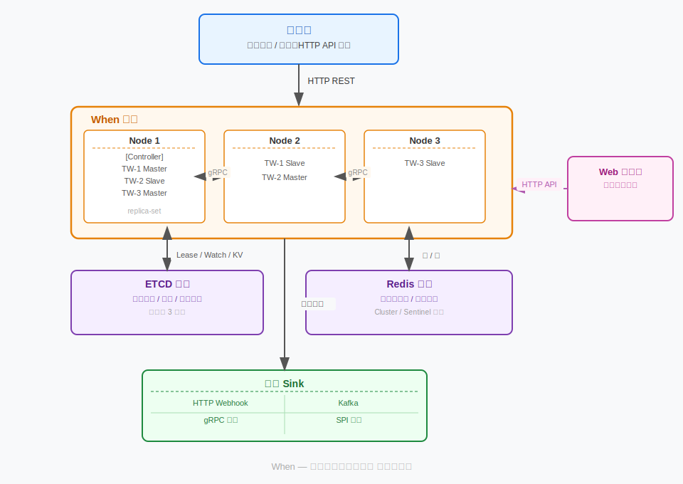

几点说明：

- **同构多节点**：集群里每个节点进程完全一样，都能收请求、跑时间轮、投消息，没有"专用角色节点"
- **Controller 是角色不是节点**：其中一台节点兼任 Controller，负责分片分配和故障处理，宕机后 ETCD 重新选举
- **ETCD 和 Redis 是外部依赖**：When 不自己做集群协调和持久化，这两件事交给成熟组件
- **Sink 插件化**：HTTP / Kafka / gRPC 内置，其余通过 Java SPI 扩展，不改核心代码
- **Web 管理台独立部署**，通过 HTTP API 和 When 集群通信


### 4.2 节点内部模块

每个 When 节点是一个 Spring Boot 应用，模块划分如下：

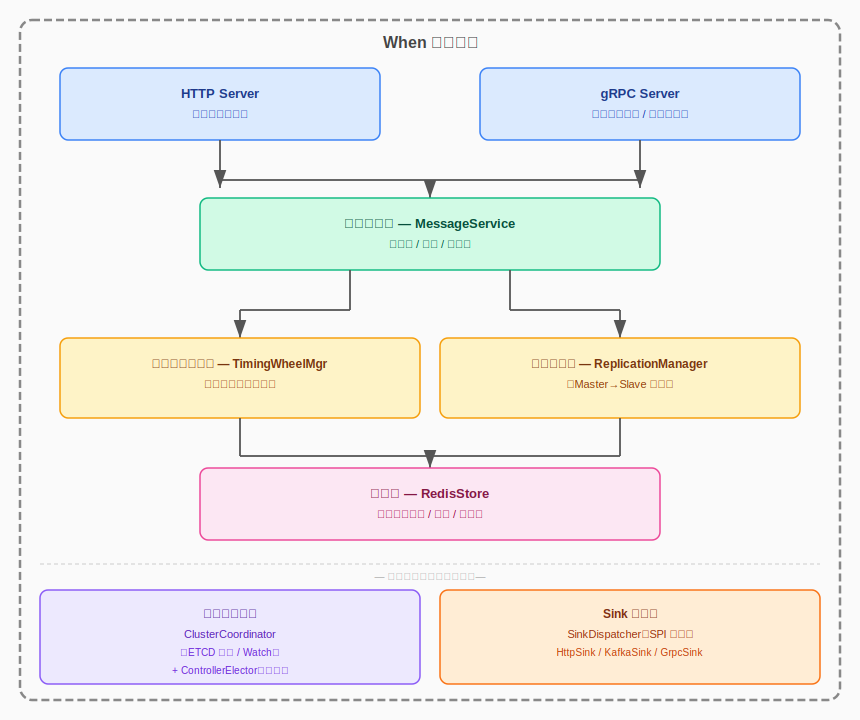


### 4.3 节点角色与集群形态

集群节点同构，运行时通过 ETCD 协调产生三种逻辑角色：

**Controller**（同一时刻只有一个）
- Watch ETCD `/when/nodes/` 感知节点上下线
- 负责时间轮的 Master/Slave 分配和 rebalance
- 负责 Master 故障时的 Slave 提升决策
- 宕机后 ETCD 自动重选

**Master**（每个时间轮分片一个）
- 本地内存时间轮负责调度和投递
- 写入时同步复制到对应 Slave

**Slave**（每个时间轮分片一个）
- 同步 Master 数据，维护热备
- 收到 Controller 指令后切换为 Master

一个节点可以同时持有多个角色：Node 1 可以是 Controller + TW-1 的 Master + TW-2 的 Slave。

时间轮数量和节点数量解耦，默认 `时间轮总数 = 节点数 × 2`。节点数变化时 Controller 重新分配，不需要增减时间轮。

生产环境最小部署：3 节点，覆盖单节点故障，奇数节点对 ETCD 选举友好。


### 4.4 关键数据流

**写入流**

业务方 `POST /messages` 打到任意节点，节点按 `message_id % timewheel_count` 路由到目标时间轮的 Master。如果 Master 不在本节点，gRPC 转发过去。Master 先写 Redis（消息体 + 时间索引），再入内存时间轮，再异步通知 Slave，最后返回 ACK。Redis 持久化先于 ACK 返回——业务方拿到 message_id 就代表消息已落盘。

**投递流**

时间轮调度循环每秒推进一次指针。Slot 到期时，Bucket 里的消息交给 SinkDispatcher 异步投递。投递成功后删 Redis 消息体和索引，通知 Slave 同步删除。投递失败按重试策略重新入轮（指数退避）。调度循环里只做读和触发，Redis 删除和 Sink 调用都是异步提交，不阻塞指针推进。

**故障切换流**

Master 宕机后 ETCD Lease 过期，Controller Watch 到 DELETE 事件，向受影响时间轮的 Slave 发 gRPC 指令。Slave 从 Redis 加载全量索引，重建内存时间轮，开始调度。全程目标 ≤ 10s。


## 五、详细设计

### 5.1 集群组建与协调

集群协调全部基于 ETCD，覆盖节点注册、保活、Controller 选举、节点上下线感知四个环节。

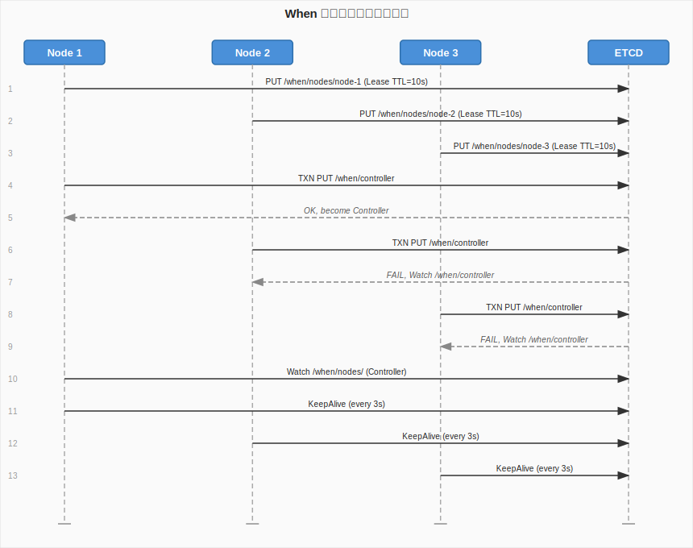

#### 节点注册

节点启动第一件事是向 ETCD 注册，key 为 `/when/nodes/{node_id}`，value 是节点元信息，绑定 TTL 10s 的 Lease：

```
PUT /when/nodes/node-1
value: {"ip":"10.0.0.1","port":8080,"grpc_port":9090,"start_time":1700000000,"load":0}
lease: 10s TTL
```

绑定 Lease 的 key 在 Lease 过期后自动删除，节点宕机的检测就靠这个。

#### 心跳保活

注册完后起一个独立后台线程，每 3s 发一次 KeepAlive 续约（TTL 10s，续约间隔 3s，留 3 倍余量应对抖动）。续约线程必须和业务线程隔离，用独立的 ETCD 连接，GC 停顿不影响续约。

#### Controller 选举

多个节点同时尝试创建 `/when/controller`，ETCD 事务保证只有一个成功：

```
TXN
  IF /when/controller NOT EXISTS (create_revision == 0)
  THEN PUT /when/controller = node_id, lease=10s
  ELSE NOOP
```

成功的节点启动 Controller 线程，失败的 Watch 这个 key 等待下次选举机会。Controller key 也绑 Lease，由 Controller 线程续约，宕机后 key 消失，其他节点立刻触发重选。

#### 节点上下线感知

Controller 持续 Watch `/when/nodes/` 前缀：

- **PUT 事件**：新节点加入，触发时间轮 rebalance（§5.5）
- **DELETE 事件**：节点下线，检查该节点的 Master 时间轮，向对应 Slave 发切换指令（§5.4）

全链路事件驱动，Controller 不主动 ping 节点。

#### 时间轮元数据

时间轮的分配信息存 ETCD，Controller 写，普通节点只读：

```
/when/timewheels/tw-001
value: {"id":"tw-001","master":"node-1","slave":"node-2","status":"running"}
```

节点 Watch 这个前缀，变更后更新本地路由表。


### 5.2 多层时间轮

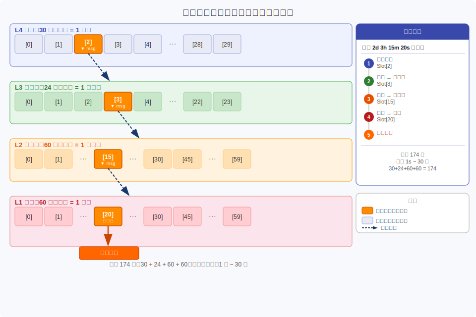

#### 单层原理

时间轮是环形数组，每个 Slot 代表一个时间刻度（秒轮 1 Slot = 1s）。指针从 0 开始，每个刻度前进一格，走到 Slot N 时触发 Slot N 上的所有消息。插入和触发均为 O(1)，与消息总数无关。

新消息延时 30s，当前指针在 Slot 5：放入 `(5+30) % 60 = Slot 35`，指针推进 30 次后触发。

#### 四层结构

| 层 | 名称 | 槽数 | 每槽跨度 | 覆盖范围 |
|----|------|------|---------|---------|
| L4 | 天轮 | 30 | 1 天 | 30 天 |
| L3 | 小时轮 | 24 | 1 小时 | 24 小时 |
| L2 | 分钟轮 | 60 | 1 分钟 | 60 分钟 |
| L1 | 秒轮 | 60 | 1 秒 | 60 秒 |

总计 174 槽，覆盖 1s ~ 30d 任意延时。

**降级机制**：延时 2d 3h 15m 20s 的消息，先放天轮 Slot[2]。天轮指针走到 Slot[2] 时，剩余 3h 15m 20s，降到小时轮 Slot[3]。依此类推，最终进入秒轮 Slot[20] 触发投递。

#### 调度循环

每个时间轮实例跑在独立线程里：

```java
while (running) {
    long tickStart = System.currentTimeMillis();

    Bucket bucket = wheel[L1][pointer];
    for (MessageRef ref : bucket.drain()) {
        sinkDispatcher.submitAsync(ref);          // 异步投递，不阻塞
        redisStore.deleteIndexAsync(ref.msgId()); // 异步删索引
    }

    if (++pointer % 60 == 0) tickHigherWheels();
    pointer = pointer % 60;

    long sleep = SLOT_DURATION_MS - (System.currentTimeMillis() - tickStart);
    if (sleep > 0) LockSupport.parkNanos(sleep * 1_000_000L);
}
```

调度循环里只做读和触发，Redis 删除和 Sink 调用全部异步提交，确保指针推进不被 IO 拖慢。

#### 时间轮分布

集群默认 `时间轮总数 = 节点数 × 2`，分布在各节点上。多时间轮的作用：并发调度提升总 QPS，单个时间轮出问题（GC 停顿）不影响其他，Controller 可动态迁移 Slave 副本均衡负载。

写入时按 `message_id % timewheel_count` 均匀散列到各时间轮。


### 5.3 延时消息生命周期

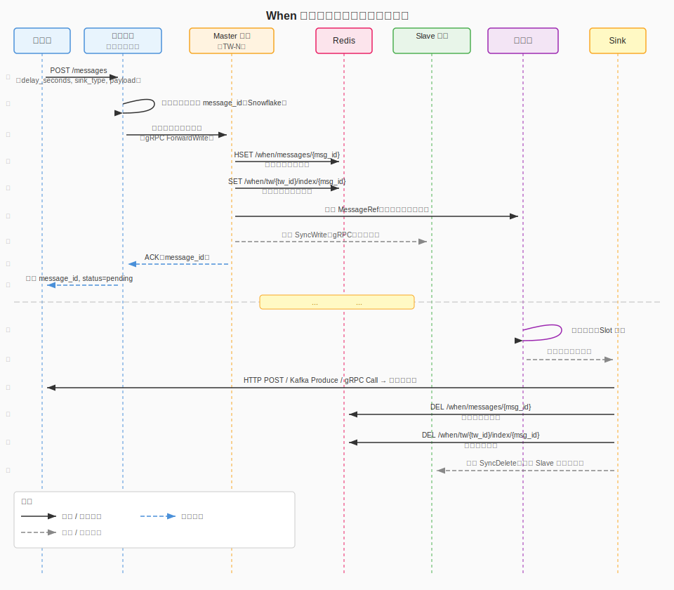

#### 写入

1. 业务方 `POST /messages`，body 包含 `delay_seconds`、`sink_type`、`sink_config`、`payload`
2. 接入层参数校验，Snowflake 生成全局唯一 `message_id`
3. `message_id % timewheel_count` 路由到目标时间轮 tw-N
4. 若本节点是 tw-N 的 Master：写 Redis（消息体 HSET + 时间索引 SET）→ 入内存时间轮 → 异步通知 Slave → 返回 `message_id`
5. 若不是：gRPC 转发到 Master 节点，等 ACK 后返回给业务方

**Redis 写入先于 ACK 是硬约束**：业务方拿到 `message_id` 就代表消息已持久化，这条消息不会丢。

#### 投递

时间轮指针推进到期，Bucket 里的消息交给 SinkDispatcher。Sink 执行投递（HTTP POST / Kafka Produce / gRPC Call），成功后删 Redis 消息体和索引，通知 Slave 同步删除。失败则按重试策略（指数退避，默认最多 4 次）重新入时间轮。

**投递语义是至少一次**：若投递成功后、Redis 删除前 Master 宕机，新 Master recover 时会重新触发投递，导致消息被投递两次。这是分布式系统的标准权衡，业务方下游需要保证幂等消费。

#### 取消

`DELETE /messages/{id}` 路由到对应 Master，内存时间轮标记 cancelled（惰性删除 O(1)），Redis 删除消息体和索引，通知 Slave 同步。

边界情况：消息已投递后取消请求到达，Redis 里消息已不存在，接口返回 404，状态为 `delivered`，业务方需处理这个竞态。

#### 查询

`GET /messages/{id}` 路由到对应节点，先查内存时间轮，没有再查 Redis，返回状态（`pending` / `delivered` / `cancelled` / `failed`）和时间戳。


### 5.4 Master/Slave 副本机制

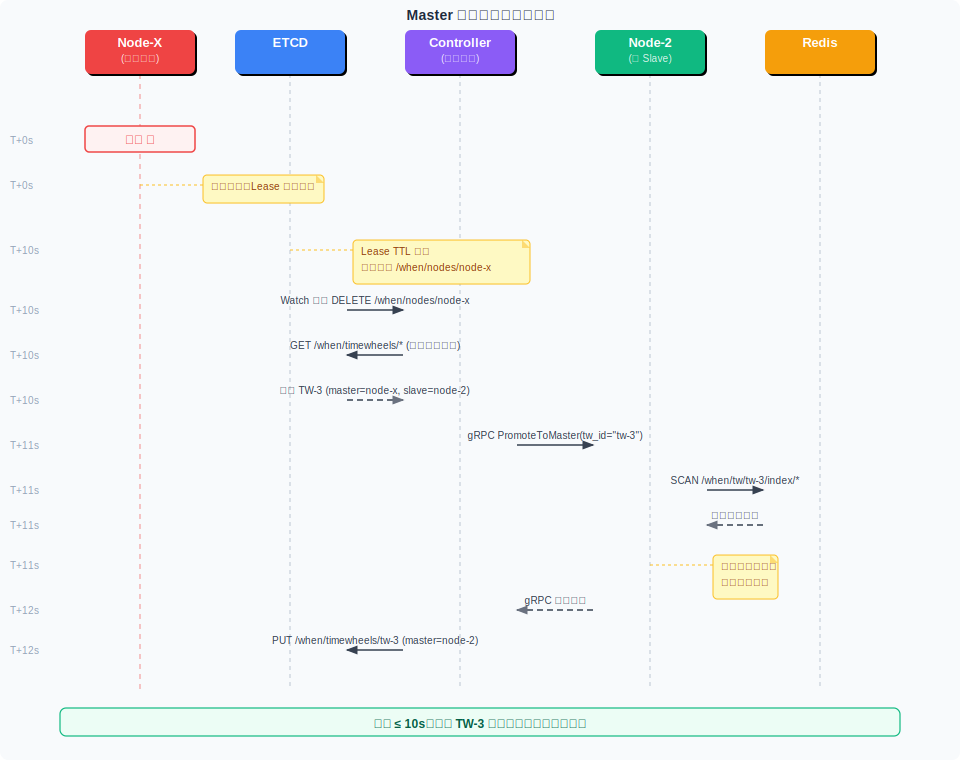

#### 数据同步

Master 完成 Redis 写入后，异步向 Slave 发 gRPC 同步请求：

```protobuf
rpc SyncWrite(SyncWriteRequest) returns (SyncWriteReply) {}

message SyncWriteRequest {
  string tw_id        = 1;
  string msg_id       = 2;
  uint64 expire_ts_ms = 3;
  bytes  payload      = 4;
  string sink_type    = 5;
  string sink_config  = 6;
}
```

Slave 在自己的内存时间轮里执行同样的插入后 ACK，整个过程通常几毫秒。

同步是异步的，不阻塞写入路径。Redis 是可靠性的真正保证，Slave 内存落后几秒不影响数据安全——故障切换时新 Master 从 Redis 全量 recover 即可。

#### 故障检测

完全依赖 ETCD Lease 机制，Controller Watch 感知，When 不另建心跳体系。Lease 由独立线程续约，GC 停顿和业务线程阻塞不影响续约——只有节点真正失能才会 Lease 过期，误判率极低。

#### 故障切换

```
T+0s   Node-X 宕机，Lease 续约停止
T+10s  ETCD 删除 /when/nodes/node-x
T+10s  Controller 收到 Watch DELETE 事件，查出 Node-X 的 Master 时间轮
T+11s  Controller → Node-2（TW-3 的 Slave）：PromoteToMaster(tw_id="tw-3")
T+11s  Node-2：SCAN Redis 加载 TW-3 所有未到期索引 → 重建内存时间轮 → 启动调度
T+12s  Node-2 回报接管完成，Controller 更新 ETCD 分片表，分配新 Slave
```

全程 ≤ 10s，期间 TW-3 的写入请求失败，业务方重试即可，已写入消息全部安全。

#### 不丢消息的两层保证

1. Redis 写入先于 ACK：Master 宕机前未写 Redis，业务方未收到 ACK，会重试提交（Snowflake message_id 幂等）
2. 新 Master 全量 recover：SCAN Redis 该时间轮的所有索引，不会漏


### 5.5 节点扩缩容与负载均衡

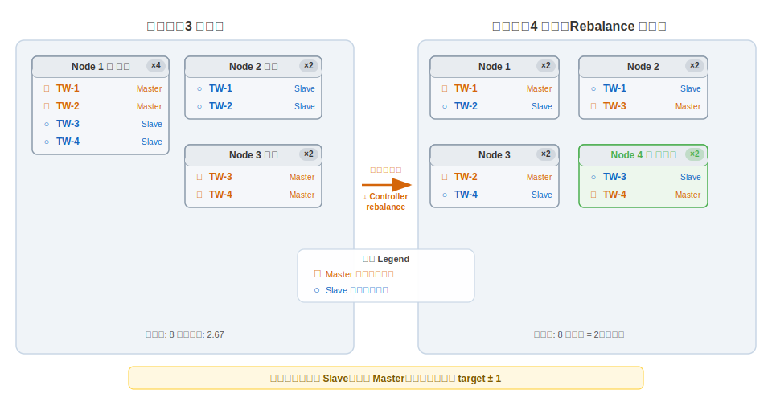

#### 节点加入

新节点向 ETCD 注册后，Controller 触发 rebalance，把部分时间轮的 Slave 副本迁移到新节点（优先迁移 Slave 不动 Master，避免影响写入路径）。新节点从 Master 全量拉取数据，同步完成后承担 Slave 角色。

#### 节点退出

**主动退出**（滚动升级、运维下线）：节点收到 SIGTERM 后主动 DELETE ETCD key（不等 Lease 过期），Controller 立即感知，执行故障切换流程，等所有 Master 时间轮切换完成，节点再真正退出。业务方视角：写入短暂失败约 1~3s，已写消息不丢。

**异常退出**：等 Lease TTL 过期，流程和故障切换相同。

#### Rebalance 算法

目标：每个时间轮 1 Master + 1 Slave，Master 和 Slave 在不同节点，各节点副本总数（Master 数 + Slave 数）均匀（target ± 1）。

```
function rebalance(nodes, timewheels):
    target = (len(timewheels) * 2) / len(nodes)  // 每节点目标副本数

    // 修复 Master 和 Slave 在同一节点的违规
    for tw in timewheels:
        if tw.master == tw.slave:
            tw.slave = pick_node(nodes, exclude=tw.master)

    // 均衡负载：优先迁移 Slave
    while exists overloaded and underloaded nodes:
        src = most_overloaded_node()
        dst = most_underloaded_node()
        tw  = pick_movable_slave(src)
        migrate_slave(tw, src, dst)
```

不追求绝对均匀，target ± 1 的容忍范围避免频繁 rebalance。每次集群变化触发一次，日常每 5 分钟检查一次。


### 5.6 Sink 投递层

#### 接口与 SPI

所有 Sink 实现同一个接口：

```java
public interface Sink {
    String type();  // 与消息的 sink_type 字段匹配，如 "http"
    DeliveryResult deliver(DelayMessage message);  // 线程安全
}
```

SinkDispatcher 通过 Java SPI 加载，构建 `Map<String, Sink>` 路由表按 `sink_type` 分发。新增 Sink 只需实现接口 + 添加 SPI 注册文件，不改核心代码。

```
META-INF/services/com.when.core.sink.Sink:
com.when.sink.HttpSink
com.when.sink.KafkaSink
com.when.sink.GrpcSink
```

#### HttpSink

业务方指定 endpoint，到期时 POST 消息体：

```json
{
  "url": "https://api.example.com/webhook/order-timeout",
  "method": "POST",
  "headers": {"X-When-Signature": "xxx"},
  "timeout_ms": 5000
}
```

OkHttp 连接池复用，读 HTTP 响应码，2xx 成功，其余触发重试。

#### KafkaSink

业务方指定 Kafka 集群和 Topic，到期时 Produce 一条消息：

```json
{
  "bootstrap_servers": "kafka-1:9092,kafka-2:9092",
  "topic": "order-timeout-events",
  "key": "${message_id}"
}
```

KafkaProducer 按 `bootstrap_servers` 分组复用，`producer.send().get()` 同步确认，key 支持模板替换。

#### GrpcSink

业务方指定 gRPC 服务地址和方法，到期时发 Unary RPC：

```json
{
  "target": "order-service:50051",
  "service": "com.example.OrderService",
  "method": "HandleTimeout",
  "deadline_ms": 3000
}
```

ManagedChannel 按 target 分组复用，消息体以 `bytes payload` 透传。

#### 重试策略

失败后重新入时间轮等待重试，默认指数退避：

```
第 1 次：10s 后
第 2 次：30s 后
第 3 次：90s 后
第 4 次：270s 后
超过 4 次 → 标记 failed（P1 阶段进入死信队列）
```

重试配置可在提交消息时自定义（`retry_config` 字段）。


### 5.7 持久化层

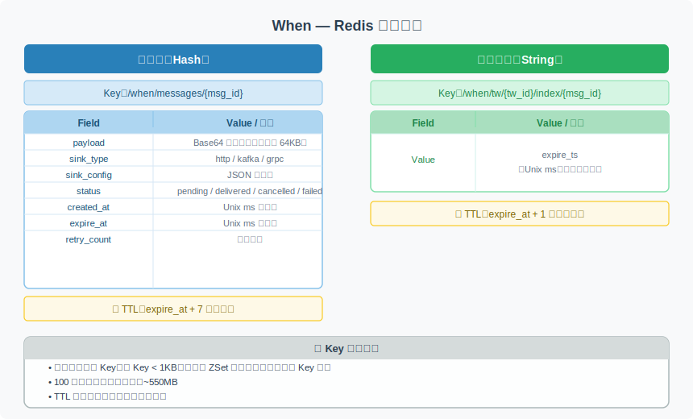

#### 数据模型

**消息体**：`/when/messages/{msg_id}`，Hash 类型，字段包含 payload、sink_type、sink_config、status、created_at、expire_at、retry_count。TTL 为 expire_at + 7 天（投递后保留 7 天供查询）。

**时间索引**：`/when/tw/{tw_id}/index/{msg_id}`，String 类型，value 为 `expire_ts`（Unix ms）。TTL 为 expire_at + 1 小时（投递后尽快清理）。

#### 大 Key 规避

Redis ZSet 方案踩坑的根源：所有消息 ID 放一个 ZSet，堆积百万条时单个 Key 几百 MB，`ZRANGEBYSCORE` 阻塞 Redis 数百毫秒。这是基于 Redis ZSet 实现延时队列的已知生产问题，在大流量场景下几乎必然触发。

When 从设计上彻底规避：每条消息一个独立 Key（单 Key < 1KB），时间索引同样按消息 ID 分散，没有任何大集合 Key。调度在内存时间轮完成，不依赖 Redis 操作触发，不给 Redis 增加额外压力。所有 Key 设 TTL，投递后自动过期，无需主动批量删除。

单节点 100 万条消息：消息体约 500MB + 索引约 50MB = ~550MB，1GB 内存的 Redis 轻松承载。

#### 节点 Recover

新 Master 接管时从 Redis 重建内存时间轮：

```java
String cursor = "0";
do {
    ScanResult<String> result = redis.scan(cursor,
        ScanParams.MATCH("/when/tw/" + twId + "/index/*"), ScanParams.COUNT(1000));
    cursor = result.getCursor();
    for (String key : result.getResult()) {
        long expireTs = Long.parseLong(redis.get(key));
        if (expireTs > System.currentTimeMillis()) {
            timingWheel.insert(extractMsgId(key), expireTs);
        }
    }
} while (!cursor.equals("0"));
timingWheel.start();
```

SCAN 是非阻塞增量扫描，100 万条索引约 1~3s 完成，满足 10s 内接管目标。


### 5.8 Web 管理台

管理台是独立部署的 Web 应用（React + Spring Boot），通过 HTTP API 和 When 集群通信，不耦合在服务节点内。管理台服务端直接读 ETCD 获取集群元数据，直接读 Redis 做统计，减少对 When 节点的压力。

页面结构为标准左侧导航 + 右侧内容区布局，导航项：集群状态 / 任务列表 / 投递日志 / 配置。

#### 集群状态页

展示整个集群的实时健康状态。顶部 4 张数据卡片汇总关键指标（在线节点数、待投递消息总量、写入 QPS、投递 QPS）。下方分左右两栏：左侧节点列表表格，列出每个节点的 ID、IP、在线状态、持有时间轮数、CPU 负载，Controller 节点高亮标注；右侧时间轮分配视图，逐行展示每个时间轮分片当前的 Master 和 Slave 节点归属，一眼看出副本分布是否均衡。

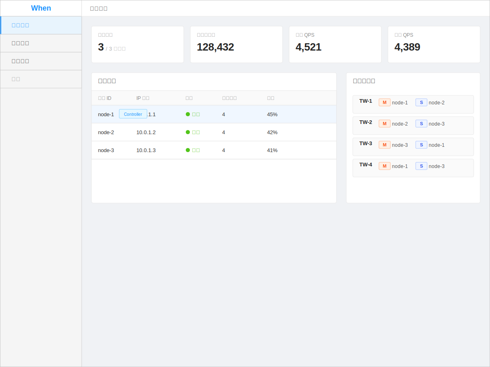

#### 任务列表页

核心的消息查询和管理界面。顶部筛选栏支持按消息 ID 搜索、状态过滤（待投递 / 已投递 / 失败 / 已取消）、Sink 类型过滤、到期时间范围筛选。列表显示消息 ID、Topic、Sink 类型、到期时间、当前状态、重试次数，操作列按状态动态展示可用操作：待投递消息可取消，失败消息可手动重投。点击任意行在右侧抽屉展开消息详情，包含完整消息体（Payload）、Sink 配置、投递时间线和每次重试的错误信息。

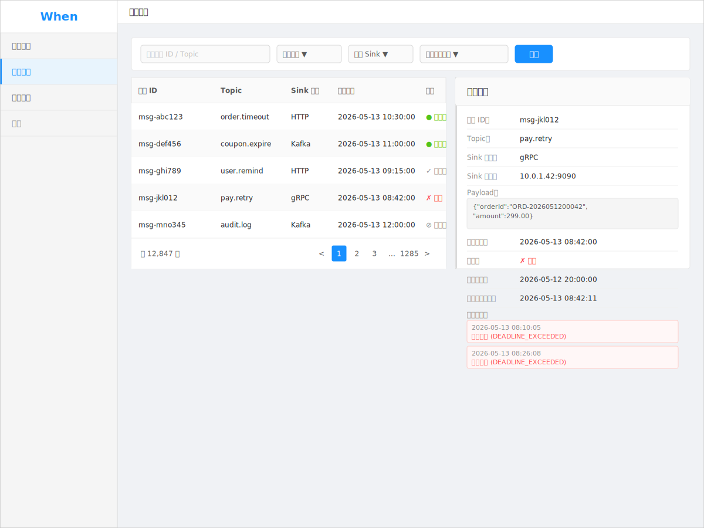

#### 投递日志页

面向运维排查的日志流水页。顶部 3 张统计卡片展示近 1 小时的投递成功率、P99 延迟、失败消息数。中部耗时分布柱状图可视化投递延迟的分位数分布，快速判断是否有异常尾延迟。下方日志表格按时间倒序列出每条消息的投递记录，失败行高亮显示，错误信息列直接展示失败原因（连接超时、HTTP 非 2xx、Kafka 写入失败等），方便快速定位问题。

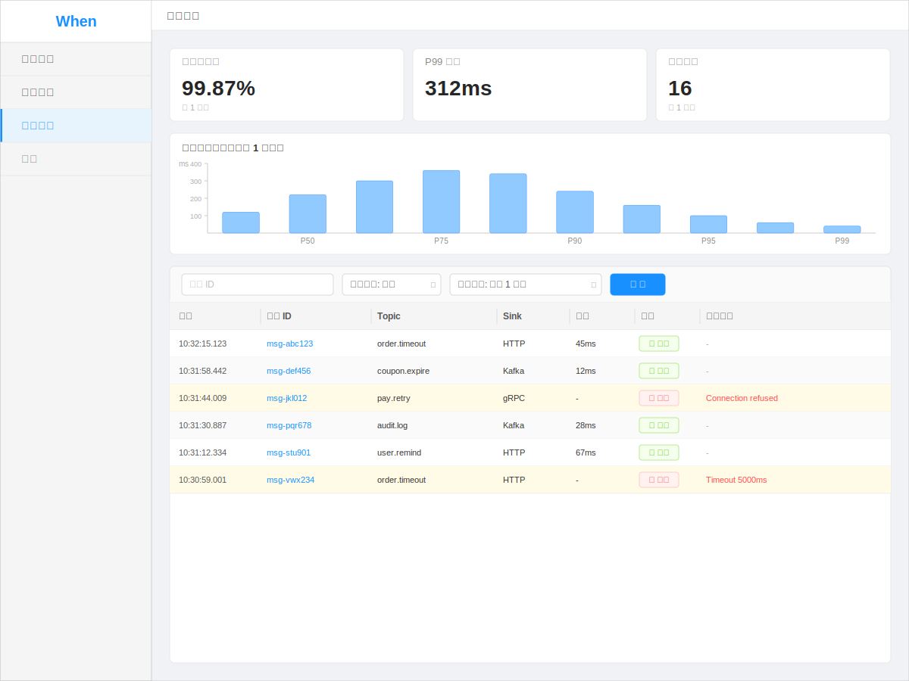


### 5.9 可观测能力

#### Prometheus Metrics

所有节点通过 `/actuator/prometheus` 暴露：

| Metric | 类型 | 说明 |
|--------|------|------|
| `when_messages_written_total` | Counter | 写入消息总数 |
| `when_messages_delivered_total` | Counter | 投递成功总数 |
| `when_messages_failed_total` | Counter | 投递失败总数 |
| `when_messages_pending_count` | Gauge | 当前待投递消息数 |
| `when_delivery_latency_ms` | Histogram | 投递耗时（P50/P95/P99） |
| `when_timing_wheel_slot_lag` | Gauge | 时间轮指针延迟（实际 vs 预期，ms） |
| `when_sink_call_duration_ms` | Histogram | Sink 调用耗时（按 sink_type） |
| `when_replication_lag_ms` | Gauge | Master→Slave 同步延迟 |

`when_timing_wheel_slot_lag` 是核心精度指标，超过 500ms 需要告警，通常是 GC 停顿或线程竞争导致。

#### 结构化日志

关键路径用结构化 JSON，包含 `trace_id`、`msg_id`、`tw_id`、`node_id`，方便日志聚合检索：

```json
{
  "timestamp": "2026-05-13T10:00:00.123Z",
  "level": "INFO",
  "event": "message_delivered",
  "trace_id": "abc123",
  "msg_id": "17000000001",
  "tw_id": "tw-001",
  "node_id": "node-1",
  "sink_type": "http",
  "latency_ms": 45,
  "retry_count": 0
}
```

日志级别：INFO 记写入和投递成功；WARN 记失败重试和 Slave 同步延迟超阈值；ERROR 记彻底失败和中间件连接异常。

#### 健康检查

```
GET /actuator/health
{
  "status": "UP",
  "components": {
    "etcd": {"status": "UP"},
    "redis": {"status": "UP"},
    "timingWheels": {"status": "UP", "count": 2, "running": 2}
  }
}
```

任意组件 DOWN 则整体变 DOWN，供 Kubernetes Liveness/Readiness Probe 使用。


## 六、接口定义

### 6.1 HTTP API（业务方接入）

统一响应格式：

```json
{
  "code": 0,
  "message": "ok",
  "data": {},
  "request_id": "abc-123"
}
```

`code` 为 0 表示成功，非 0 为错误码。


#### POST /api/v1/messages — 提交延时消息

**请求**

```json
{
  "delay_seconds": 1800,
  "sink_type": "http",
  "sink_config": {
    "url": "https://api.example.com/webhook/order-timeout",
    "method": "POST",
    "headers": {"X-Source": "when"},
    "timeout_ms": 5000
  },
  "payload": "eyJvcmRlcl9pZCI6IjEyMzQ1NiJ9",
  "idempotency_key": "order-123456-timeout",
  "retry_config": {
    "max_retries": 4,
    "strategy": "exponential",
    "initial_interval_ms": 10000
  }
}
```

| 字段 | 类型 | 必填 | 说明 |
|------|------|------|------|
| delay_seconds | int | 是 | 延时秒数，范围 [1, 2592000] |
| sink_type | string | 是 | `http` / `kafka` / `grpc` |
| sink_config | object | 是 | 结构因 sink_type 不同而异 |
| payload | string | 是 | Base64 编码，最大 64KB |
| idempotency_key | string | 否 | 相同 key 不重复创建 |
| retry_config | object | 否 | 不填用默认（指数退避，最多 4 次） |

**响应（200）**

```json
{
  "code": 0,
  "data": {
    "message_id": "1700000000001",
    "status": "pending",
    "expire_at": "2026-05-13T11:30:00Z",
    "created_at": "2026-05-13T11:00:00Z"
  }
}
```

**错误码**

| code | HTTP | 含义 |
|------|------|------|
| 1001 | 400 | 参数校验失败 |
| 1002 | 400 | sink_type 不支持 |
| 1003 | 400 | sink_config 格式错误 |
| 2001 | 409 | idempotency_key 重复，data 中返回已有 message_id |
| 5001 | 503 | 集群不可用 |


#### DELETE /api/v1/messages/{message_id} — 取消延时消息

**响应（200）**

```json
{
  "code": 0,
  "data": {"message_id": "1700000000001", "status": "cancelled"}
}
```

| code | HTTP | 含义 |
|------|------|------|
| 4001 | 404 | 消息不存在（已投递、已取消或 ID 错误） |
| 4002 | 409 | 消息已投递，无法取消 |


#### GET /api/v1/messages/{message_id} — 查询消息状态

**响应（200）**

```json
{
  "code": 0,
  "data": {
    "message_id": "1700000000001",
    "status": "delivered",
    "sink_type": "http",
    "created_at": "2026-05-13T11:00:00Z",
    "expire_at": "2026-05-13T11:30:00Z",
    "delivered_at": "2026-05-13T11:30:00.432Z",
    "retry_count": 0,
    "actual_delay_ms": 432
  }
}
```

`actual_delay_ms` 是实际投递时间与预期到期时间的差值，用于精度统计。


#### Sink Config 结构

**HTTP**
```json
{"url": "https://...", "method": "POST", "headers": {}, "timeout_ms": 5000}
```

**Kafka**
```json
{"bootstrap_servers": "k1:9092,k2:9092", "topic": "my-topic", "key": "${message_id}"}
```

**gRPC**
```json
{"target": "svc:50051", "service": "com.example.Svc", "method": "Handle", "deadline_ms": 3000}
```


### 6.2 内部 gRPC API（节点间）

```protobuf
syntax = "proto3";
package when.internal.v1;

// 消息转发（任意节点 → Master）
service MessageService {
  rpc ForwardWrite(ForwardWriteRequest) returns (ForwardWriteReply) {}
  rpc ForwardCancel(ForwardCancelRequest) returns (ForwardCancelReply) {}
  rpc ForwardQuery(ForwardQueryRequest) returns (ForwardQueryReply) {}
}

message ForwardWriteRequest {
  string tw_id           = 1;
  string msg_id          = 2;
  uint64 expire_ts_ms    = 3;
  string sink_type       = 4;
  string sink_config     = 5;
  bytes  payload         = 6;
  string idempotency_key = 7;
}

// 副本同步（Master → Slave）
service ReplicationService {
  rpc SyncWrite(SyncWriteRequest) returns (SyncWriteReply) {}
  rpc SyncDelete(SyncDeleteRequest) returns (SyncDeleteReply) {}
  rpc SyncCancel(SyncCancelRequest) returns (SyncCancelReply) {}
  rpc FullSync(FullSyncRequest) returns (stream FullSyncChunk) {}
}

message SyncWriteRequest {
  string tw_id        = 1;
  string msg_id       = 2;
  uint64 expire_ts_ms = 3;
  bytes  payload      = 4;
  string sink_type    = 5;
  string sink_config  = 6;
}

message FullSyncChunk {
  repeated SyncWriteRequest messages = 1;
  bool is_last = 2;
}

// Controller 指令
service ControllerService {
  rpc PromoteToMaster(PromoteRequest) returns (PromoteReply) {}
  rpc AssignSlave(AssignSlaveRequest) returns (AssignSlaveReply) {}
}

message PromoteRequest {
  string tw_id       = 1;
  string master_hint = 2;
}
```


### 6.3 管理台 API

#### GET /admin/api/v1/cluster — 集群概览

```json
{
  "nodes": [
    {"node_id": "node-1", "ip": "10.0.0.1", "status": "healthy",
     "is_controller": true, "master_count": 2, "slave_count": 1, "pending_messages": 12500}
  ],
  "time_wheels": [
    {"tw_id": "tw-001", "master_node": "node-1", "slave_node": "node-2",
     "status": "running", "pending_messages": 6200}
  ],
  "total_pending": 25000,
  "write_qps": 450,
  "deliver_qps": 380
}
```

#### GET /admin/api/v1/messages — 消息列表（分页）

Query params: `status`, `sink_type`, `created_after`, `created_before`, `page`, `page_size`

#### POST /admin/api/v1/messages/{id}/cancel — 强制取消

#### POST /admin/api/v1/messages/{id}/redeliver — 手动重投（failed 状态）

#### GET /admin/api/v1/metrics/summary — 指标摘要

```json
{
  "write_qps_p1m": 450,
  "deliver_qps_p1m": 380,
  "deliver_success_rate_p1h": 0.9987,
  "delivery_latency_p50_ms": 12,
  "delivery_latency_p95_ms": 98,
  "delivery_latency_p99_ms": 312
}
```


## 七、训练营排期

### 7.1 整体节奏

训练营共 3 周，目标是交付一个**单节点功能完整、端到端可验证的核心版本**。三周结束时，When 应当能够独立运行：接收延时消息、持久化到 Redis、到期后通过 HttpSink 投递到目标地址，全链路跑通，并配有基础的查询和取消接口。

集群化（ETCD 协调、节点间路由、Master/Slave 副本）、多 Sink 扩展（Kafka / gRPC）、Web 管理台、可观测性、性能压测等能力不在这 3 周内要求，列为课后作业，由参训者在训练营结束后自行完成。

这样划定边界的原因：单节点版本已经包含了 When 最核心的两个设计挑战——多层时间轮的级联调度逻辑和 Redis 持久化 + 故障恢复机制。把这两件事做扎实，集群化只是在此之上加协调层，逻辑上是可组合的。如果单节点版本没有跑稳，后续集群化会踩更多坑。

**3 周节奏：**

- **W1**：项目骨架 + 单层时间轮，打通最小 HTTP 收发链路
- **W2**：四层时间轮升级 + Redis 持久化 + 节点重启恢复
- **W3**：HttpSink 投递 + 完整消息生命周期 + 集成测试


### 7.2 周排期

#### W1 — 项目骨架 + 单层时间轮

第一周的目标是把整个项目的骨架搭起来，让最简单的链路跑通：HTTP 提交一条延时消息，单层时间轮在到期时打印出来。这一周不涉及持久化，也不涉及多层时间轮，重点是把工程结构、核心对象模型、时间轮基础逻辑确定下来，后续两周在这个基础上扩展。

**本周任务：**

Maven 多模块工程初始化，划分 `when-core`（调度核心）、`when-server`（Spring Boot 入口）、`when-client`（HTTP 接入层）三个模块，明确各模块的职责边界，避免后期依赖混乱。定义核心领域对象 `DelayMessage`，包含 `messageId`、`topic`、`deliverAt`（到期时间戳）、`payload`、`status` 等字段，这个对象贯穿整个系统，字段设计要在这一周定稳。

实现单层内存时间轮：环形数组（大小 60，对应秒级精度），后台线程每秒推进指针，指针经过的 Slot 触发对应 Bucket 里的全部消息。将消息按照 `(deliverAt - now) % 60` 落入对应 Slot。这一阶段时间轮只做秒级，超过 60s 的消息暂时不处理，留到 W2 升级。

Spring Boot HTTP 接入层实现 `POST /api/v1/messages` 接口，接收业务方提交的延时消息，解析参数，写入时间轮。不做鉴权，不做持久化，专注核心路径。

**验收标准：** curl 提交一条 10s 后到期的延时消息，10s 后控制台打印出该消息内容，时间偏差在 1s 以内。


#### W2 — 四层时间轮 + Redis 持久化 + 重启恢复

第二周是整个训练营技术含量最高的一周。要把单层时间轮升级为四层级联结构，同时接入 Redis 实现消息持久化，并完成节点重启后从 Redis 重建时间轮的恢复逻辑。这三件事彼此关联：四层时间轮决定了 Redis 里时间索引的组织方式，而恢复逻辑又依赖时间索引能被正确扫描重建。

**本周任务：**

将单层时间轮升级为四层级联：L1 秒轮（60 Slot，1s 精度）、L2 分轮（60 Slot，1min 精度）、L3 时轮（24 Slot，1h 精度）、L4 天轮（30 Slot，1d 精度）。消息投递时根据剩余时间落入对应层的 Slot；每层轮转到末尾时，将下一层当前 Slot 的消息降级到上层重新分配——例如 L2 指针推进一格，取出该分钟桶里的所有消息，按其秒级精度重新投入 L1。这套降级逻辑是四层时间轮的核心，需要仔细处理边界条件。

接入 Redisson，实现 Redis 数据模型：每条消息写入独立的 Hash Key（`/when/messages/{messageId}`），存储消息体完整字段；同时写入一个时间索引 String Key（`/when/tw/{twId}/index/{messageId}`），value 为 `deliverAt` 时间戳，并设置 TTL 为消息到期后 24h 自动清理。消息体与时间索引解耦，两种 Key 互不干扰，也避免了大 Key 问题。

实现节点启动时的 Redis 恢复流程（recover）：启动时通过 `SCAN` 遍历 `/when/tw/{twId}/index/*` 前缀的全部 Key，按 `deliverAt` 重新将消息插入时间轮。对于 `deliverAt` 已经过期的消息（`deliverAt < now`），立即触发投递，不丢消息。

补充单元测试，覆盖：四层降级的正确性（消息从 L4 经 L3/L2 逐步降到 L1 并触发）；Redis 写入和读取的一致性；重启后时间轮状态与重启前一致。

**验收标准：** 提交一条 2 分钟后到期的延时消息，杀掉进程，重启后消息在正确时间点投递，内容无损。


#### W3 — HttpSink + 完整消息生命周期 + 集成测试

第三周把延时调度和实际投递打通，完成消息从提交到投递的完整闭环，并补齐取消、查询等生命周期管理接口。到这一周结束，When 单节点版本应当是一个可以真正被业务方接入的功能完整的服务。

**本周任务：**

实现 HttpSink：使用 OkHttp 连接池管理对目标地址的 HTTP 连接，时间轮触发后向 `deliverTarget` 发送 POST 请求，携带消息体作为 JSON payload。处理响应码：2xx 视为成功；5xx 或网络异常触发重试；4xx 视为业务拒绝，不重试，直接标记为 `FAILED`。重试采用指数退避策略（初始 1s，最大 5 次，上限 60s），重试消息重新入 L1 时间轮，不额外占用 Redis 存储，状态流转写回 Redis Hash。

实现 SinkDispatcher，通过 Java SPI 机制加载 Sink 实现。`META-INF/services/` 中注册 `HttpSink`，Dispatcher 根据消息的 `sinkType` 字段路由到对应实现。这一步不要求实现 Kafka Sink 或 gRPC Sink，但 SPI 框架要搭好，后续扩展只需新增实现类和注册文件，不改核心代码。

补充消息生命周期管理接口：`DELETE /api/v1/messages/{id}` 取消尚未投递的消息（更新 Redis 状态为 `CANCELLED`，时间轮触发时检查状态直接跳过）；`GET /api/v1/messages/{id}` 查询消息当前状态和基本信息，从 Redis Hash 读取。

编写端到端集成测试，覆盖完整链路：HTTP 提交消息 → 时间轮调度 → HttpSink 投递 → 回调地址收到请求 → 状态查询返回 `DELIVERED`；以及取消流程：提交 → 取消 → 到期不投递 → 状态查询返回 `CANCELLED`。用 MockWebServer（OkHttp 自带）模拟回调地址，测试不依赖外部服务。

**验收标准：** 集成测试全绿；curl 完整演示提交 → 到期 → HTTP 回调 → 状态查询全链路；取消后到期不触发投递。


### 7.3 课后作业

以下能力是 When 完整版本的重要组成部分，但不在 3 周训练营范围内要求。参训者可以在训练营结束后按照兴趣和时间自行完成，也可以作为后续迭代的方向。

**集群化（难度：高）**

接入 ETCD，实现节点注册与 Lease 保活、Controller 选举、时间轮元数据管理。在此基础上实现消息路由层（`messageId % timewheelCount` 映射到目标 Master），节点间通过 gRPC 转发写入/查询/取消请求。进一步实现 Master/Slave 副本机制——Master 写入时同步复制到 Slave，Controller 通过 ETCD Watch 感知节点下线并向存活 Slave 下发 PromoteToMaster 指令。这部分是 When 区别于单机延时队列的核心价值，也是工程量最大的一块。

**多 Sink 扩展（难度：中）**

在 W3 搭好的 SPI 框架上，补充 KafkaSink（KafkaProducer 连接池 + 同步 Produce）和 GrpcSink（ManagedChannel 复用 + TLS 支持）。验证 SPI 扩展机制：新增 MockSink 不需要修改任何核心代码。

**扩缩容与 Rebalance（难度：高）**

实现集群弹性扩缩容：新节点加入时 Controller 触发 rebalance，将超额节点上的 Slave 副本迁移到新节点；节点 SIGTERM 时优雅退出，提前完成副本迁移再下线。目标是 3→5 节点扩容、5→3 节点缩容全程消息不丢，业务方无感知。

**可观测性（难度：低）**

接入 Prometheus Metrics，暴露写入 QPS、投递 QPS、投递成功率、延时分位数（P50/P95/P99）等核心指标；结构化日志加入 `traceId` 全链路追踪；`/health` 健康检查接口供 K8s 存活探针使用。

**Web 管理台（难度：中）**

实现集群状态页（各节点负载、时间轮数量）、任务列表页（分页查询、按状态过滤）、投递日志页（投递记录、重试历史）以及手动取消/重投操作。后端 API 参考 §6.3 接口定义。


### 7.4 风险与兜底

| 风险 | 应对 |
|------|------|
| W2 四层时间轮降级逻辑比预期复杂，联调耗时 | 优先保证 L1/L2 两层跑通，L3/L4（小时/天级）降级逻辑后移到 W3 压缩时间内完成，或降级为课后作业 |
| W3 HttpSink 重试与时间轮交互出现死循环 | 重试消息设置最大重试次数上限，超限直接标记 FAILED，不再入轮 |
| Redis SCAN recover 在消息量大时耗时超预期 | 改为异步 recover：启动后先接受新消息请求，recover 在后台线程完成，已过期消息补齐后立即投递 |
| GC 停顿导致时间轮推进不均匀，精度超 ±1s | W3 集成测试阶段验证，必要时改用 ZGC，或在时间轮推进时加追赶逻辑（检测到滞后则连续推进多格）|
